# MATU — Documento de Arquitectura

**Proyecto:** MATU · Sistema de continuidad del cuidado
**Versión:** 1.1
**Fecha:** septiembre 2026
**Equipo:** Jorge Espinoza · Martín Henríquez
**Estado:** anteproyecto validado. Línea base de diseño, revisada, auditada y contrastada con diez entrevistas a cuidadoras. **El desarrollo no ha comenzado.**

### Sobre esta versión

Esta es la **versión 1.1** del documento de arquitectura de MATU. Incorpora los resultados de la validación con cuidadoras que la versión 1.0 comprometía en su sección 18, y con ellos modifica el alcance de la capa 1, los tres supuestos económicos de la sección 16, la ventana de construcción del semestre y el estado de dos de los cinco huecos declarados.

**Qué significa que sea 1.1.** Que la línea base 1.0 se mantiene como diseño y que lo que cambió, cambió por evidencia y no por preferencia. Cada modificación de esta versión tiene su origen en un dato medido o en una restricción de calendario verificable, y ambos quedan citados en el punto donde se aplican.

**Qué es y qué no es este documento.** Es el diseño que el equipo se compromete a construir, con sus decisiones fundamentadas y sus alternativas descartadas. No reporta avance de desarrollo. Cuando el documento dice que algo "se verifica" o "queda garantizado por una prueba", describe el criterio de aceptación comprometido, no un resultado ya obtenido. La sección 12 detalla cómo y en qué sprint se comprueba cada afirmación.

### Cómo se llegó a esta línea base

El diseño pasó por tres reestructuraciones y tres rondas de revisión crítica antes de estabilizarse, y después por una ronda de evidencia de campo. Vale la pena dejarlo escrito, porque la trazabilidad de por qué algo cambió es lo que permite no repetir el error.

| Etapa | Qué se descubrió |
|---|---|
| **Diseño inicial** | MATU como plataforma de despacho, con la bitácora de cuidados relegada a fase 2 |
| **Primera corrección** | El pago dividido no existe en ninguna pasarela chilena y hay que orquestarlo. El repartidor no puede manejar dinero si es multi-plataforma. El comercio debe preparar el pedido |
| **Reestructuración en tres capas** | Dos evaluaciones independientes, una de negocio y una académica, coincidieron: **el activo diferenciador estaba relegado y el componente replicable estaba al centro.** El plan de cuidado pasó a ser el núcleo y el despacho pasó a ser desacoplable |
| **Revisión crítica, ronda 1** | 18 defectos graves. El modelo de aislamiento no cubría a comercio, repartidor ni operación, y faltaba `FORCE ROW LEVEL SECURITY` |
| **Revisión crítica, ronda 2** | La estrategia de pruebas declarada no cerraba: las reglas de arquitectura podían pasar en vacío. Error de un factor diez en el costo de pasarela |
| **Revisión crítica, ronda 3** | La regla de prorrateo no quedaba fijada por ninguna afirmación comprobable: invertir el criterio del mayor resto habría pasado igual el plan de pruebas descrito |
| **Validación con cuidadoras** | Se ejecutó la meta completa del protocolo, diez entrevistas, contra criterios fijados antes de entrevistar. H2, H3 y H4 validadas. **H1 refutada**, lo que activó el ADR-023 y redujo la versión mínima de la capa 1 a tres campos. H5, H6 y H7 quedaron en zona intermedia y disparan la regla de ampliación del propio protocolo. Las tres mediciones económicas de la sección 16 pasaron de supuesto a valor medido, y el recálculo expuso un error propio en el volumen transado |
| **Cierre de Fase 1** | La ventana de construcción quedó en nueve semanas y no en trece. Segundo recorte de alcance, de 160 horas, decidido sobre el papel antes del primer sprint |

**Y cinco defectos del modelo de aislamiento aparecieron al revisarlo política por política**, ninguno visible en una lectura lineal. Están en la sección 12.8, con la prueba que debe fijar cada corrección.

## 0. Cómo leer este documento

Este documento define **cómo se construye MATU**. Asume el documento conceptual como fuente del qué y del por qué.

Está escrito para cuatro lectores:

- **El equipo de desarrollo**, que necesita requisitos, módulos, modelo de datos, contratos y estados. Este documento es además el **contrato de trabajo entre Jorge y Martín**: define los límites por los que se puede avanzar en paralelo sin pisarse.
- **El profesor guía y la comisión**, que evalúan si las decisiones están fundamentadas.
- **Quien evalúe el cumplimiento legal**, que necesita ver el tratamiento de datos sensibles.
- **El equipo de dentro de seis meses**, que necesita entender por qué se decidió algo antes de cambiarlo.

**Ruta rápida de lectura.** Secciones 1 y 2 para la vista general. Sección 3 para el alcance comprometido. Secciones 4 a 9 para el detalle constructivo. Sección 14 para las decisiones fundamentadas, que es la parte de mayor peso en una defensa de título. Secciones 15 y 16 para la factibilidad y la aritmética del piloto, que son las que más cambiaron en esta versión.

---

## 1. Decisiones de cabecera

Las doce decisiones que determinan todo lo demás. Cada una se desarrolla en la sección 14.

| # | Decisión | Razón corta |
|---|---|---|
| 1 | **MATU es un sistema de continuidad del cuidado en tres capas**, no una plataforma de despacho | El activo diferenciador es el conocimiento del cuidado hecho transferible. El despacho es un servicio derivado de él |
| 2 | **El despacho es desacoplable.** El sistema entrega valor completo sin ningún comercio en convenio | Elimina el único punto de falla externo del proyecto. Si no hay convenio, la familia exporta su lista de reposición y compra donde quiera |
| 3 | **El perfil de consumo lo declara el cuidador, no lo infiere el sistema** | Al inicio no existe historial del cual inferir, y quien cuida sabe exactamente cuántos pañales al día se usan |
| 4 | **Monolito modular en FastAPI**, con módulos de límite explícito, no microservicios | El volumen del piloto no justifica el costo operacional de servicios distribuidos |
| 5 | **Un repositorio Flutter con dos aplicaciones** (familia y repartidor) sobre un núcleo compartido | Dos apps nativas separadas duplican el esfuerzo de un equipo de dos personas |
| 6 | **El monto se autoriza con margen y se captura por el monto real** | El precio no se conoce hasta que el comercio prepara, y cobrar el estimado obliga a reembolsar en cada pedido |
| 7 | **El pago del MVP es de un solo pagador.** El reparto entre varios familiares queda diseñado y fuera del alcance comprometido | La hipótesis que lo justificaba quedó en zona intermedia, y sus 110 horas no caben en una ventana de nueve semanas. Ver ADR-007 y sección 15.3 |
| 8 | **El repartidor nunca maneja dinero.** El comercio cobra a cuenta corriente de MATU | Los repartidores son multi-plataforma y sin vínculo fuerte. Una tarjeta prepago exigiría un control que el equipo no puede sostener |
| 9 | **Aislamiento con Row Level Security sobre tres ejes** (familia, comercio, operación), con `FORCE` y rol de aplicación no propietario | Un olvido filtra datos de otra familia. Y un solo eje no alcanza: un comercio atiende pedidos de decenas de grupos distintos |
| 10 | **El plan de cuidado se cifra por sección con sobre-cifrado**, y la clave maestra vive fuera del servidor de aplicación | Es el dato más sensible del sistema bajo la Ley 21.719, vigente desde el 1 de diciembre de 2026 |
| 11 | **La testabilidad es un requisito de diseño**, no una actividad posterior. Toda dependencia externa entra por un puerto sustituible | Sin puerto de pasarela no se puede probar el pago, que es el atributo de calidad número uno del sistema |
| 12 | **Retiro en CESFAM y medicamentos con receta quedan fuera del MVP**, diseñados y sin implementar | Es el diferenciador de mayor riesgo regulatorio y depende de convenios que no controla el equipo |

---

### 1.1 El problema, con cifras citadas

**La dependencia en Chile no es un nicho.** Según el Estudio Nacional de la Discapacidad y Dependencia (ENDIDE 2022), del Ministerio de Desarrollo Social y Familia, **1.498.977 personas adultas** viven en situación de dependencia, un **9,8% de la población de 18 años y más**, de las cuales un **2,7% presenta dependencia severa**.

**El cuidado lo sostienen familias, sin pago.** El **96,4% de los cuidadores del hogar no recibe remuneración alguna**. El **69,9%** de los cuidadores principales son mujeres, y el **38,3%** son hijos o hijas de la persona cuidada.

**Y el cuidador promedio no es joven.** El **37,9% de quienes cuidan en el hogar tiene 60 años o más**, y solo un 12% tiene menos de 30. Esa cifra sostiene, con dato y no con intuición, la decisión de tratar la accesibilidad como requisito funcional y no como acabado (sección 10).

**El déficit de relevo está medido.** El **41,3% de las personas adultas dependientes no cuenta con un cuidador formal**, y de quienes no tienen cuidador, un 24,5% recibe ayuda no permanente pero necesita más. Es exactamente el problema que la capa 1 ataca: no falta gente dispuesta, falta poder traspasar el cuidado.

**En demencia específicamente**, el Plan Nacional de Demencia 2025-2035 del MINSAL estima una prevalencia del **1,06% de la población general y 7,0% sobre los 60 años**, del orden de **200.000 personas**, con al menos un cuidador directo cada una. La demencia pasó de quinta causa de muerte en 2011 a **cuarta en 2024**, y en 2025 es la **primera causa de muerte en mujeres**.

**Lo que estas cifras no dicen, y ahora sí se sabe.** Las cifras nacionales no dicen con qué frecuencia se quiebra el stock de un insumo, cuánto cuesta traspasar el cuidado a un relevo ni cuánto está dispuesta a pagar una familia. Esos tres datos eran el objeto de la investigación de la sección 18 y **ya se midieron**: diez entrevistas con cuidadoras, realizadas entre agosto y septiembre de 2026 con criterios de falsación fijados por escrito antes de la primera.

| Lo que se midió | Resultado |
|---|---|
| Quiebres de insumos en los últimos tres meses | **6 de 10** reportaron al menos uno, con costos de una a dos horas y hasta el doble del precio habitual |
| Relevos en los últimos tres meses | **7 de 10**. De los nueve relevos relatados con detalle, **6 fallaron** por conocimiento que solo tenía la cuidadora |
| Dejaron de salir por falta de relevo o por el costo de explicar | **9 de 10** |
| Ya pagan por algún servicio de cuidado | **6 de 10**, cinco de forma recurrente |
| Llevan un registro propio de insumos o de cuidado | **4 de 10**, una de ellas una hoja de traspaso manuscrita |

El detalle completo, con veredicto por hipótesis, las tres mediciones y las diez fichas anonimizadas, está en `docs/resultados-entrevistas.md`.

Estas cifras establecen que el problema es grande, está mal cubierto y duele en las dos dimensiones que el sistema ataca. **No establecen que MATU sea la única solución**, y una de las siete hipótesis del protocolo quedó refutada, lo que cambió el producto. Ver el ADR-023.

---

## 2. Restricciones y atributos de calidad

### 2.1 Restricciones del contexto

| Restricción | Implicancia arquitectónica |
|---|---|
| **Equipo de dos personas, nueve semanas de construcción**, sin dedicación completa | Se prohíbe cualquier componente que exija operación continua. Nada de Kafka, nada de service mesh, nada de microservicios. Obliga a que backend, móvil y web avancen en paralelo, no en secuencia |
| Presupuesto de infraestructura cercano a cero | Un nodo de cómputo, base de datos gestionada de plan bajo, almacenamiento compatible con S3 |
| Piloto en una comuna acotada | Decenas de pedidos diarios, no miles. Diseñar para corrección y trazabilidad, no para escala |
| **Datos de salud y de personas con dependencia** | Cumplimiento de Ley 21.719 como requisito de diseño, no como mejora futura |
| **Ningún convenio comercial garantizado al inicio** | El despacho tiene que ser desacoplable. El sistema no puede depender de un tercero para entregar valor |
| El equipo aprende el stack mientras construye | Preferir tecnología aburrida y documentada sobre tecnología óptima |
| **Usuario primario en situación de carga, de 38 a 71 años en la muestra medida** | La accesibilidad y la simplicidad son requisitos funcionales, no acabado. La validación agregó dos restricciones no previstas: hay usuarias que no manejan aplicaciones y piden que un tercero llene por ellas, y hay contenido que nadie va a digitalizar por dignidad de la persona cuidada |

### 2.2 Atributos de calidad priorizados

Cada atributo se expresa como escenario medible, porque un atributo sin métrica no se puede evaluar.

| Prioridad | Atributo | Escenario medible | Cómo se verifica |
|---|---|---|---|
| 1 | **Integridad transaccional del pago** | Ante caída del backend durante el retorno de la pasarela, ningún pedido queda pagado sin registrar ni registrado sin pagar | Prueba de reintento del retorno y del job de conciliación (sección 12.4) |
| 2 | **Confidencialidad y trazabilidad** | Todo acceso al plan de cuidado queda registrado con actor, momento y motivo. Un repartidor nunca recibe datos clínicos en ninguna respuesta de la API | Prueba de aislamiento entre grupos y prueba de proyecciones por rol (sección 12.5) |
| 3 | **Accesibilidad del flujo principal** | Una persona de 68 años completa la ficha de relevo sin ayuda en menos de 3 minutos, con el texto del sistema al 200% de escala | Prueba con 3 usuarios reales, de tres perfiles distintos, en la semana 13 (sección 10.5) |
| 4 | **Evolucionabilidad modular** | Agregar el módulo de retiro en CESFAM no obliga a modificar el módulo de pedidos | Prueba automática de dependencias (sección 6.4) |
| 5 | **Disponibilidad del flujo de pedido** | Catálogo a pedido a pago bajo 800 ms en percentil 95 con 50 usuarios concurrentes. Disponibilidad objetivo 99% mensual | Prueba de carga básica en el sprint 8 |
| 6 | **Observabilidad operacional** | Ante un pedido con incidencia, la operación reconstruye la línea de tiempo completa desde el backoffice sin tocar la base de datos | Revisión manual en el sprint 8 |

**El atributo 3 cambió de métrica en esta versión.** La v1.0 medía "primer pedido completo en menos de 6 minutos". La validación mostró que el cuello de botella no es el pedido sino el llenado del plan, y que ocho preguntas no se responden en cinco minutos. La métrica pasa a medir la ficha de relevo, que es la versión mínima obligatoria.

Atributos deliberadamente **no** priorizados: escalabilidad horizontal, latencia sub-100 ms, multi-región y alta disponibilidad activo-activo. Declararlo es parte de la decisión.

---

## 3. Requisitos funcionales

Catálogo de requisitos trazados a módulo y priorizados con MoSCoW. **Debe** entra al MVP, **Debería** entra si hay holgura, **Podría** queda para fase 2.

### 3.1 Capa 1 · Plan de cuidado

| ID | Requisito | Módulo | Prioridad |
|---|---|---|---|
| RF-01 | El cuidador registra a la persona cuidada con nombre, nivel de apoyo y dirección de entrega | `care_circle` | Debe |
| RF-02 | El cuidador completa una **ficha de relevo de tres campos**: la rutina en una línea, qué hacer si la persona se altera y a quién llamar. Es la versión mínima obligatoria del plan de cuidado | `care_plan` | Debe |
| RF-03 | El cuidador amplía la ficha con hasta ocho secciones opcionales: rutina, horarios, manejo de situaciones difíciles, preferencias, actividades, red de apoyo, alimentación y movilidad. **Ningún flujo del sistema exige el plan completo** | `care_plan` | Debe |
| RF-04 | El sistema impide la sobreescritura silenciosa cuando dos miembros editan la misma sección | `care_plan` | Debe |
| RF-05 | El cuidador genera un acceso de relevo con alcance por sección, vencimiento y motivo | `care_plan` | Debe |
| RF-06 | El relevo accede al plan sin crear cuenta, mediante un enlace con token expirable | `care_plan` | Debe |
| RF-07 | El cuidador revoca un acceso de relevo en cualquier momento, con efecto inmediato | `care_plan` | Debe |
| RF-08 | Todo acceso al plan de cuidado queda registrado en auditoría | `care_plan` | Debe |
| RF-09 | El plan de cuidado se exporta como documento imprimible para el relevo sin conexión | `care_plan` | Debe |
| RF-42 | El plan de cuidado admite **llenado asistido**: un miembro del círculo familiar completa o corrige la ficha en nombre del cuidador principal, y la autoría queda registrada | `care_plan` | Debe |

**RF-02, RF-03 y RF-42 son nuevos o reescritos en esta versión.** La v1.0 tenía un RF-02 que exigía ocho secciones y un RF-03 que pedía "una versión mínima utilizable en menos de 5 minutos". La validación refutó que eso fuera posible. RF-42 entra porque el único abandono del piloto fue por manejo del teléfono, y la entrevistada pidió ella misma que alguien escribiera por ella.

### 3.2 Capa 2 · Consumo y predicción

| ID | Requisito | Módulo | Prioridad |
|---|---|---|---|
| RF-10 | El cuidador declara el consumo de un producto con tasa de uso y unidad | `consumption` | Debe |
| RF-11 | El sistema calcula la fecha estimada de quiebre de cada producto declarado | `consumption` | Debe |
| RF-12 | El sistema avisa a la familia antes del quiebre, con anticipación configurable | `consumption` | Debe |
| RF-13 | El cuidador registra una reposición hecha fuera de MATU y el cálculo se ajusta | `consumption` | Debe |
| RF-14 | El sistema genera una lista de reposición con los productos próximos a quiebre | `consumption` | Debe |
| RF-15 | La familia exporta la lista de reposición como documento o enlace compartible | `consumption` | Debe |
| RF-16 | Las líneas de un plan de reposición se proponen desde el perfil de consumo | `replenishment` | Debería |
| RF-17 | La familia programa envíos periódicos con frecuencia definida | `replenishment` | Debería |
| RF-18 | La familia adelanta, salta o cancela una ocurrencia programada | `replenishment` | Debería |
| RF-19 | El pedido generado por reposición admite edición durante 24 horas antes del cobro | `replenishment` | Debería |

**El módulo `replenishment` completo baja de Debe a Debería.** La validación no encontró demanda de envío periódico programado. Lo que las entrevistadas pidieron fue el aviso anticipado y el botón para pedir en ese momento, que es RF-14 más RF-20. Son 64 horas que salen del alcance comprometido. Ver sección 15.3.

### 3.3 Capa 3 · Despacho

| ID | Requisito | Módulo | Prioridad |
|---|---|---|---|
| RF-20 | La familia arma un pedido desde un catálogo organizado por categorías de cuidado | `catalog`, `ordering` | Debe |
| RF-21 | La familia define reglas de sustitución por producto | `ordering` | Debe |
| RF-25 | El monto se autoriza con margen y se captura por el monto real | `payments` | Debe |
| RF-26 | El comercio en convenio ve sus pedidos del día, resuelve faltantes e informa monto real | `fulfillment` | Debe |
| RF-31 | La operación concilia la boleta contra el pedido y cierra períodos de liquidación | `settlement` | Debe |
| RF-32 | La operación gestiona catálogo, convenios, incidencias e indicadores | `backoffice` | Debe |
| RF-22 | La familia reparte el gasto entre miembros del grupo y designa un respaldo | `payments` | Podría |
| RF-23 | Cada participante autoriza su parte de forma independiente dentro de un plazo | `payments` | Podría |
| RF-24 | El sistema redistribuye el faltante al vencer el plazo, sobre el respaldo primero | `payments` | Podría |
| RF-27 | El repartidor recibe ofertas en cascada con plazo de aceptación | `fulfillment` | Debería |
| RF-28 | El repartidor retira el pedido exhibiendo un código de un solo uso | `fulfillment` | Debería |
| RF-29 | El repartidor registra evidencia geolocalizada de boleta y entrega | `fulfillment` | Debería |
| RF-30 | La familia sigue el estado del pedido y la posición del repartidor en ruta | `fulfillment` | Debería |

**RF-22, RF-23 y RF-24 bajan de Debe a Podría, y RF-25 se simplifica.** El reparto del gasto entre varios pagadores era el compromiso más caro del semestre, 110 horas, y su justificación de negocio no sobrevivió a la validación: cuatro de diez reparten el gasto cuando el criterio exigía cinco, y ocho de diez declaran que pagaría la propia cuidadora. Con la ventana de construcción en nueve semanas, construirlo habría consumido casi la mitad de la capacidad sobre evidencia que no lo sostiene. **RF-25 se mantiene en el MVP sin el prorrateo**, porque autorizar con margen y capturar por el monto real sigue siendo necesario con un solo pagador. Ver ADR-007 y sección 15.3.

### 3.4 Transversales

| ID | Requisito | Módulo | Prioridad |
|---|---|---|---|
| RF-37 | El usuario se registra, autentica y gestiona sus dispositivos para notificaciones | `iam` | Debe |
| RF-38 | El administrador del grupo invita miembros y les asigna rol | `care_circle` | Debe |
| RF-39 | El sistema entrega avisos por push y correo, con preferencia por canal y horario | `notifications` | Debe |
| RF-40 | La operación registra y resuelve incidencias sobre un pedido | `backoffice` | Debe |

### 3.5 Fuera del MVP

| ID | Requisito | Módulo | Prioridad |
|---|---|---|---|
| RF-33 | La familia carga una receta y solicita medicamentos en farmacia | `rx` | Podría |
| RF-34 | El sistema gestiona el retiro autorizado de medicamentos en CESFAM | `rx` | Podría |
| RF-35 | El sistema propone reposición a partir del historial de consumo real | `consumption` | Podría |
| RF-36 | El repartidor optimiza ruta para varios pedidos simultáneos | `fulfillment` | Podría |
| RF-41 | MATU cobra una suscripción mensual por el servicio, independiente de los pedidos | `payments` | Podría |

**Los medicamentos con receta fueron la demanda más repetida fuera del alcance.** Tres de las diez entrevistadas dependen del hospital o del consultorio para sus fármacos, y el único quiebre grave que reportó una de ellas fue una receta vencida, no un insumo. Se mantienen fuera del MVP por el riesgo regulatorio del ADR-022, ahora con evidencia de campo que respalda priorizarlos en la fase 2.

**Cobertura:** **26 requisitos comprometidos** como *Debe*, 8 condicionados como *Debería* y 8 fuera del MVP como *Podría*, sobre un catálogo de 42, tras los dos recortes de la sección 15.3 y la incorporación de RF-42.

**El cobro de la suscripción del servicio (RF-41) queda fuera del MVP a propósito.** La sección 16 calcula un punto de equilibrio suponiendo ese ingreso, y conviene ser explícito: **es un ejercicio de viabilidad, no un compromiso de alcance**.

Un requisito sin módulo o un módulo sin requisito son errores de diseño y se revisan en cada cierre de sprint.

---

## 4. El modelo en tres capas

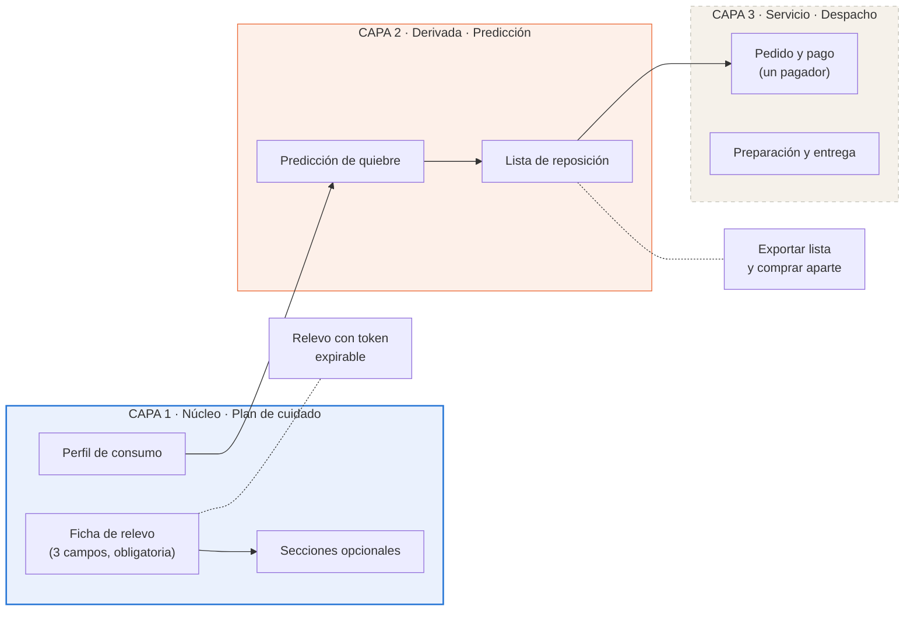

**La capa 1 es el producto.** El plan de cuidado convierte el conocimiento del cuidador en algo transferible, que es lo que permite el relevo. Sin ella, MATU es un despacho más. **Su versión mínima obligatoria es la ficha de relevo de tres campos**, y las ocho secciones son ampliación opcional. Ese cambio viene de la refutación de H1 y está en el ADR-023.

**La capa 2 es el diferenciador computable.** Del perfil de consumo declarado en la capa 1 se deriva cuándo se acaba cada insumo. Ese cálculo es lo que MATU tiene y un delivery genérico no puede tener, porque requiere conocer a la persona cuidada.

**La capa 3 es un servicio, no la razón de existir.** Con convenio, MATU despacha. Sin convenio, la familia exporta la lista y compra donde quiera. El sistema sigue entregando su valor central.

**Consecuencia arquitectónica principal:** las dependencias apuntan hacia abajo y nunca hacia arriba. `care_plan` no sabe que existe `fulfillment`. Eso es lo que permite construir y demostrar el producto sin haber cerrado un solo convenio.

---

## 5. Vista de contexto (C4 nivel 1)

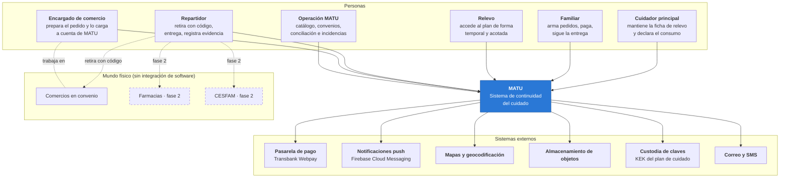

**El cuidador principal es el usuario central**, no el familiar que paga. Es quien alimenta la capa 1, de la cual depende todo lo demás. La validación reforzó esa decisión por una vía inesperada: ocho de diez entrevistadas declararon que la suscripción la pagaría la propia cuidadora, no un tercero.

**MATU no se integra por software con el punto de venta de ningún comercio.** La integración es humana: el comercio recibe el pedido en una pantalla, lo prepara, lo carga a cuenta y lo entrega contra un código. Una de las entrevistadas describió un arreglo idéntico ya operando entre su familia y una farmacia de barrio, con boleta a nombre de la familia, lo que confirma que el modelo existe en terreno.

**La persona cuidada no es usuaria del sistema.** Es sujeto de los datos y destinataria de la entrega, pero no tiene cuenta. Esa distinción tiene consecuencias legales tratadas en la sección 11.

**MATU es soporte logístico y de continuidad del cuidado, no un prestador de salud.** Esa frase delimita el alcance del sistema y explica por qué el modelo de datos no contiene diagnósticos.

---

## 6. Vista de contenedores y módulos

### 6.1 Contenedores (C4 nivel 2)

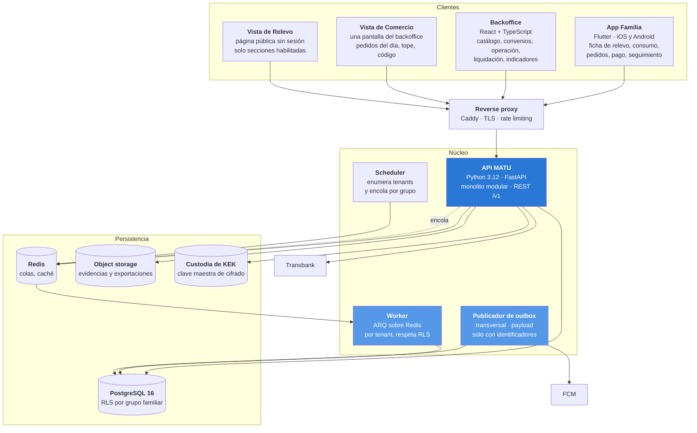

**La App Repartidor sale del diagrama de contenedores comprometido.** RF-27 a RF-30 quedaron en *Debería* desde el primer recorte, y en el piloto el retiro y la entrega se marcan desde la vista de comercio. El paquete Flutter compartido del ADR-005 se mantiene, porque la segunda aplicación sigue siendo el camino de evolución.

### 6.2 Responsabilidad de cada contenedor

| Contenedor | Responsabilidad | Lo que explícitamente no hace |
|---|---|---|
| **App Familia** | Ficha de relevo, secciones opcionales, perfil de consumo, catálogo, pedido, seguimiento | No calcula totales finales. No decide sustituciones |
| **Backoffice** | Catálogo, convenios, monitoreo, incidencias, conciliación, liquidación, indicadores | No accede al plan de cuidado. No es canal de soporte al cliente final |
| **Vista de Comercio** | Pedidos del día, resolución de faltantes, monto real, validación de código, marcado de retiro y entrega | No ve la dirección de entrega ni datos de la persona cuidada más allá del nombre de pila |
| **Vista de Relevo** | Lectura de las secciones habilitadas del plan de cuidado | No permite edición. No expone otras secciones. No crea sesión persistente |
| **API MATU** | Toda la lógica de negocio y toda la autorización | No ejecuta trabajo largo. Nada sobre 2 segundos vive aquí |
| **Worker** | Trabajo por tenant: predicción de quiebre, materialización de alertas | No expone endpoints. No es alcanzable desde internet. **No evade RLS** |
| **Publicador de outbox** | Publicación de eventos de dominio hacia notificaciones | **Transversal a tenants, y por eso su payload contiene solo identificadores, nunca datos** |
| **PostgreSQL** | Fuente única de verdad transaccional | No almacena archivos binarios |
| **Redis** | Colas y caché de catálogo | No es fuente de verdad de nada. Se puede vaciar sin pérdida |
| **Object storage** | Evidencias, exportaciones del plan de cuidado y de la lista de reposición | Nunca sirve archivos públicos. Solo URLs firmadas de vida corta |
| **Custodia de KEK** | Guarda la clave maestra que cifra las claves de datos | No guarda datos. Ver ADR-016 |

### 6.3 Módulos del backend (C4 nivel 3)

```
app/
├── core/                 configuración, seguridad, dependencias, errores
├── shared/               eventos de dominio, outbox, auditoría, tipos comunes
├── modules/
│   ├── iam/              usuarios, autenticación, roles, dispositivos
│   ├── care_circle/      grupo familiar, membresías, personas cuidadas, direcciones
│   ├── care_plan/        ficha de relevo, secciones, accesos de relevo      ← CAPA 1
│   ├── consumption/      perfil de consumo, predicción de quiebre, lista    ← CAPA 2
│   ├── catalog/          productos, comercios, convenios, ofertas
│   ├── replenishment/    planes de reposición, ocurrencias        [DEBERÍA]
│   ├── ordering/         carrito, pedido, líneas, reglas de sustitución
│   ├── payments/         cargos, captura, pasarela                          ← CAPA 3
│   ├── fulfillment/      preparación, código, evidencia
│   ├── settlement/       consumo por comercio, conciliación, liquidación
│   ├── rx/               recetas, farmacia, CESFAM                  [FASE 2]
│   ├── notifications/    plantillas, push, correo, SMS
│   └── backoffice/       operación, vista de comercio, indicadores
└── main.py
```

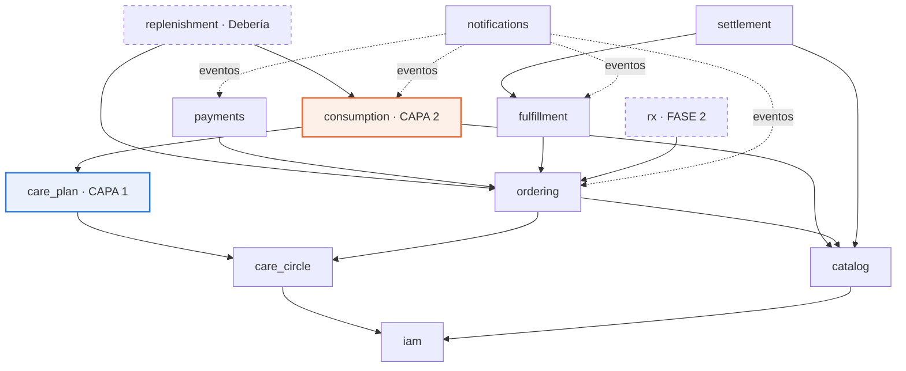

### 6.4 Regla de dependencias

Cuatro reglas, que verificará una prueba automática recorriendo el árbol de importaciones. No dependen de disciplina.

1. **Las flechas no se invierten.** `catalog` no importa `ordering`. Si necesita reaccionar a algo, escucha un evento.
2. **`care_plan` es hoja hacia arriba.** Ningún módulo de la capa 2 o 3 lo importa, salvo `consumption`, y solo para leer el perfil de consumo a través de una interfaz explícita que no expone las secciones sensibles.
3. **`fulfillment`, `settlement` y `payments` no son importados por `care_plan` ni por `consumption`.** Es lo que hace desacoplable el despacho: se puede eliminar la capa 3 completa y el sistema arranca.
4. **`notifications` no se llama directamente.** Solo consume eventos, para que ningún flujo de negocio falle porque una notificación falló.

La prueba vivirá en `tests/test_arquitectura.py`. La regla 3 se verifica además con una prueba de arranque que desactiva los routers de la capa 3 y comprueba que la aplicación levanta y que los flujos de las capas 1 y 2 siguen respondiendo.

---

## 7. Modelo de datos

### 7.1 Diagrama entidad-relación

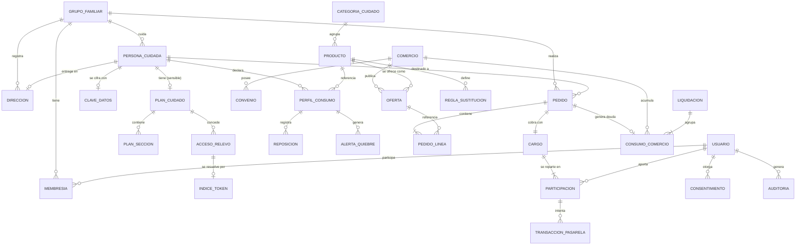

**El modelo no cambió en esta versión, y eso es deliberado.** La activación del ADR-023 reduce la versión mínima del plan de cuidado a tres campos, pero esos tres campos son tres de los ocho tipos de sección que `plan_seccion` ya contempla. Que el plan B no obligue a migrar el esquema es exactamente la razón por la que se escribió antes de entrevistar.

### 7.2 Capa 1 · Plan de cuidado

| Entidad | Campos relevantes | Notas de diseño |
|---|---|---|
| `plan_cuidado` | id, grupo_id, persona_cuidada_id, completitud_pct, actualizado_por, actualizado_en | `completitud_pct` se calcula sobre las ocho secciones, pero **la interfaz nunca bloquea por completitud**. Ver ADR-018 |
| `plan_seccion` | id, plan_id, tipo, **contenido_cifrado**, **nonce**, **tag_auth**, **version**, actualizado_por, actualizado_en | Cifrado por sección, no por documento, para compartir una parte sin descifrar el resto. **`nonce` de 96 bits aleatorio por cada escritura, nunca un contador**: repetir un nonce en AES-GCM permite recuperar la clave de autenticación y forjar texto cifrado. `version` implementa bloqueo optimista (RF-04) |
| `acceso_relevo` | id, plan_id, otorgado_a_nombre, otorgado_a_telefono, secciones_permitidas, token_hash, **pin_hash**, expira_en, revocado_en, motivo, usos | El relevo no crea cuenta. **Token de uso múltiple hasta vencer**, no de un solo uso: el relevo consulta el plan durante todo su turno. `pin_hash` es el segundo factor de cuatro dígitos enviado al teléfono ya registrado, porque un enlace por WhatsApp es una credencial al portador sobre datos de salud |
| `clave_datos` | id, persona_cuidada_id, dek_cifrada_con_kek, kek_version, creada_en, rotada_en | Sobre-cifrado. Una clave de datos por persona cuidada, cifrada con la clave maestra. Ver ADR-016 |

**Tipos de sección:** `rutina`, `manejo_situaciones`, `red_apoyo`, `horarios`, `preferencias`, `actividades`, `alimentacion`, `movilidad`.

**Los tres primeros constituyen la ficha de relevo y son los únicos obligatorios.** El orden de la lista cambió en esta versión para que refleje la prioridad real. La validación mostró que tres de diez entrevistadas pidieron por su cuenta un campo de «qué la calma», que es precisamente el contenido de `manejo_situaciones`, y que tres piden otro lenguaje para la incontinencia dentro de `alimentacion` y `movilidad`, lo que cambia la redacción de las preguntas y no el modelo.

### 7.3 Capa 2 · Perfil de consumo

| Entidad | Campos relevantes | Notas de diseño |
|---|---|---|
| `perfil_consumo` | id, grupo_id, persona_cuidada_id, producto_id, **tasa_uso_diaria**, **stock_unidades**, **stock_medido_en**, **fecha_quiebre_estimada**, dias_aviso, activo | El corazón de la capa 2. **Todo en unidades base**, nunca en envases: la conversión vive en la presentación. **El ancla del cálculo es `stock_medido_en`, no la última reposición**, porque el cuidador declara stock en cualquier momento sin haber comprado nada, y anclar en la reposición produce fechas de quiebre en el pasado |
| `reposicion` | id, perfil_id, **cantidad_unidades**, origen (`pedido_matu`, `declarada`), **pedido_ref**, ocurrida_en | Registrar una compra hecha fuera de MATU es obligatorio (RF-13): sin eso el cálculo se desalinea y las alertas pierden credibilidad. **`pedido_ref` es una referencia opaca sin clave foránea**, para que la capa 2 no dependa de la 3 |
| `alerta_quiebre` | id, perfil_id, fecha_prevista, estado (`pendiente`, `notificada`, `resuelta`, `descartada`), notificada_en | Se materializa antes de dispararse, lo que hace idempotente el aviso |

**El cálculo, completo:**

```
dias_de_cobertura = piso(stock_unidades / tasa_uso_diaria)
fecha_quiebre     = stock_medido_en + dias_de_cobertura
alerta_si         = (fecha_quiebre - hoy) <= dias_aviso
```

Tres detalles que parecen menores y no lo son. **El piso es deliberado**: es preferible avisar un día antes que un día tarde. **El ancla es `stock_medido_en`**, no la reposición. Y **`unidades_a_envases` redondea hacia arriba**, porque nadie compra un tercio de paquete de pañales.

Vive en `app/modules/consumption/domain/quiebre.py` y su criterio de aceptación son ocho pruebas de dominio, incluida una de regresión sobre el ancla. Entregable del sprint 5.

Es aritmética de tercero básico, y esa es exactamente la gracia. **El valor no está en el algoritmo, está en tener el dato.** Ningún despacho genérico sabe que la persona usa cuatro pañales al día, porque nunca se lo preguntó a nadie.

**Lo que la validación agregó a esta capa.** Dos de los seis quiebres reportados fueron de un tipo que la predicción no evita: un desabastecimiento de la farmacia y una receta vencida. Eso no invalida el cálculo, pero sí obliga a que la interfaz no prometa evitar todo quiebre. Y el valor que las entrevistadas nombraron no fue la prevención de la urgencia sino la descarga mental: «el problema no es comprar, el problema es que yo tengo la cabeza en mil cosas y esa es una más».

`dias_aviso` tiene un valor por defecto de 7 y es configurable por producto.

### 7.4 Capa 3 · Catálogo, pedido, cumplimiento y pagos

| Entidad | Campos relevantes | Notas de diseño |
|---|---|---|
| `producto` | id, categoria_id, nombre, marca, presentacion, unidad, **unidades_por_envase**, requiere_receta, activo | `unidades_por_envase` conecta el catálogo con el perfil de consumo: 30 pañales por paquete permite traducir tasa de uso a paquetes |
| `oferta` | producto_id, comercio_id, precio_referencia, disponibilidad, actualizado_en | El precio es referencial, no vinculante. Ver ADR-011 |
| `convenio` | comercio_id, vigencia_desde, vigencia_hasta, **comision_pct**, **tarifa_despacho**, prepara_pedidos, cuenta_corriente, estado | `comision_pct` y `tarifa_despacho` son la regla de cálculo de la liquidación |
| `pedido` | id, grupo_id, persona_cuidada_id, comercio_id, direccion_id, estado, modo_cumplimiento, origen (`manual`, `alerta_quiebre`), ventana_entrega, total_estimado, total_autorizado, total_real, codigo_retiro_hash, creado_por | `origen` incorpora `alerta_quiebre`, que es el camino que conecta la capa 2 con la 3 |
| `pedido_linea` | id, pedido_id, oferta_id, cantidad, precio_snapshot, precio_real, estado_linea, sustituto_de_linea_id | La sustitución es una línea nueva que apunta a la original, no una edición |
| `cargo` | id, pedido_id, monto_objetivo, monto_autorizado, monto_capturado, estado, pagador_usuario_id | |
| `participacion` | id, cargo_id, usuario_id, monto_comprometido, monto_autorizado, **monto_capturado**, porcentaje, estado | **Se mantiene en el modelo aunque el MVP use una sola participación al 100%.** Conservarla es lo que permite activar RF-22 a RF-24 en la fase 2 sin migrar el esquema |
| `transaccion_pasarela` | id, participacion_id, proveedor, buy_order, token, tipo (`autorizacion`, `captura`, `reversa`), monto, estado, payload_respuesta, idempotency_key | Nunca se borra ni se actualiza destructivamente. Es el registro contable |
| `consumo_comercio` | id, comercio_id, pedido_id, monto_autorizado, monto_boleta, folio_boleta, evidencia_id, estado, desviacion_pct | Contrapartida de `cargo`: lo que MATU debe al comercio |
| `liquidacion` | id, comercio_id, periodo_desde, periodo_hasta, monto_bruto, **monto_comision**, monto_neto, estado, factura_ref, pagada_en | `monto_comision = Σ(consumo.monto_boleta × convenio.comision_pct)` |

### 7.5 Transversales

| Entidad | Campos relevantes | Notas |
|---|---|---|
| `consentimiento` | id, grupo_id, usuario_id, persona_cuidada_id, **calidad_otorgante** (`titular`, `representante_legal`, `cuidador_de_hecho`), finalidad, version_politica, evidencia, otorgado_en, revocado_en | Requisito directo de la Ley 21.719. **`calidad_otorgante` es la pieza clave**: el titular de los datos es muchas veces una persona sin capacidad para consentir, y quien opera la aplicación puede no ser su representante legal. Ver la sección 11.5 |
| `auditoria` | id, grupo_id, actor_tipo, **actor_ref**, accion, entidad, entidad_id, **motivo**, ip, ocurrido_en | Append-only, con una prueba comprometida que lo verifique. **`actor_ref` es polimórfico** porque el relevo no es usuario y es justamente el actor más sensible del sistema |
| `evento_outbox` | id, grupo_id, tipo, **payload solo con identificadores**, agregado_id, disponible_en, intentos, publicado_en, fallido_en | Tabla de **infraestructura sin RLS**, acotada por permiso de rol. Contrato completo en 8.6 |
| `idempotencia` | clave, **grupo_id**, endpoint, respuesta, creada_en | Soporta el header `Idempotency-Key`. **Lleva `grupo_id` y RLS como cualquier tabla de negocio**: guarda cuerpos de respuesta de pedidos y pagos, de modo que sin tenant sería una excepción no declarada al modelo de aislamiento (sección 12.8) |
| `evento_consumido` | evento_id, consumidor, consumido_en | Clave primaria compuesta. Es lo que hace idempotente al consumidor |

### 7.6 Nueve decisiones de modelado que conviene defender

**a) El dinero es entero, no decimal.** El peso chileno no tiene subunidad en uso. Todo monto es `BIGINT` en pesos. Usar coma flotante para dinero es un error clásico, y `NUMERIC(12,2)` aquí solo invita a redondeos que no existen en el dominio.

**b) La sustitución es una línea nueva, no una edición.** Se crea una línea con `sustituto_de_linea_id` apuntando a la original, y la original pasa a `sustituida`. La familia ve exactamente qué pidió y qué llegó.

**c) El precio se congela al confirmar y se reconcilia al preparar.** `precio_snapshot` guarda el referencial mostrado, `precio_real` lo efectivamente cobrado. La diferencia es visible y auditable, y es la base de confianza de un servicio de compra por encargo.

**d) La alerta se materializa antes de dispararse.** El scheduler no pregunta "qué toca hoy", crea filas con anticipación. Una corrida doble del job no genera dos avisos, y "descartar" y "resolver" son transiciones auditables y no un borrado.

**e) La fecha de quiebre es un campo materializado, no una consulta.** Se recalcula cuando cambia el perfil o cuando se registra una reposición, y una vez al día por seguridad. Consultarla en línea obligaría a calcular sobre toda la base para responder "qué se está por acabar", que es la consulta más frecuente de la aplicación.

**f) Hay dos flujos de dinero y dos tablas distintas.** `cargo` describe lo que MATU cobra a la familia. `consumo_comercio` y `liquidacion` describen lo que MATU debe al comercio. Son montos parecidos en momentos distintos: se cobra el día de la entrega y se paga a fin de período.

**g) El código de retiro se guarda con hash, no en claro.** Es la credencial que autoriza a llevarse mercadería cargada a la cuenta de MATU. Se trata como contraseña de un solo uso.

**h) El nonce se guarda, no se deriva.** `plan_seccion` lleva `nonce` y `tag_auth` como columnas. Sin nonce almacenado no se puede descifrar, y reutilizarlo entre escrituras rompe AES-GCM por completo.

**i) El plan de cuidado se cifra por sección y con clave por persona.** Cifrar por sección permite compartir rutina y manejo de situaciones con un relevo sin exponer red de apoyo ni preferencias. Una clave de datos por persona cuidada permite revocar el acceso a una persona sin rotar todo el sistema.

### 7.7 Aislamiento multi-tenant sobre tres ejes

Esta sección se reescribió por completo tras la primera ronda de revisión. La versión anterior describía un solo eje de acceso, el de la familia, y con eso **no se podía atender a tres de los ocho roles del sistema**.

#### Los tres hechos que gobiernan el modelo

**1. El rol de la aplicación no es propietario de las tablas, y se aplica `FORCE`.**

En PostgreSQL, **el propietario de una tabla ignora sus propias políticas RLS** salvo que se declare `FORCE ROW LEVEL SECURITY`. Si Alembic corre las migraciones con el mismo usuario que la API, el aislamiento queda desactivado en silencio. Es literalmente el escenario "RLS finge proteger".

```sql
-- migraciones: matu_owner. Ejecución: matu_app, que NO es propietario.
ALTER TABLE pedido ENABLE ROW LEVEL SECURITY;
ALTER TABLE pedido FORCE  ROW LEVEL SECURITY;
```

**2. Hay tres ejes de acceso, y PostgreSQL los combina con OR.**

```sql
CREATE POLICY pedido_familia   ON pedido FOR ALL
  USING (grupo_id    = current_setting('app.grupo_id',    true)::uuid);
CREATE POLICY pedido_comercio  ON pedido FOR ALL
  USING (comercio_id = current_setting('app.comercio_id', true)::uuid);
CREATE POLICY pedido_operacion ON pedido FOR ALL
  USING (current_setting('app.rol', true) = 'operacion');
```

**Y el eje de operación no está en todas partes.** `plan_cuidado` y `perfil_consumo` quedan deliberadamente **fuera** de él, porque la sección 11.2 declara que operación nunca los alcanza.

**3. Las tablas hijas no llevan `grupo_id`: heredan del padre.**

```sql
CREATE POLICY plan_seccion_hereda ON plan_seccion FOR ALL
  USING (EXISTS (SELECT 1 FROM plan_cuidado p WHERE p.id = plan_seccion.plan_id));
```

#### Contexto de sesión

| Variable | Cuándo se fija |
|---|---|
| `app.usuario_id` | **Siempre y primero.** La política de `membresia` depende de él |
| `app.grupo_id` | Cuando el actor es una familia |
| `app.comercio_id` | Cuando el actor es un comercio en convenio |
| `app.rol` | `operacion` habilita el eje transversal, auditado |

```python
@asynccontextmanager
async def sesion_tenant(maker, *, usuario_id=None, grupo_id=None,
                        comercio_id=None, rol=None, verificar_membresia=True):
    async with maker() as sesion:
        async with sesion.begin():
            # el orden importa: primero identidad, después tenant
            await _fijar(sesion, "app.usuario_id",  usuario_id)
            await _fijar(sesion, "app.grupo_id",    grupo_id)
            await _fijar(sesion, "app.comercio_id", comercio_id)
            await _fijar(sesion, "app.rol",         rol)
            if verificar_membresia and usuario_id and grupo_id and rol != "operacion":
                ...  # la consulta de membresía corre DENTRO del contexto
            yield sesion
```

El `true` de `set_config(clave, valor, true)` hace el ajuste **local a la transacción**, de modo que el pool de conexiones no arrastre el contexto de una petición a la siguiente. Ese detalle es la diferencia entre que RLS proteja y que RLS finja proteger.

**Y el orden importa.** La verificación de membresía consulta una tabla con RLS, cuya política es por `app.usuario_id`. Fijar el contexto **después** de verificar habría devuelto cero filas y toda petición autenticada habría fallado.

#### Los trabajos asíncronos

1. El scheduler enumera los grupos activos y **encola un job por grupo**, no un job global.
2. Cada job abre su transacción y fija `app.grupo_id` con el mismo helper que usa la API.
3. **El worker corre con el mismo rol que la API.** No existe un rol de aplicación que evada RLS.

#### Las dos excepciones, reconocidas y acotadas

**a) El publicador de outbox.** Es transversal por definición. `evento_outbox` se declara **tabla de infraestructura sin RLS**, justificado porque su payload contiene solo identificadores. El publicador corre con un rol propio con permiso **únicamente** sobre esa tabla:

```sql
REVOKE ALL ON ALL TABLES IN SCHEMA public FROM matu_publisher;
GRANT SELECT, UPDATE ON evento_outbox   TO matu_publisher;
GRANT SELECT, INSERT ON evento_consumido TO matu_publisher;
```

**b) Los endpoints públicos.** La vista de relevo y el retorno de pasarela deben resolver un token **antes** de saber a qué grupo pertenece. Se resuelve con `indice_token`, una tabla sin RLS y sin dato sensible que solo traduce `token_hash → grupo_id`.

#### Qué hay que demostrar, y no solo afirmar

`tests/test_aislamiento.py` es entregable comprometido del sprint 1 y debe correr contra PostgreSQL real, no contra un doble.

| Prueba | Qué debe demostrar |
|---|---|
| sin contexto, cero filas | Una consulta sin `app.grupo_id` no devuelve todo, devuelve nada |
| worker sin contexto, cero filas | El hueco que tenía el diseño anterior quedó cerrado |
| operación no alcanza el plan | La celda "operación · plan de cuidado · nunca" de la sección 11.2 es cierta |
| `FORCE` activo tabla por tabla | El escenario "RLS finge proteger" no puede ocurrir |

La revisión de este modelo descrita en la sección 12.8 encontró **cinco defectos que la lectura del diseño no dejaba ver**. Los cinco están corregidos en el modelo que esta sección describe.

---

## 8. Máquinas de estado y flujos

### 8.1 Ciclo de vida del pedido

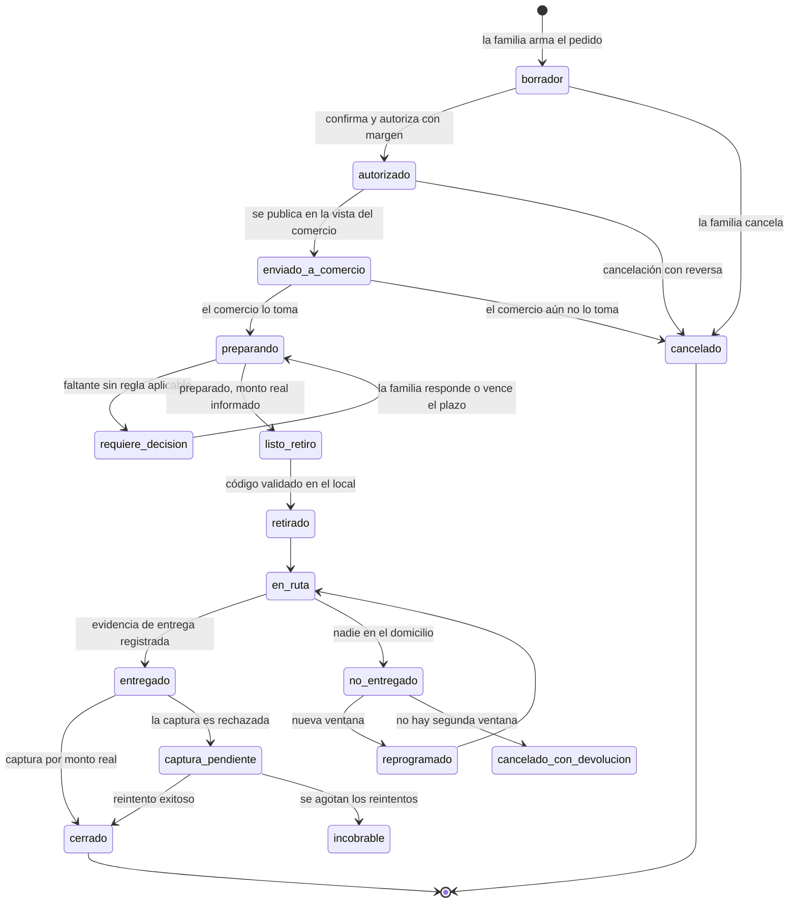

**El pedido se prepara antes de asignar repartidor**, no después. El comercio confirma `listo_retiro` con el monto real y recién ahí sale el retiro. Eso baja el tiempo del repartidor por pedido de unos 40 minutos a menos de 10.

**Efecto colateral valioso:** `requiere_decision` dejó de ser un cuello de botella. Ya no ocurre con alguien parado frente a una góndola sino con el comercio preparando, y hay minutos u horas para que la familia responda.

**Los estados de recaudación salen de la máquina del MVP.** `pendiente_recaudacion`, `expirado`, `sin_repartidor` y `cancelado_con_devolucion` por cascada agotada dependían del reparto multi-pagador y de la app de repartidor, ambos fuera del alcance comprometido. Quedan documentados en esta sección como el camino de evolución, y su reincorporación no cambia el modelo de datos.

| Estado | Por qué existe |
|---|---|
| `captura_pendiente` | Entre autorizar y capturar pasan horas. La tarjeta puede bloquearse **con la mercadería ya entregada** |
| `incobrable` | Salida de `captura_pendiente` cuando se agotan los reintentos. Es una pérdida reconocida, no un pedido eterno |
| `cancelado_con_devolucion` | Cierra el caso donde la mercadería ya salió del local y no llegó a destino |

Una prueba parametrizada recorre **todas las combinaciones** de estados y verifica que toda transición no declarada lanza. Dos pruebas adicionales comprueban que ningún estado no terminal queda sin salida y que todos son alcanzables desde `borrador`.

### 8.2 Autorización y captura

Una transacción con tarjeta tiene dos momentos que normalmente ocurren juntos y que aquí se separan a propósito.

**Autorizar** es preguntar al banco si la tarjeta tiene el monto y, si la respuesta es sí, **reservarlo**. El dinero no se mueve. **Capturar** es indicar cuánto de lo reservado se cobra. El resto se libera solo.

| Momento | Qué ocurre | Ejemplo |
|---|---|---|
| La familia confirma el pedido | Se **autoriza** el estimado más 15% de holgura | $69.000 retenidos |
| El comercio prepara e informa | Se registra el monto real | $51.340 |
| Se registra la entrega | Se **captura** el monto real | $51.340 cobrados |
| Automático | Se libera la diferencia | $17.660 liberados |

Sin separar los dos momentos hay que elegir entre cobrar el estimado y reembolsar en cada pedido, o salir a comprar sin certeza de fondos.

**Obligación de interfaz.** Al cliente se le retiene más de lo que paga durante algunas horas. Si la aplicación no lo explica, genera reclamos. Ver la sección 10.4.

**Riesgo abierto sobre el medio de pago.** La captura diferida de Transbank opera sobre transacciones de **crédito**. El débito se cursa en el acto y no admite retención con captura posterior, y es medio de pago mayoritario en el segmento objetivo. La prueba de concepto del sprint 0 lo verifica. Si se confirma, **el flujo cobra el monto estimado y emite nota de crédito por la diferencia**, que es peor experiencia pero no bloquea el semestre.

### 8.3 Regla de captura

Con un solo pagador la captura es directa: se captura `total_real` sobre la única participación, siempre menor o igual al monto autorizado. Si `total_real` excede lo autorizado, **se captura hasta el tope** y la diferencia se disputa con el comercio según el convenio, nunca se convierte en deuda del cliente.

**La regla de prorrateo por resto mayor se mantiene documentada y con su prueba escrita**, porque es la que se activa cuando RF-22 a RF-24 entren en la fase 2:

```python
def prorratear(total_a_capturar: int, participaciones) -> dict[str, int]:
    base = sum(p.monto_autorizado for p in participaciones)
    cuota, resto = {}, {}
    for p in participaciones:
        q, r = divmod(total_a_capturar * p.monto_autorizado, base)   # entero puro
        cuota[p.id], resto[p.id] = q, r
    faltan = total_a_capturar - sum(cuota.values())
    orden = sorted(participaciones, key=lambda p: (-resto[p.id], not p.es_respaldo, p.id))
    for p in orden[:faltan]:
        cuota[p.id] += 1
    return cuota
```

**Aritmética entera de punta a punta.** Una versión anterior usaba `total * monto / base`, que en Python devuelve coma flotante, y un valor exacto como 17.114,0 puede materializarse como 17.113,999999999996 y truncarse, desplazando un peso y el orden del desempate. Con `divmod` sobre enteros eso no puede ocurrir. Era el error que la decisión 7.6(a) prohíbe, cometido en la propia regla que reparte el dinero.

Con un solo pagador la función devuelve el total completo, de modo que **el MVP la ejecuta igual y su prueba de propiedad sobre 300 casos sigue corriendo**. Es la forma más barata de mantener viva la fase 2.

### 8.4 Flujo de pago con retorno de pasarela

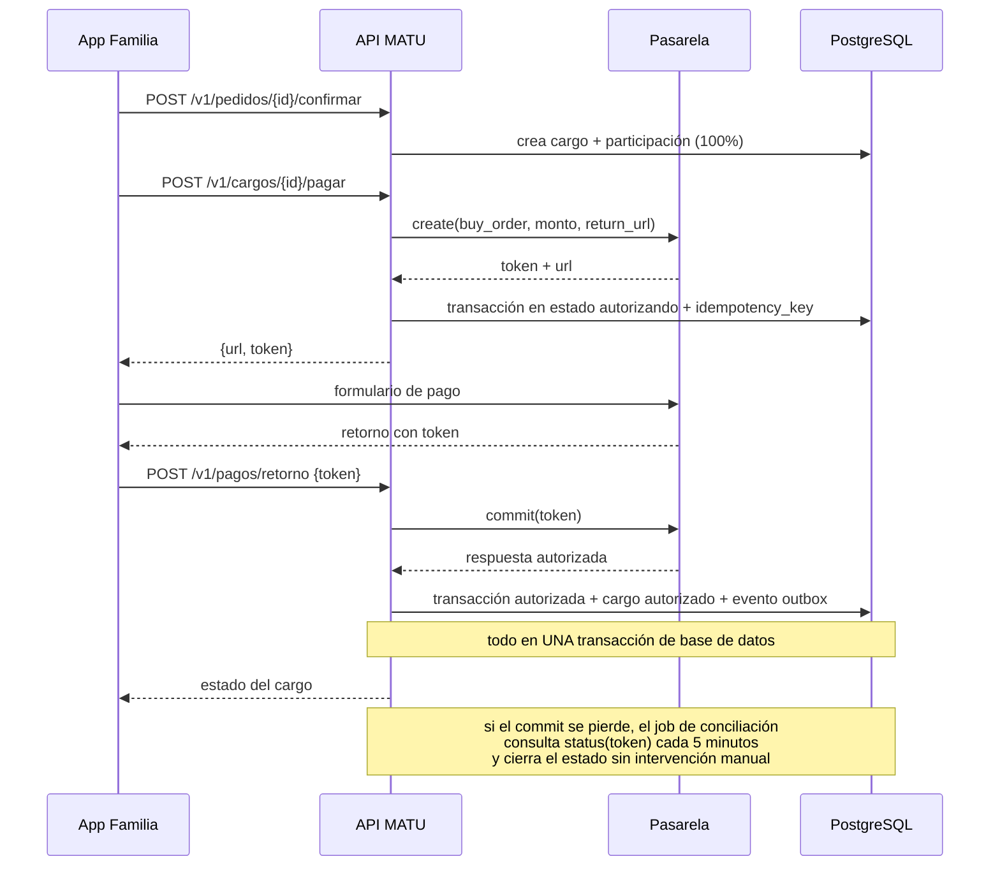

**Tres defensas contra el punto más frágil del sistema**, que es el usuario que paga y cierra el navegador antes de volver:

1. `commit` es idempotente por token. Un segundo llamado no cobra dos veces.
2. Un job de conciliación consulta el estado de toda transacción en `autorizando` con más de 10 minutos.
3. El resultado se escribe en **una sola transacción** junto con el cambio de estado y el evento del outbox.

### 8.5 Predicción de quiebre y lista de reposición

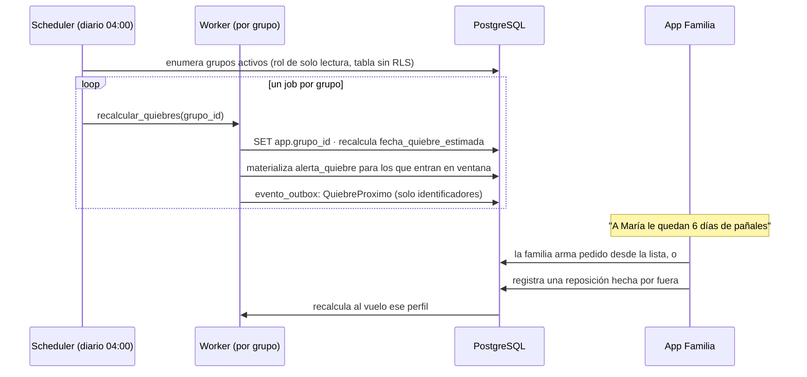

**El aviso es el momento de mayor valor del producto** y la validación lo confirmó de forma literal. Una entrevistada lo describió como el producto entero: «que me diga quedan cuatro días de pañales y yo apreto un botón y llega. Que no tenga que pensarlo yo».

Por eso el aviso se materializa como fila antes de enviarse: para que una corrida doble del job no genere dos notificaciones, y para que descartar y resolver sean transiciones auditables y no un borrado.

### 8.6 Contrato del outbox

| Aspecto | Definición |
|---|---|
| **Escritura** | El evento se inserta en `evento_outbox` **dentro de la misma transacción** que cambia el estado. Nunca fuera |
| **Payload** | Solo identificadores y tipo. **Nunca contenido de negocio ni datos personales**, porque el publicador es transversal a tenants |
| **Toma** | `SELECT ... FOR UPDATE SKIP LOCKED LIMIT 100 ORDER BY id` |
| **Orden** | **No se garantiza orden.** `SKIP LOCKED` con varios publicadores, y el backoff, rompen el FIFO por construcción. Afirmarlo y no cumplirlo es peor que no ofrecerlo |
| **Entrega** | **Al menos una vez.** El consumidor está obligado a ser idempotente |
| **Idempotencia** | Tabla `evento_consumido(evento_id, consumidor)` con clave primaria compuesta |
| **Reintentos** | Backoff exponencial: 1 s, 5 s, 30 s, 2 min, 10 min, 30 min, 1 h, 2 h |
| **Tope** | 8 intentos. Al superarlo pasa a `fallido`, se alerta a operación y **no se reintenta solo** |
| **Observabilidad** | Indicador de eventos con `intentos = 0` pendientes hace más de 5 minutos |

### 8.7 Preparación, retiro y liquidación

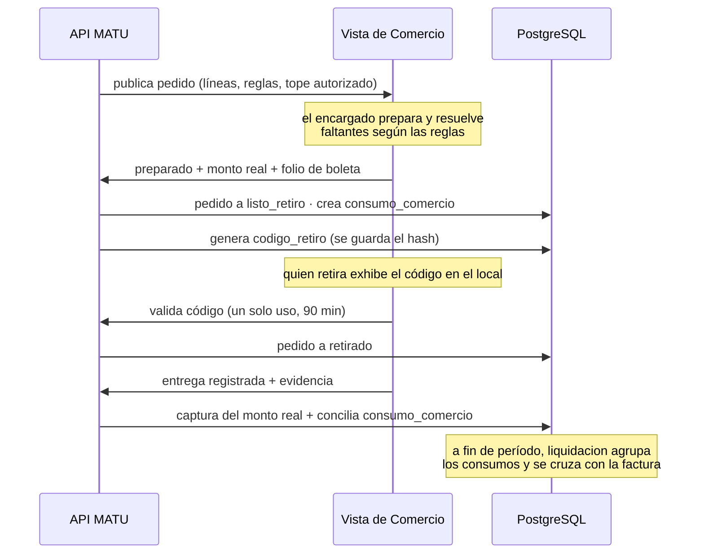

**El calce de caja va a favor de MATU:** se cobra a la familia el día de la entrega y se paga al comercio a fin de período. Es un argumento de viabilidad que conviene mencionar en la defensa, porque muestra que el modelo de negocio y la arquitectura se sostienen mutuamente.

**En el piloto, el retiro y la entrega se marcan desde la vista de comercio**, porque la app de repartidor quedó fuera del alcance comprometido. El flujo completo se demuestra igual.

---

## 9. Contratos de API

### 9.1 Convenciones transversales

| Aspecto | Definición |
|---|---|
| Base | `/v1` |
| Autenticación | `Authorization: Bearer <access_token>` JWT de 15 minutos, refresh rotativo de 30 días por dispositivo con detección de reutilización |
| Contexto de tenant | Header `X-Grupo-Id`. La API verifica membresía en cada petición y nunca confía en el header |
| Errores | RFC 7807 `application/problem+json` con `type`, `title`, `status`, `detail`, `errores[]` |
| Idempotencia | Header `Idempotency-Key` obligatorio en POST de pedidos, pagos y evidencias |
| Concurrencia | `If-Match` con `ETag` en PUT de secciones del plan de cuidado. Respuesta 412 con el contenido actual si cambió |
| Paginación | Cursor, no offset |
| Fechas | ISO 8601 con zona. El servidor opera en UTC, la aplicación muestra en America/Santiago |
| Versionado | La v1 no rompe contratos. Un cambio incompatible crea `/api/v2` |

### 9.2 Capa 1 · Plan de cuidado

```
POST   /v1/grupos/{id}/personas-cuidadas
GET    /v1/personas-cuidadas/{id}/plan              → secciones, completitud, ETags
PUT    /v1/personas-cuidadas/{id}/plan/ficha        → los tres campos obligatorios
PUT    /v1/personas-cuidadas/{id}/plan/secciones/{tipo}
       headers: If-Match: "<version>"               → 412 si otro miembro editó
       body: {contenido, en_nombre_de}              → llenado asistido (RF-42)
GET    /v1/personas-cuidadas/{id}/plan/exportar     → documento imprimible
POST   /v1/personas-cuidadas/{id}/plan/accesos-relevo
       body: {secciones:[...], expira_en, motivo, nombre, telefono}
DELETE /v1/accesos-relevo/{id}                      → revocación inmediata
GET    /v1/relevo/{token}                           → vista pública restringida, sin sesión
```

`PUT /plan/ficha` es nuevo en esta versión y es el endpoint que sostiene el ADR-023: escribe los tres campos obligatorios en una sola llamada, sin exigir el resto del plan.

### 9.3 Capa 2 · Perfil de consumo

```
GET    /v1/personas-cuidadas/{id}/consumo           → perfiles con fecha de quiebre
POST   /v1/personas-cuidadas/{id}/consumo
       body: {producto_id, tasa_uso, unidad_tasa, stock_estimado, dias_aviso}
PATCH  /v1/consumo/{id}
POST   /v1/consumo/{id}/reposiciones                → registrar compra hecha por fuera
GET    /v1/personas-cuidadas/{id}/lista-reposicion  → productos próximos a quiebre
POST   /v1/personas-cuidadas/{id}/lista-reposicion/exportar
                                                     → PDF o enlace compartible
GET    /v1/alertas?estado=pendiente
POST   /v1/alertas/{id}/descartar
POST   /v1/pedidos/desde-alertas                    → borrador por comercio (ADR-024)
```

### 9.4 Capa 3 · Catálogo, pedidos y pagos

```
GET    /v1/catalogo/categorias
GET    /v1/catalogo/productos?categoria=&q=&cursor=
GET    /v1/catalogo/productos/{id}/ofertas?comuna=

POST   /v1/pedidos                                  → crea borrador
PUT    /v1/pedidos/{id}/lineas
POST   /v1/pedidos/{id}/reglas-sustitucion
POST   /v1/pedidos/{id}/confirmar                   → crea cargo y autoriza con margen
GET    /v1/pedidos/{id}
POST   /v1/pedidos/{id}/cancelar
POST   /v1/pedidos/{id}/decisiones/{lid}

GET    /v1/cargos/{id}
POST   /v1/cargos/{id}/pagar                        → autoriza el monto con margen
POST   /v1/pagos/retorno                            → commit, público con validación de token
```

### 9.5 Comercio y operación

```
GET    /v1/comercio/pedidos?fecha=
GET    /v1/comercio/pedidos/{id}                    → líneas, reglas, tope autorizado
POST   /v1/comercio/pedidos/{id}/lineas/{lid}/resolver
POST   /v1/comercio/pedidos/{id}/preparado          → monto real y folio de boleta
POST   /v1/comercio/pedidos/{id}/validar-codigo
POST   /v1/comercio/pedidos/{id}/entregado          → dispara la captura

GET    /v1/backoffice/comercios/{id}/consumos?estado=&periodo=
POST   /v1/backoffice/consumos/{id}/conciliar
GET    /v1/backoffice/indicadores
```

### 9.6 Ejemplo de respuesta con la capa 2 en acción

```json
{
  "persona_cuidada": {"id": "3a...", "nombre": "María"},
  "generada_en": "2026-09-15T09:00:00-03:00",
  "items": [
    {
      "producto": "Pañal adulto talla M x30",
      "tasa_uso": "4 por día",
      "stock_estimado": 24,
      "dias_restantes": 6,
      "fecha_quiebre_estimada": "2026-09-21",
      "sugerido": {"cantidad": 2, "razon": "cubre 15 días"},
      "estado_alerta": "notificada"
    }
  ],
  "acciones": ["armar_pedido", "exportar_lista", "compartir_enlace"]
}
```

La clave está en `acciones`. **`exportar_lista` y `compartir_enlace` funcionan sin ningún comercio en convenio.** Es la decisión 2 de cabecera hecha contrato de API.

---

## 10. Diseño de interacción y accesibilidad

**Aquí la accesibilidad es un requisito funcional, no un acabado.** Y en esta versión, además, es la sección con más cambios de origen empírico: la validación con cuidadoras tocó directamente el diseño del flujo principal.

### 10.1 Perfiles de usuario

| Perfil | Edad medida | Contexto de uso | Implicancia de diseño |
|---|---|---|---|
| **Cuidador principal** | 38 a 71 en la muestra | En casa, con interrupciones constantes, muchas veces cansado o de noche | Todo tiene que poder pausarse y retomarse. Nada de formularios largos sin guardado |
| **Familiar que aporta** | 30 a 65 | A distancia, sin visibilidad de la operación, en dos minutos | El aportante quiere información, no logística. Puede no manejar aplicaciones |
| **Relevo** | 20 a 70 | Primera vez, con urgencia, en casa ajena, muchas veces sin instalar nada | Vista web, sin cuenta, legible en un teléfono prestado |
| **Cuidador remunerado** | 25 a 55 | Con contrato, alta competencia digital, sin relevo propio | Perfil no previsto en la v1.0 y el que mejor entendió el producto. Ver 10.6 |
| **Encargado de comercio** | 20 a 60 | En el local, con computador compartido, apurado | Una pantalla, sin navegación, sin aprendizaje previo |

### 10.2 Cinco principios de diseño

1. **Nada obligatorio de una sola vez.** La ficha de relevo son tres campos. Todo lo demás es opcional y ningún flujo lo exige.
2. **El sistema recuerda, la persona no.** El producto avisa antes del quiebre. El usuario nunca tiene que acordarse de nada.
3. **Un asunto por pantalla.** Sin pestañas, sin acordeones anidados, sin menús de tres niveles.
4. **El dinero se explica siempre.** Cada monto que aparece dice de dónde sale y en qué se puede convertir.
5. **La urgencia manda.** El caso "necesito relevo ahora" tiene que resolverse en dos toques, incluso a costa de configurabilidad.

### 10.3 Criterios de accesibilidad, medibles

| Criterio | Valor obligatorio | Cómo se verifica |
|---|---|---|
| Área táctil mínima | 48 × 48 dp, con 8 dp de separación | Inspección en el prototipo y prueba manual |
| Tamaño de texto base | 17 sp, escalable hasta **200%** sin pérdida de contenido ni de función | Prueba manual con el ajuste del sistema al máximo |
| Contraste de texto | 4,5:1 mínimo. 3:1 para texto grande y elementos gráficos | Verificación automática en el pipeline sobre los tokens de color |
| Identidad por color | **Nunca solo color.** Todo estado lleva ícono o etiqueta | Revisión de checklist por pantalla |
| Lenguaje | Sin jerga técnica ni clínica. "Se acaban en 6 días", no "stock proyectado" | Revisión por el equipo, con criterio explícito |
| **Lenguaje sobre el cuerpo** | Ningún campo obliga a escribir sobre incontinencia con ese término. Se pregunta por apoyos, no por funciones | **Criterio nuevo.** Tres de diez entrevistadas lo pidieron por dignidad de la persona cuidada |
| Etiquetado para lector de pantalla | Todo control con etiqueta semántica, incluidos íconos | Prueba con TalkBack en el flujo principal |
| **Entrada por dictado** | Disponible en todos los campos de texto del plan | Prueba manual |
| **Llenado asistido** | Un tercero puede completar la ficha en nombre del cuidador, con autoría registrada | RF-42, prueba de integración |
| Objetivo de tiempo | **Ficha de relevo completa en menos de 3 minutos** por una persona de 65+ sin ayuda | Prueba con 3 usuarios reales en la semana 13 |

### 10.4 Los tres momentos difíciles

**a) Explicar la retención mayor al cobro.** El sistema autoriza $69.000 y captura $51.340. Si no se explica, genera reclamos.

> **Solución:** al confirmar, un bloque fijo dice *"Reservamos $69.000 por si algún precio cambió. Se te cobrará solo lo que realmente cueste, y el resto se libera automáticamente."* Y al cerrar el pedido, una notificación dice *"Se cobraron $51.340. Los $17.660 restantes ya se liberaron."* La segunda frase es la que construye confianza.

**b) Llenar el plan de cuidado sin abandonar.** Era el riesgo de producto más grande del diseño y **la validación lo confirmó**: con ocho preguntas, solo tres de diez entrevistadas respondieron tres de ellas en menos de cinco minutos, cuando el criterio fijado exigía siete. Una rechazó responder y una abandonó en la segunda pregunta.

> **Solución, tras el ADR-023:** la versión mínima obligatoria es una ficha de tres campos que se responde en menos de dos minutos. Las ocho secciones quedan como ampliación opcional, con dictado por voz en todos los campos y una barra de completitud que celebra el avance sin castigar lo que falta. El acceso de relevo se genera con la ficha sola. Y se agrega el **llenado asistido** (RF-42), porque la entrevistada que abandonó no lo hizo por falta de disposición sino por el teclado del teléfono, y pidió ella misma que se lo leyeran y alguien escribiera.
>
> Dos hallazgos entran directamente a la redacción: el segundo campo se llama **"qué la calma"** y no "manejo de situaciones difíciles", porque es la expresión que usaron tres entrevistadas por su cuenta, y la rutina admite responder por el día bueno o el día malo, porque una entrevistada se trabó exactamente ahí.

**c) Presentar la auditoría de accesos sin que parezca vigilancia.** Cinco de diez entrevistadas declararon que no mirarían nunca la pantalla de "quién ha visto el plan". Dos la valoran, y por razones opuestas: una como termómetro de involucramiento familiar, la cuidadora remunerada como respaldo laboral.

> **Solución:** la funcionalidad se mantiene, porque la exige la Ley 21.719 y porque para el perfil remunerado es la función principal, pero **deja de ser una pantalla de primer nivel** y se presenta como "quién se está informando", no como un registro de vigilancia.

### 10.5 Prototipo y validación

El prototipo navegable de los flujos críticos está terminado y cubre:

0. Alta de persona cuidada y consentimiento
1. Ficha de relevo, secciones opcionales, acceso de relevo, vista del relevo, auditoría, revocación y versión imprimible
2. Declaración de consumo, alerta de quiebre y lista de reposición
3. Pedido y pago
4. Vista de comercio
5. Errores y casos borde

En total **32 pantallas en siete recorridos**. Se usó como instrumento en las diez entrevistas de validación, lo que permitió medir conducta y no opinión: la prueba cronometrada del plan de cuidado se hizo sobre él.

**Validación de usabilidad pendiente:** tres usuarios reales, de tres perfiles distintos, en la semana 13. No es investigación de mercado, es prueba de usabilidad, y con tres personas se detecta la mayoría de los problemas graves.

### 10.6 Un perfil que la validación descubrió

**La cuidadora remunerada no estaba en el diseño y es quien mejor entendió el producto.** Lo describió espontáneamente con el término técnico correcto, "entrega de turno", que trajo del vocabulario clínico. Completó la prueba en 2 minutos 45 segundos, el mejor tiempo del piloto, porque ya lleva un cuaderno de turno desde hace once meses. Y planteó dos cosas que el diseño no resuelve:

- **El registro que escribe una trabajadora tiene consecuencias laborales para ella.** Preguntó de quién es ese registro, si de la familia o suyo. No hay respuesta en la arquitectura y queda como consulta legal abierta en la sección 18.
- **Su cuaderno es de su propiedad y se lo lleva si se va.** La continuidad del cuidado depende hoy de alguien con contrato. Es exactamente el hueco que el producto viene a cerrar, visto desde el lado que la v1.0 no había mirado.

Se documenta como línea de continuidad para la fase 2, no como cambio de alcance del semestre.

---

## 11. Seguridad, privacidad y cumplimiento

### 11.1 Marco legal aplicable

La **Ley 21.719** de protección de datos personales, publicada en diciembre de 2024, entra plenamente en vigencia el **1 de diciembre de 2026**, dentro del horizonte de vida del proyecto. Crea una Agencia con potestad sancionatoria, exige consentimiento verificable y documentado, medidas de seguridad proporcionales al riesgo y notificación de brechas sin dilación indebida.

MATU trata datos que la ley clasifica como sensibles: estado de salud y condición de dependencia. **Con la estructura en tres capas, el plan de cuidado es el núcleo del producto, y por lo tanto el cumplimiento es estructural y no accesorio.**

| Exigencia legal | Traducción técnica |
|---|---|
| Consentimiento explícito, verificable y versionado | Tabla `consentimiento` con finalidad, versión de política y evidencia. Sin consentimiento vigente, `care_plan` devuelve 403 |
| Finalidad limitada y minimización | Proyecciones por rol. El comercio recibe un DTO distinto, no el objeto completo con campos ocultos en la interfaz |
| Medidas proporcionales al riesgo | Sobre-cifrado por sección, MFA para operación, URLs firmadas de vida corta, cifrado de volumen |
| Notificación de brecha **sin dilación indebida** | La ley chilena exige notificar sin dilación indebida a la Agencia y a los titulares. **El plazo de 72 horas proviene del RGPD europeo**, y se adopta como objetivo interno, no como cifra legal chilena. Requiere **detectar**: registro de acceso a datos sensibles con alerta ante patrones anómalos |
| Derechos de acceso, rectificación y supresión | Endpoints de exportación y borrado por titular, con borrado lógico que respeta obligaciones contables sobre pagos |
| Encargados de tratamiento | Comercio y proveedores de infraestructura son encargados. Requieren cláusula contractual y registro |

### 11.2 Modelo de autorización

Tres dimensiones, evaluadas siempre en este orden: **quién es** (JWT válido y no revocado), **si pertenece al tenant** (consulta a `membresia` más contexto RLS) y **si su rol permite la acción sobre ese recurso**.

| Rol | Plan de cuidado | Perfil de consumo | Catálogo | Pedidos | Pago | Datos de la persona cuidada |
|---|---|---|---|---|---|---|
| `admin` del grupo | ver, editar, compartir | ver, editar | ver | crear, cancelar | pagar | completo |
| `cuidador` | ver, editar, compartir | ver, editar | ver | crear | no | completo |
| `pagador` | según permiso explícito | ver | ver | ver | pagar | nombre, dirección |
| `observador` | no | ver | ver | ver | no | nombre |
| `relevo` (token) | **solo secciones habilitadas, solo lectura** | no | no | no | no | nombre de pila |
| `comercio` | **nunca** | **nunca** | solo su propia oferta | solo sus pedidos del día | no | nombre de pila, **sin dirección de entrega** |
| `operación` | **nunca** | **nunca** | administrar | ver todos, intervenir | ver, reembolsar, liquidar | nombre, dirección |

**Las celdas "nunca" no se garantizan por permiso, se garantizan por arquitectura.** `fulfillment`, `settlement` y `backoffice` no importan `care_plan` ni `consumption`, y la regla se verifica con la prueba de dependencias de la sección 6.4. Un permiso se puede configurar mal. Una importación que no existe, no.

### 11.3 Minimización de datos de salud

**`persona_cuidada` no tiene campo de diagnóstico.** Tiene `nivel_apoyo`, un enumerado operacional (`autovalente_con_supervision`, `apoyo_parcial`, `apoyo_total`), que es lo que el servicio realmente necesita.

Guardar "demencia tipo Alzheimer, etapa moderada" no cambiaría ni un pañal del catálogo, pero convertiría la base de datos en un repositorio clínico con las obligaciones correspondientes. **El diagnóstico es del sistema de salud, no de una plataforma de continuidad del cuidado.**

Lo mismo aplica al plan de cuidado: sus secciones describen **conducta y manejo**, no patología. "Se altera cuando hay ruido fuerte, ayuda bajar las persianas" es información de cuidado. "Demencia frontotemporal con desinhibición" es información clínica y no entra al sistema.

**El mismo criterio gobernó el protocolo de entrevistas**, que prohibió anotar diagnósticos y datos identificatorios de la persona cuidada. Que la investigación y el producto compartan la regla de minimización no es casualidad: es la misma decisión aplicada dos veces.

### 11.4 Sobre-cifrado del plan de cuidado

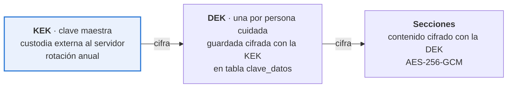

**Por qué dos niveles.** Rotar la clave maestra no obliga a redescifrar y recifrar todo el contenido, solo las claves de datos, que son pocas y pequeñas. Y borrar los datos de una persona cuidada se reduce a destruir su clave de datos, lo cual es borrado criptográfico inmediato y verificable.

**Dónde vive la clave maestra.** El ADR-016 lo cierra: en el servicio de custodia de secretos del proveedor de nube, no en el servidor de aplicación. Si el despliegue del piloto termina siendo un VPS único sin ese servicio disponible, **la limitación se declara explícitamente** en el informe: la clave estaría en variable de entorno en el mismo servidor, quien accede al servidor accede a todo, y el piloto no debe operar con datos reales de terceros hasta migrar.

### 11.5 Quién consiente por una persona con demencia

Esta es la pregunta jurídica central del proyecto.

**El problema.** La Ley 21.719 exige el consentimiento del titular o de su representante legal para tratar datos sensibles. En MATU el titular es, con frecuencia, una persona con demencia moderada o avanzada, es decir sin capacidad para consentir. Y quien opera la aplicación suele ser un hijo o hija que **no tiene interdicción declarada ni curatela**: es un cuidador de hecho. Esa es la situación mayoritaria en Chile, no la excepción, y las diez entrevistas la confirmaron sin excepción.

| Calidad del otorgante | Qué habilita | Qué exige |
|---|---|---|
| `titular` | Todo, incluido el plan de cuidado completo | Declaración del propio titular, registrada con fecha y versión de política |
| `representante_legal` | Todo | Declaración más referencia al documento que acredita la representación. **No se almacena el documento**, solo su referencia |
| `cuidador_de_hecho` | Todo, con **alcance declarado y revisión periódica** | Declaración responsable de la relación de cuidado, aviso explícito de la limitación y recordatorio anual |

**Lo que el diseño reconoce que no resuelve.** El caso `cuidador_de_hecho` es una zona gris. MATU no puede verificar la representación y no pretende hacerlo. Lo que sí hace es **registrar la calidad declarada**, mostrarla en la interfaz, y no tratarla como equivalente a un consentimiento del titular.

**Y la validación agregó una segunda pregunta jurídica que no estaba.** Cuando quien escribe el plan es una **cuidadora remunerada con contrato**, el registro deja de ser solo un dato sensible de la persona cuidada y pasa a ser también un antecedente laboral de quien lo escribe. La entrevistada lo planteó con precisión: si anota que un día la persona estuvo agresiva y eso lo lee un hijo, puede volverse en su contra o en contra de la persona cuidada. **No hay respuesta en la arquitectura** y se incorpora a la consulta legal pendiente de la sección 18.

**Por qué esto importa para la arquitectura y no solo para el informe.** Sin consentimiento vigente, el módulo `care_plan` devuelve 403. Es la única puerta de entrada al dato sensible, y esa puerta depende de una tabla que distingue quién otorgó y con qué calidad.

### 11.6 Controles técnicos

| Capa | Control |
|---|---|
| Transporte | TLS 1.3 y HSTS. **Sin certificate pinning en el piloto**: con renovación automática de certificados, fijar el certificado hoja inhabilita todas las instalaciones publicadas cada 60 días |
| Autenticación | Argon2id, access token de 15 min, refresh rotativo con detección de reutilización, MFA obligatorio para operación. **La revocación de un access token es efectiva en 15 minutos por caducidad**, no de forma inmediata: un JWT autocontenido no se revoca. Se acepta y se declara |
| API | Rate limiting por IP y por usuario, validación estricta con Pydantic, CORS restringido, proyecciones por rol |
| Base de datos | RLS forzado en toda tabla de negocio, con las dos excepciones de la sección 7.7 acotadas por permiso, usuario de aplicación sin `SUPERUSER`, `auditoria` sin UPDATE ni DELETE, cifrado de volumen |
| Datos sensibles | Sobre-cifrado por sección, borrado criptográfico, sin plan de cuidado en ningún registro de log |
| Archivos | Bucket privado, URL firmada de 5 minutos para lectura y 15 para subida, sin CDN público, hash SHA-256 de cada evidencia |
| Acceso de relevo | Token de **uso múltiple hasta vencer** más **PIN de cuatro dígitos** enviado al teléfono registrado, alcance por sección, revocación inmediata, cada apertura auditada. El enlace se canjea por una cookie de sesión efímera en un paso, para que el token no quede en el historial de un teléfono prestado |
| Secretos | Variables inyectadas, nunca en el repositorio, escaneo de secretos en el pipeline |
| Aplicación móvil | Sin datos sensibles en el dispositivo, tokens en el keystore del sistema, bloqueo de captura de pantalla en la vista del plan de cuidado |
| Registro | Logs estructurados en JSON, sin datos personales en el mensaje, correlación por `request_id` |

### 11.7 Control de fraude sobre la cuenta del comercio

| Control | Implementación |
|---|---|
| Código de retiro de un solo uso | Generado al preparar, guardado con hash, vence en 90 minutos, se invalida al primer uso |
| Tope autorizado por pedido, como control **detectivo** | Viaja al comercio con el pedido. **No es un control técnico**: sin integración con el punto de venta, el tope es un número en una pantalla que el encargado puede ignorar. Si `monto_boleta` lo excede, la conciliación marca la desviación, MATU captura hasta el tope y la diferencia se disputa con el comercio. Presentarlo como barrera dura era falso |
| Conciliación boleta contra pedido | `consumo_comercio.desviacion_pct`. Sobre umbral abre incidencia sin bloquear la entrega |
| Evidencia de entrega | Foto de boleta con hash que impide alteración posterior |
| Bloqueo automático **del comercio** | Dos desviaciones de monto en 30 días abren revisión del convenio. En modo `preparado` el comercio informa el monto, de modo que la desviación le es imputable |

Que la incidencia **no bloquee la entrega** es deliberado: la familia está esperando insumos que no admiten quiebre.

### 11.8 Retención

| Dato | Retención | Fundamento |
|---|---|---|
| Registro de pagos y boletas | 6 años | Obligación tributaria |
| Pedidos y evidencias de entrega | 2 años | Resolución de disputas |
| **Plan de cuidado** | Mientras exista consentimiento vigente, más 90 días | Dato sensible. Se minimiza |
| Perfil de consumo | Igual que el plan de cuidado | Deriva de él |
| Auditoría de acceso | 3 años | Capacidad de acreditar cumplimiento |

---

## 12. Estrategia de calidad y pruebas

**Un sistema cuyo atributo de calidad número uno es la integridad del pago no puede tener como plan de pruebas una meta de cobertura.**

### 12.1 Principio: la testabilidad es una decisión de arquitectura

Toda dependencia externa entra por un **puerto** definido en `application/ports.py` de su módulo, con al menos dos implementaciones.

| Puerto | Real | Doble |
|---|---|---|
| `PasarelaPago` | `TransbankAdapter` | `PasarelaFalsa` con respuestas programables, incluidas las de falla |
| `AlmacenObjetos` | `S3Adapter` | `AlmacenEnMemoria` |
| `Notificador` | `FcmAdapter` | `NotificadorRegistrador` que solo acumula |
| `Reloj` | `RelojSistema` | `RelojFijo`, indispensable para probar vencimientos y predicciones |
| `CustodiaClaves` | `KmsAdapter` | `CustodiaEnMemoria` |

**El `Reloj` como puerto no es purismo.** Sin él no se puede probar la expiración del token de relevo ni la predicción de quiebre, que son dos de las piezas más importantes del sistema.

### 12.2 Niveles de prueba

| Nivel | Qué cubre | Herramienta | Dónde corre | Objetivo |
|---|---|---|---|---|
| **Unitarias de dominio** | Reglas puras: cálculo de quiebre, prorrateo, transiciones de estado | pytest, sin base de datos | Cada push, < 10 s | **85% en `app/modules/*/domain` y `app/shared`** |
| **Integración** | Repositorios, RLS, migraciones, transacciones | pytest + PostgreSQL en contenedor | Cada push, < 3 min | 70% en `application/` |
| **Contrato de API** | Que el esquema generado por el código **no rompa** el contrato versionado en `docs/api/openapi.json` | comparación del generado contra el versionado, más schemathesis | Cada push | 100% de endpoints |
| **Extremo a extremo** | Los seis recorridos críticos | pytest + cliente HTTP + dobles | Cada push | Los 6, siempre verdes |
| **Interfaz** | Widgets críticos y accesibilidad básica | flutter test | Cada push de móvil | Los flujos del prototipo |
| **Manual con pasarela real** | Autorizar, capturar por menos, revertir | Guion escrito, ambiente de integración | Sprint 0 y sprint 7 | 3 casos |
| **Usabilidad** | 3 usuarios reales, de tres perfiles distintos | Guion de tareas | Semana 13 | 3 sesiones |

**Sobre la cobertura.** La meta es 85% en `domain/` y 70% en `application/`, y **ninguna meta en `infrastructure/`**. Una meta global de 70% se cumple probando adaptadores triviales y dejando sin probar la regla de cálculo de quiebre.

### 12.3 Cómo se prueban las máquinas de estado

Las transiciones válidas se declaran una vez, como dato, y la prueba las recorre todas:

```python
TRANSICIONES_VALIDAS = {
    ("borrador", "autorizado"),
    ("borrador", "cancelado"),
    ("autorizado", "enviado_a_comercio"),
    ("autorizado", "cancelado"),
    # ... el conjunto completo
}

@pytest.mark.parametrize("desde", ESTADOS)
@pytest.mark.parametrize("hacia", ESTADOS)
def test_transiciones(desde, hacia):
    pedido = pedido_en(desde)
    if (desde, hacia) in TRANSICIONES_VALIDAS:
        pedido.transicionar_a(hacia)
        assert pedido.estado == hacia
    else:
        with pytest.raises(TransicionInvalida):
            pedido.transicionar_a(hacia)
```

**Es la mejor relación entre esfuerzo y confianza de todo el plan**, y cubre el error más frecuente en sistemas de estados, que es la transición que nadie previó.

### 12.4 Pruebas obligatorias del flujo de pago

Siete casos que tienen que estar verdes antes de considerar terminado el módulo de pagos.

| # | Caso | Resultado esperado |
|---|---|---|
| 1 | Autorizar y capturar por el mismo monto | Cargo capturado, pedido cerrado |
| 2 | Autorizar y capturar por menos | Se captura el real, se libera la diferencia |
| 3 | Autorizar y revertir | Autorización liberada, nada cobrado |
| 4 | Retorno de pasarela recibido dos veces | Un solo cobro. Idempotencia por token |
| 5 | Retorno nunca recibido | El job de conciliación cierra el estado en menos de 15 min |
| 6 | Pasarela no responde durante 20 minutos | Reintentos con backoff, sin doble cobro, alerta a operación |
| 7 | Monto real mayor al autorizado | Se captura el autorizado. **La diferencia es pérdida de MATU o se disputa con el comercio, no es un saldo del cliente** |

**Los casos 1 a 3 se ejecutan además manualmente contra el ambiente de integración de Transbank en el sprint 0**, porque si alguno falla cae el ADR-006 y hay que saberlo en la semana 7, no en la semana 14. **Y hay un cuarto caso que la prueba de concepto debe verificar: el medio de pago.** La captura diferida opera sobre crédito y el débito es mayoritario en el segmento.

**Los cinco casos de recaudación multi-pagador quedan escritos y marcados como `skip`**, para que se activen junto con RF-22 a RF-24 en la fase 2 sin volver a diseñarlos.

### 12.5 Pruebas obligatorias de aislamiento y privacidad

| # | Caso | Resultado esperado |
|---|---|---|
| 1 | Usuario del grupo A consulta un pedido del grupo B por identificador | 404, nunca 403, para no confirmar existencia |
| 2 | Consulta SQL directa sin fijar `app.grupo_id` | Cero filas |
| 3 | Job de worker sin fijar el contexto | Cero filas, y la prueba falla si el job asumió lo contrario |
| 4 | Comercio consulta el endpoint del plan de cuidado | 404. El router ni siquiera está montado para su rol |
| 5 | Respuesta de pedido al comercio | El esquema no contiene ningún campo del plan de cuidado ni del perfil de consumo |
| 6 | Token de relevo vencido | 410, y la apertura queda auditada como intento. **Criterio de códigos:** 404 cuando el solicitante no tiene relación alguna con el recurso. 403 o 410 cuando la relación ya está acreditada |
| 7 | Token de relevo con alcance de dos secciones | La respuesta contiene exactamente esas dos |
| 8 | Acceso al plan sin consentimiento vigente | 403 con motivo explícito |
| 9 | Lectura de `idempotencia` desde otro grupo | Cero filas. Regresión del defecto 4 de la sección 12.8 |
| 10 | Escritura sobre el plan después del borrado criptográfico | Error de dominio explícito, **nunca una clave nueva en silencio**. Regresión del defecto 5 |

### 12.6 Criterio de terminado

Una historia está terminada cuando, y solo cuando:

1. Tiene pruebas de dominio de sus reglas nuevas.
2. Tiene al menos una prueba de integración del camino feliz y una del principal camino de error.
3. El pipeline pasa completo, incluidas las pruebas de arquitectura y de aislamiento.
4. Si toca una pantalla, cumple los criterios de accesibilidad de la sección 10.3.
5. Si toca dinero o datos sensibles, la revisa la otra persona del equipo. **Sin excepción.**

### 12.7 Integración continua

```yaml
# .github/workflows/ci.yml (esquema)
on: [push, pull_request]
jobs:
  calidad:
    - ruff check + ruff format --check
    - mypy app/
    - pytest tests/unit --cov=app/modules --cov=app/shared --cov-fail-under=85
    - pytest tests/integration --cov=app/modules --cov-fail-under=70
    - openapi-diff docs/api/openapi.json <(python -m app.exportar_openapi)
    - pytest tests/test_arquitectura.py       # regla de dependencias
    - pytest tests/test_aislamiento.py        # RLS entre grupos y en workers
    - pytest tests/test_capa3_desacoplable.py # arranca sin la capa 3
    - schemathesis run openapi.json
    - detect-secrets scan
  migraciones:
    - alembic upgrade head sobre base efímera
    - alembic downgrade -1 y upgrade de vuelta   # reversibilidad
  build:
    - docker build api, worker
  deploy:
    - solo en main, tras aprobación
    - migración antes del cambio de imagen
    - healthcheck posterior, rollback automático si falla
```

La prueba `test_capa3_desacoplable.py` merece mención aparte: debe **arrancar la aplicación con los routers de la capa 3 desactivados y verificar que los flujos de las capas 1 y 2 responden.** Es la garantía ejecutable de la decisión 2 de cabecera. Es entregable del sprint 3.

### 12.8 Cinco defectos que el modelo de aislamiento tenía y no se veían

El modelo de la sección 7.7 no se dio por bueno al escribirlo. Se revisó escribiendo las políticas una por una y siguiendo, para cada rol, qué filas alcanzaría realmente en PostgreSQL. Ese ejercicio encontró **cinco defectos que la lectura del diseño no dejaba ver**:

1. El rol de operación alcanzaba el plan de cuidado por herencia de política.
2. `clave_datos` heredaba de `persona_cuidada` y quedaba al alcance de ese mismo rol.
3. `usuario` y `grupo_familiar` habían quedado sin política alguna.
4. **`idempotencia` guardaba cuerpos de respuesta de pedidos y pagos sin columna de tenant y sin RLS.** Era una tercera excepción no declarada al modelo de aislamiento.
5. **Tras el borrado criptográfico el servicio generaba una clave nueva en silencio**, dejando filas cifradas huérfanas y una falsa sensación de que el dato seguía ahí.

Los cinco están corregidos y cada uno queda comprometido como prueba de regresión en la sección 12.5. **Es el argumento más fuerte que este documento puede ofrecer sobre su propio modelo de aislamiento: no se afirma correcto, se afirma revisado hasta encontrarle cinco errores, y corregido en los cinco.**

---

## 13. Despliegue e infraestructura

### 13.1 Topología

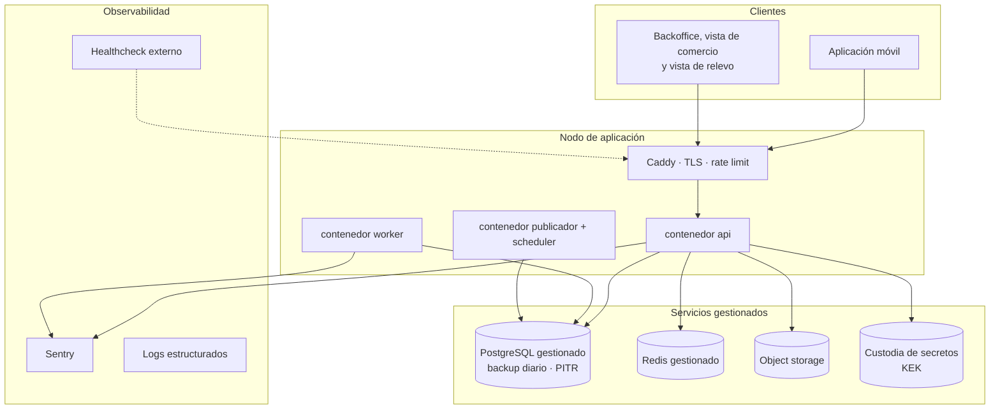

**Recomendación (ADR-019): una instancia de cómputo persistente en un proveedor con base de datos gestionada y servicio de secretos.** No una plataforma de escalado a cero, que no sostiene un worker en escucha permanente ni un bucle de publicador de outbox.

Las razones son **acumuladas**: respaldos gestionados con recuperación a un punto en el tiempo, restauración probada, y custodia de secretos separada del cómputo. Sobre esta última conviene ser preciso: **un servicio de custodia impide extraer la clave maestra, no impide usarla.** Una API comprometida puede invocar el descifrado tantas veces como quiera. El beneficio real es contra robo de respaldos y de disco, y el control complementario es el registro de uso de la clave con alerta por volumen anómalo.

Kubernetes queda descartado: consume sprints y no agrega puntos en la defensa.

### 13.2 Entornos

| Entorno | Propósito | Datos |
|---|---|---|
| Local | `docker compose up` levanta todo | Semillas sintéticas, jamás datos reales |
| Staging | Integración, demostración al profesor guía, pasarela en modo integración | Sintéticos |
| **Demostración** | **Entorno dedicado con catálogo semilla, comercio simulado y guion de recorrido** | Sintéticos verosímiles |
| Producción | Fuera del alcance del semestre. Requiere persona jurídica. Ver 16.6 | — |

**El entorno de demostración es entregable del sprint 6, en la semana 13, no del último.** En un proyecto cuyo mayor riesgo externo es no conseguir convenio, el entorno de demostración es también el plan de contingencia de la defensa.

**El catálogo semilla se arma con los productos que reportaron las entrevistadas**, y no con una lista inventada: pañales de adulto, toallitas húmedas, protectores diarios, crema para escaras, suplemento nutricional y bolsas de ostomía. Los seis salieron de quiebres reales relatados en el piloto.

### 13.3 Observabilidad mínima viable

- Logs estructurados en JSON con `request_id`, `usuario_id`, `grupo_id`, nunca datos personales en el mensaje.
- Sentry para excepciones no controladas, con `release` atado al SHA del despliegue.
- `/health` que verifica base de datos, Redis, almacenamiento y custodia de claves, consultado por un monitor externo.
- **Cuatro indicadores de negocio** en el backoffice, que son los que se muestran en la defensa: pedidos por estado, **alertas de quiebre generadas y convertidas en pedido**, tiempo medio de entrega y **completitud media de la ficha de relevo**.

Los dos indicadores en negrita son los que miden si el producto funciona como producto y no solo como software. El segundo cambió de métrica en esta versión: mide la ficha, que es lo obligatorio, y no el plan completo.

---

## 14. Decisiones de arquitectura (ADR)

### ADR-001 · MATU es un sistema de continuidad del cuidado en tres capas

**Contexto.** Los dos diseños anteriores concibieron MATU como plataforma de despacho con una bitácora de cuidados anexa en fase 2. Dos evaluaciones independientes llegaron al mismo hallazgo: el activo diferenciador estaba relegado y el componente replicable estaba al centro.

**Decisión.** Reestructurar en tres capas con dependencia estrictamente descendente. Capa 1, el plan de cuidado, es el núcleo. Capa 2, el perfil de consumo y la predicción de quiebre, deriva de la capa 1. Capa 3, el despacho, deriva de la capa 2 y es desacoplable.

**Consecuencias.**
- El diferenciador se construye desde el sprint 2 y queda demostrable de punta a punta en el sprint 3.
- La pregunta "¿esto no lo hace Cornershop?" tiene respuesta estructural: un despacho genérico no sabe cuánto consume la persona cuidada.
- El cumplimiento de la Ley 21.719 pasa de importante a estructural, porque el núcleo del producto es dato sensible.
- El cuidador principal reemplaza al familiar pagador como usuario central.

**Qué dijo la validación.** La reforzó y la corrigió a la vez. La reforzó porque H2 quedó validada con margen y porque cuatro de diez entrevistadas ya llevan un registro propio, una de ellas una hoja de traspaso manuscrita que es el producto en papel. La corrigió porque H1 cayó: el problema es real, el formato de ocho preguntas no. Ver ADR-023.

**Alternativas descartadas.** Mantener el despacho al centro: deja el proyecto expuesto a la dependencia del convenio. Pivotar a venta institucional: correcto como destino, inviable como punto de partida.

---

### ADR-002 · El despacho es desacoplable

**Contexto.** El MVP del diseño anterior no se podía construir sin al menos un comercio dispuesto a convenio. Era el único punto de falla externo y no estaba bajo control del equipo.

**Decisión.** Las capas 1 y 2 no dependen de la capa 3. Si no hay convenio, la familia **exporta su lista de reposición** y compra donde quiera.

**Consecuencias.** La exportación de lista es un requisito de primer orden (RF-15), no un extra. Una prueba automática lo verifica arrancando la aplicación sin la capa 3. El riesgo del convenio baja de crítico a medio.

**Qué dijo la validación.** Que el sustituto está instalado: tres de diez ya compran por aplicación y están conformes, y una rechaza el despacho por especificidad del producto. MATU no compite contra la nada, lo que hace del desacoplamiento una decisión más valiosa, no menos.

**Costo.** Se pierde parte del atractivo inmediato de "delivery para el cuidado". Se gana un producto que existe sin permiso de terceros.

---

### ADR-003 · El perfil de consumo lo declara el cuidador

**Contexto.** El sistema necesita saber a qué ritmo se consume cada insumo. Hay dos caminos: inferirlo del historial de pedidos o preguntárselo a quien cuida.

**Decisión.** Lo declara el cuidador. Tasa de uso, unidad y stock estimado, en un formulario de tres campos por producto.

**Por qué.** Al inicio no existe historial del cual inferir, y el problema del arranque en frío haría inútil la funcionalidad justo cuando más importa. Además, quien cuida **sabe** cuántos pañales al día se usan.

**Qué dijo la validación.** Que el dato existe y es preciso. Cuatro de diez llevan cuenta propia, con umbrales explícitos: una cuenta sus bolsas cada domingo y compra cuando bajan de ocho. **Ese umbral es exactamente `dias_aviso` puesto por la usuaria.** Pero también mostró el límite: dos de los seis quiebres no eran de previsión sino de mercado y de receta, y la capa 2 no los evita.

**Evolución.** La inferencia desde el historial queda como RF-35 de fase 2, para **corregir** la declaración, nunca para reemplazarla.

---

### ADR-004 · Monolito modular en lugar de microservicios

**Decisión.** Un solo despliegue de FastAPI con módulos de límite explícito, comunicación por interfaces de aplicación y eventos de dominio vía outbox.

**Consecuencias.** Una transacción de base de datos cubre operaciones que en microservicios exigirían saga distribuida. Un pipeline, un despliegue, depuración local trivial. A cambio, todo escala junto, lo cual es irrelevante con decenas de pedidos diarios.

**Salida futura.** Los límites de módulo y el outbox son exactamente lo que permitiría extraer un servicio si hiciera falta.

---

### ADR-005 · Flutter con un repositorio y dos aplicaciones

**Decisión.** Flutter, monorepo con un paquete `core` compartido. En el MVP se publica solo `app_familia`.

**Por qué Flutter y no React Native. Una sola razón, y es honesta.** La aplicación de repartidor necesita **ubicación en segundo plano y cámara con buen rendimiento**, y el soporte para ese par está más consolidado en un solo paquete.

**Se elimina la segunda razón que el diseño anterior alegaba**, porque se invierte con su propia premisa: el equipo **ya** construye un backoffice en React con TypeScript, luego ya carga npm. React Native no agregaría ningún lenguaje nuevo, mientras Dart sí agrega un tercer lenguaje. **Un ADR con una razón sólida es más defendible que uno con una sólida y una falsa.**

**Sobre accesibilidad, con corrección respecto del diseño anterior.** Renderizar canvas propio significa que la aplicación **no hereda** el árbol de accesibilidad nativo y debe reconstruirlo mediante una capa de semántica. Flutter lo resuelve bien, pero es trabajo explícito, no una ventaja gratuita. Los criterios de la sección 10.3 hay que implementarlos y probarlos a mano.

**Nota de alcance.** Con la app de repartidor fuera del alcance comprometido, la razón principal de este ADR queda sin ejercitarse en el semestre. Se mantiene la decisión porque el `core` compartido ya está diseñado y porque cambiar de stack ahora costaría más que sostenerlo, pero se declara: **si el proyecto continuara sin app de repartidor, React Native sería la elección correcta.**

---

### ADR-006 · Autorización con margen y captura por monto real

**Contexto.** El precio no se conoce hasta que el comercio prepara. Cobrar el estimado obliga a reembolsar en casi todos los pedidos, y reembolsar es lento, caro y genera desconfianza.

**Decisión.** Webpay Plus en modalidad diferida. Al confirmar se autoriza `total_estimado × 1,15`. Al registrar la entrega se captura el `total_real`. La diferencia se libera automáticamente.

**Consecuencias.** El cliente ve una retención mayor durante algunas horas, lo que exige la comunicación de la sección 10.4. Se elimina el reembolso como operación rutinaria. Si el monto real excede lo autorizado, **se captura solo hasta el tope**.

**Riesgo declarado.** Depende de que la captura parcial y la reversa se comporten como documenta el proveedor, y de que operen sobre el medio de pago del segmento. Se verifica en el **sprint 0, semana 7**. Si el débito no lo admite, el plan B es cobrar el estimado y emitir nota de crédito.

---

### ADR-007 · El pago del MVP es de un solo pagador

**Contexto.** El documento conceptual pide dividir el gasto entre familiares. **Ninguna pasarela chilena divide un cobro entre pagadores distintos**, de modo que había que orquestarlo: autorizaciones independientes, plazo de recaudación, redistribución sobre un respaldo y captura prorrateada por resto mayor. El diseño completo está en la sección 8.3 y es correcto.

**Decisión, revisada en esta versión: el reparto multi-pagador sale del alcance comprometido del semestre y pasa a la fase 2.** RF-22, RF-23 y RF-24 bajan a *Podría*. RF-25 se mantiene sin prorrateo.

**Por qué cambió, y son dos razones que se refuerzan.**

**Primera, la evidencia.** H5 preguntaba si el gasto se reparte y genera fricción. Cuatro de diez reparten, cuando el criterio de validación exigía cinco y el de refutación tres: zona intermedia. H6 preguntaba si quien paga no es quien cuida. Ocho de diez respondieron que pagaría la propia cuidadora. La orquestación multi-pagador resuelve un problema que la mayoría de la muestra no tiene.

**Segunda, la capacidad.** Las 110 horas de RF-22 a RF-25 representaban el 29% del alcance comprometido. Con la ventana de construcción reducida a nueve semanas y 270 horas, construirlas habría consumido más de un tercio del semestre en la parte de mayor riesgo técnico, sobre la hipótesis peor sostenida.

**Lo que se conserva, y es lo que hace barata la vuelta atrás.** La tabla `participacion` se mantiene en el modelo, con una sola fila al 100%. La función `prorratear` se implementa igual y su prueba de propiedad sobre 300 casos corre en cada push. Los cinco casos de prueba de recaudación quedan escritos y marcados como `skip`. **Activar RF-22 a RF-24 en la fase 2 no exige migrar el esquema ni rediseñar nada.**

**Lo que se pierde.** El diferenciador comercial más vistoso frente a un delivery genérico. Se acepta porque el diferenciador real, según la validación, es la ficha de relevo y el aviso de quiebre, no el reparto del pago.

**Cómo se cierra.** Las cuatro entrevistas de ampliación resuelven H5 y H6 en la semana 9. Su resultado no cambia el semestre, orienta la hoja de ruta.

**Alternativas descartadas.** Pagador ancla con deuda intrafamiliar: da visibilidad pero no resuelve que nadie quiere adelantar $60.000 todos los meses. Billetera interna con saldo: convierte a MATU en emisor de dinero electrónico.

---

### ADR-008 · El repartidor no maneja dinero

**Contexto.** Hay tres modelos en la industria. **Instacart** entrega al shopper una tarjeta prepagada. **Cornershop** opera de forma equivalente. **Rappi**, en pedidos donde el repartidor compra, hace que adelante dinero propio, lo que genera un flujo documentado de reclamos.

**La restricción específica de MATU.** Los repartidores de Santiago operan varias aplicaciones simultáneamente y no tendrán exclusividad. Una tarjeta prepago exige entregarla, controlarla y recuperarla.

**Decisión.** Cuenta corriente de MATU en el comercio en convenio. El comercio carga el pedido a esa cuenta y MATU liquida por período.

**Qué dijo la validación, y es el hallazgo más útil de todo el piloto para esta decisión.** Una de las entrevistadas describió un arreglo **idéntico ya operando**: la familia tiene cuenta abierta en una farmacia de barrio, la cuidadora firma, y se factura a los hijos a fin de mes con boleta a nombre de ellos. El modelo no es hipotético. Y agregó un requisito que el diseño no tenía: **la boleta debe emitirse a nombre de quien paga**, lo que es la razón por la que esa familia no usa aplicaciones de despacho.

**Consecuencias.** Aparece el módulo `settlement`. El calce de caja queda a favor. El fraude se mueve del anticipo a la cuenta y se controla con la sección 11.7. **Ese comercio es el primer candidato para la carta de intención.**

---

### ADR-009 · Solo el modo de cumplimiento `preparado` en el MVP

**Decisión.** El MVP implementa solo `preparado`: el comercio prepara y se retira con un código. `picking` queda en el enumerado y sin implementar.

**Consecuencias.** El estado `requiere_decision` deja de ser cuello de botella. El monto real se conoce antes del retiro. El tiempo del repartidor por pedido baja de unos 40 minutos a menos de 10.

**A cambio, el comercio tiene que aceptar preparar pedidos.** Con el ADR-002, ese riesgo dejó de ser existencial, y con el hallazgo del ADR-008 se sabe que al menos un comercio ya lo hace.

---

### ADR-010 · Asignación en cascada con plazo de aceptación

**Decisión.** El pedido se ofrece, no se adjudica. Candidatos ordenados por cercanía y tasa histórica de aceptación, 60 segundos por oferta, cascada al siguiente.

**Estado.** Diseñado y **fuera del alcance comprometido** junto con RF-27 a RF-30. En el piloto el retiro se marca desde la vista de comercio.

---

### ADR-011 · El precio de catálogo es referencial

**Decisión.** El catálogo muestra `precio_referencia` con fecha de actualización visible. El pedido congela `precio_snapshot`. El comercio informa `precio_real`. La aplicación muestra las tres cifras cuando difieren.

**Consecuencias.** Transparencia total, que es la base de confianza de un servicio de compra por encargo.

---

### ADR-012 · Alertas materializadas

**Decisión.** El scheduler materializa filas de `alerta_quiebre` al entrar en la ventana de aviso, con restricción única. Disparar es una transición de estado sobre una fila existente.

**Consecuencias.** Reintentar es idempotente por construcción. Descartar y resolver son transiciones auditables y no un borrado.

---

### ADR-013 · Aislamiento con Row Level Security, incluidos los trabajos asíncronos

**Decisión.** RLS de PostgreSQL sobre **tres ejes** de acceso implementados como políticas permisivas separadas, con `FORCE ROW LEVEL SECURITY` en toda tabla de negocio y **rol de aplicación distinto del rol propietario**. El worker usa el mismo rol que la API.

**Tres correcciones respecto del diseño anterior:**

1. **Faltaba `FORCE`.** En PostgreSQL el propietario de una tabla ignora sus políticas.
2. **Faltaban los ejes de comercio y operación.** Con un solo eje, tres de los ocho roles no podían operar.
3. **El orden de la verificación de membresía estaba invertido.** Consultar `membresia` antes de fijar `app.usuario_id` devuelve cero filas.

**Alternativas descartadas.** Esquema por tenant: inmanejable con cientos de grupos. Solo filtro de ORM: un olvido equivale a una filtración de datos de salud.

---

### ADR-014 · Sobre-cifrado del plan de cuidado con clave por persona

**Decisión.** Cifrado en dos niveles. Una clave de datos por persona cuidada, guardada cifrada con una clave maestra en custodia externa. El contenido de cada sección se cifra con AES-256-GCM.

**Consecuencias.**
- Rotar la clave maestra no obliga a recifrar contenido, solo claves de datos.
- El derecho de supresión se cumple con **borrado criptográfico**.
- Compartir con un relevo descifra solo las secciones habilitadas.
- El cifrado por sección hace imposible buscar dentro del plan, lo cual es aceptable.

**Qué dijo la validación.** Que el cifrado por sección era la decisión correcta por una razón que el diseño no había anticipado: hay contenido que las cuidadoras **no digitalizarían nunca**, no por desconfianza técnica sino por dignidad de la persona cuidada y por conflictos familiares. Que el modelo permita compartir tres secciones y no ocho es lo que hace usable el relevo en ese contexto.

---

### ADR-015 · Concurrencia del plan de cuidado por bloqueo optimista

**Decisión.** Bloqueo optimista por sección. `plan_seccion.version` viaja como `ETag`, el PUT exige `If-Match`, y una versión desactualizada devuelve **412 con el contenido actual**.

**No hay fusión automática.** Fusionar texto libre de forma automática produce resultados peores que mostrar ambas versiones.

**Relevancia nueva.** Con RF-42, el llenado asistido, dos personas editando la misma ficha deja de ser hipotético: es el caso de uso previsto cuando un familiar completa por el cuidador principal.

---

### ADR-016 · La clave maestra vive fuera del servidor de aplicación

**Decisión.** La clave maestra se guarda en el servicio de custodia de secretos del proveedor, con acceso por identidad de servicio y registro de uso.

**Con una limitación que conviene declarar:** un servicio de custodia **impide extraer** la clave, no impide **usarla**. Una API comprometida puede invocar el descifrado tantas veces como quiera. El beneficio real es contra robo de respaldos y de disco. El control complementario es el **registro de uso de la clave maestra con alerta por volumen anómalo**.

**Si el piloto termina en un servidor único sin ese servicio**, la limitación se declara explícitamente en el informe de título. **Declarar la limitación es preferible a fingir que no existe.**

---

### ADR-017 · Seguimiento por sondeo con cadencias alineadas

**Decisión.** Los cambios de estado viajan por notificación push. La posición, cuando exista app de repartidor, se publica y se consulta **cada 20 segundos**, con `If-None-Match` para que la respuesta sin cambios sea 304.

**Estado.** Fuera del alcance comprometido junto con RF-30.

**Alternativas descartadas.** WebSocket: complejidad que no se paga a esta escala. SSE: mejor para este caso y queda como evolución natural.

---

### ADR-018 · Completitud progresiva del plan de cuidado

**Contexto.** El mayor riesgo de producto no es técnico: es que un cuidador agotado no se siente a llenar información.

**Decisión.** El plan se completa de forma incremental y **nunca se exige completo**. Dictado por voz en todos los campos. Un indicador de completitud que celebra el avance. **El acceso de relevo se puede generar con el plan incompleto.**

**Cómo se validó, y con qué resultado. Quedó refutada la premisa cuantitativa.** El criterio fijado antes de entrevistar exigía que siete de diez respondieran tres preguntas en menos de cinco minutos sin abandonar. Respondieron tres, o cuatro contando a una entrevistada que llegó exactamente al límite. Una rechazó responder y una abandonó en la segunda pregunta.

**Un matiz que se deja anotado sin usarlo a favor.** Dos de las que excedieron el tiempo lo hicieron por exhaustividad y no por dificultad. Una dijo «si lo voy a escribir, lo escribo bien». El criterio mide minutos y no causa, y **no alcanza para sostener la hipótesis**: se registra la distinción y se aplica la consecuencia igual.

**Consecuencia aplicada:** se activa el ADR-023. El principio de completitud progresiva se mantiene, pero deja de descansar sobre ocho preguntas iniciales.

---

### ADR-019 · Despliegue gestionado en lugar de servidor único

**Decisión.** Despliegue en plataforma gestionada con base de datos gestionada y servicio de custodia de secretos, dentro de niveles gratuitos o de bajo costo.

**Por qué, concretamente.** No es por moda ni por currículum: es porque la custodia de la clave maestra no se puede resolver bien en un servidor único, y sin esa custodia el ADR-014 pierde la mitad de su valor.

---

### ADR-020 (retirado)

Existía en el diseño anterior sobre la publicación exclusiva en Android. Se reemplazó por el **ADR-025**. **La numeración no se reutiliza**, para que las referencias antiguas no apunten a otra cosa.

---

### ADR-021 · La testabilidad entra por puertos, no por disciplina

**Decisión.** Toda dependencia externa entra por un **puerto** declarado en `application/ports.py`, con dos implementaciones.

**El caso que lo justifica solo.** `Reloj` como puerto no es purismo: sin él no se puede probar la expiración del token de relevo ni la predicción de quiebre. Un `RelojFijo` convierte "esperar dos horas" en una línea de prueba.

---

### ADR-022 · Medicamentos y CESFAM quedan fuera por riesgo regulatorio

**Decisión.** `rx` se diseña en el modelo de datos y **no se implementa**.

**Por qué, en orden de peso.** Primero, **responsabilidad**: un error en la entrega de un medicamento tiene consecuencias que un error con pañales no tiene. Segundo, **el retiro por un tercero exige autorización del titular** y el procedimiento varía por establecimiento, sin API pública. Tercero, **depende de una negociación institucional** que el equipo no controla.

**Qué dijo la validación, y refuerza la decisión y la prioridad de fase 2 a la vez.** Los fármacos fueron la demanda más repetida fuera del alcance. Una entrevistada describió el único quiebre verdaderamente grave del piloto y **era una receta vencida, no un insumo**. Tres de diez dependen del hospital o del consultorio para sus medicamentos. El dolor existe y es mayor que el de los insumos. **Y por eso mismo el riesgo regulatorio hay que resolverlo antes y no evitarlo:** queda como primera prioridad de la fase 2, con evidencia de campo que la respalda.

**Consecuencias.** Para la defensa, **es más sólido presentar un diseño consciente del riesgo regulatorio que una funcionalidad implementada que no puede operar legalmente.**

---

### ADR-023 · Modo ficha de relevo · **ACTIVADO**

**Contexto.** El riesgo de mayor criticidad del proyecto era que un cuidador agotado no completara el plan de cuidado. Este ADR se escribió como plan B **antes** de entrevistar, para no tener que rediseñar bajo presión si la hipótesis caía.

**Estado: activado en septiembre de 2026**, tras la refutación de H1. No es una decisión tomada bajo presión: es la ejecución de una decisión escrita con anticipación, que es exactamente para lo que se escribió.

**Decisión.** La versión mínima obligatoria de la capa 1 es una **ficha de relevo de tres campos**: la rutina en una línea, qué hacer si la persona se altera y a quién llamar. Las ocho secciones pasan a ser ampliación opcional y ningún flujo del sistema exige el plan completo. El peso del producto se traslada a la capa 2, que no depende de texto largo porque el perfil de consumo son dos números por producto.

**Qué NO cambia, y por eso el plan B funciona.** El modelo de datos no se toca: la ficha son tres de los ocho tipos de sección que `plan_seccion` ya contempla. El cifrado por sección, el acceso de relevo con token, la auditoría y la exportación operan igual. El ADR-001 y el ADR-002 quedan intactos. **El costo de la activación es menor a un sprint.**

**Qué se agrega.** RF-42, llenado asistido por un tercero, porque el único abandono del piloto fue por manejo del teléfono y por no tener la información, no por falta de disposición. La entrevistada lo pidió ella misma: que se lo leyeran y alguien escribiera.

**Qué se renombra.** El segundo campo se llama **"qué la calma"**, que es la expresión que usaron tres entrevistadas por su cuenta, y no "manejo de situaciones difíciles".

**Lo que la evidencia sostiene a favor del producto.** H2 quedó validada con margen: siete de diez tuvieron un relevo en tres meses, nueve dejaron de salir por falta de relevo o por el costo de explicar, y seis de los nueve relevos relatados fallaron por conocimiento que solo tenía la cuidadora. Cuatro entrevistadas ya llevan un registro propio. **La necesidad está probada. Lo que se refutó es el formato, no el problema.**

---

### ADR-024 · Un pedido por comercio, y las alertas se consolidan

**Contexto.** Con un costo de última milla de $3.500 por entrega, un pedido por producto destruye la unidad económica. Y `pedido` tiene un solo `comercio_id`, mientras la lista de reposición puede abarcar productos de dos comercios distintos.

**Decisión.** El endpoint es `POST /v1/pedidos/desde-alertas` con una lista de alertas, no una por alerta. Si las alertas cruzan comercios, **se generan tantos borradores como comercios**, y la interfaz lo explica antes de confirmar.

**Refuerzo de la validación.** La mediana medida es de **una salida a comprar al mes**, no 1,5. Consolidar no es una optimización, es la forma en que estas familias ya compran.

---

### ADR-025 · La aplicación de repartidor se publica solo en Android

**Decisión.** Publicar solo en Android durante el piloto. El parque de dispositivos de repartidores en Chile es mayoritariamente Android.

**Estado.** Sin efecto en el semestre, porque la app de repartidor quedó fuera del alcance comprometido. Se conserva como decisión vigente para la fase 2.

---

## 15. Alcance por fases y plan de sprints

### 15.1 Alcance

| Componente | MVP (8 sprints) | Fase 2 |
|---|---|---|
| **Plan de cuidado** | **Completo**: ficha de relevo de tres campos como mínimo obligatorio, ocho secciones opcionales, llenado asistido, cifrado, concurrencia, acceso de relevo, exportación | Plantillas por tipo de dependencia, adjuntos, historial de cambios |
| **Perfil de consumo y predicción** | **Completo**: declaración, cálculo, alertas, lista, exportación | Corrección por historial real, sugerencia de cantidad óptima |
| Registro, grupo familiar, persona cuidada | Completo | Invitaciones por enlace profundo |
| Catálogo y convenios | Completo, administrado desde backoffice | Precios sincronizados, disponibilidad en vivo |
| Reposición programada | **Fuera del alcance comprometido** | Envíos periódicos con calendario |
| Pedido y pago | Completo **con un solo pagador**: autorización con margen, captura por monto real | Reparto entre varios pagadores, recaudación, respaldo, captura prorrateada |
| Vista de comercio | Completo, incluidos retiro y entrega | Integración con punto de venta |
| Aplicación de repartidor | **Fuera del alcance comprometido** | Ofertas en cascada, código, evidencia geolocalizada |
| Despacho y liquidación | Conciliación manual, **demostrable simulado si no hay convenio** | Liquidación automática, optimización de ruta |
| Medicamentos y CESFAM | **Fuera**, diseñados en el modelo | **Primera prioridad de fase 2**, con evidencia de campo |

### 15.2 Capacidad declarada

**Esta subsección cambió por completo en la v1.1.** La v1.0 planificaba trece semanas de construcción. Al cerrar la Fase 1 en la semana 6, la ventana real quedó en nueve.

| Parámetro | v1.0 | **v1.1** |
|---|---|---|
| Ventana de construcción | 13 semanas | **9 semanas, de la 7 a la 15** |
| Sprints | 0 más doce | **0 más ocho** |
| Duración del sprint | 1 semana | 1 semana |
| Personas | 2 | 2 |
| Horas semanales por persona | 15 | 15 |
| **Capacidad total** | 390 h | **270 h** |

**Equivalencia entre sprints y semanas:** el sprint 0 ocupa la semana 7, y desde ahí el sprint N corresponde a la semana N más 7. El semestre cierra con informe final y defensa entre las semanas 16 y 18.

**No se aplica factor de foco.** Las tallas están estimadas en horas reales, no ideales, e incluyen el costo de aprender Flutter.

**Estimación por talla, contrastada contra la capacidad real.**

| Talla | Horas | Total en el catálogo completo |
|---|---|---|
| S | 4 | 44 h |
| M | 10 | 160 h |
| L | 20 | 140 h |
| XL | 35 | 70 h |
| | **Subtotal del catálogo** | **414 h** |
| | Capacidad disponible | **270 h** |

**414 contra 270 no cierra por un margen enorme. El recorte no es opcional, es aritmética.**

### 15.3 Los dos recortes

**Primer recorte, 41 horas, aplicado al cerrar el diseño.**

| Qué se saca | Requisitos | Horas | Cómo se demuestra igual |
|---|---|---|---|
| Aplicación de repartidor | RF-27, RF-28, RF-29 | 24 h | El pedido se marca retirado y entregado desde la vista de comercio |
| Seguimiento de posición | RF-30 | 4 h | Los cambios de estado por push cubren la necesidad real |
| Liquidación automática | mitad de RF-31 | 5 h | Se registra el consumo por pedido y el cierre se hace en planilla |
| Indicadores avanzados | parte de RF-32 | 8 h | Quedan cuatro de los seis indicadores |
| | | **41 h** | |

**Segundo recorte, 160 horas, aplicado al cerrar la Fase 1.** Este es el recorte que la ventana de nueve semanas obliga, y cada línea tiene su justificación de evidencia además de la de capacidad.

| Qué se saca | Requisitos | Horas | Por qué, además de las horas |
|---|---|---|---|
| **Reparto del gasto entre varios pagadores** | RF-22 (L), RF-23 (L), RF-24 (XL) | 75 h | H5 en zona intermedia, cuatro de diez reparten. H6 con tendencia en contra, ocho de diez dicen que pagaría la cuidadora. Ver ADR-007 |
| **Prorrateo de la captura** | RF-25 baja de XL a M | 25 h | Con un solo pagador la captura es directa. La función y su prueba se mantienen para la fase 2 |
| **Reposición programada completa** | RF-16 (L), RF-17 (L), RF-18 (S), RF-19 (L) | 64 h | Ninguna entrevistada pidió envío periódico. Lo que pidieron fue el aviso y el botón para pedir en ese momento, que son RF-14 y RF-20 |
| Se agrega el llenado asistido | RF-42 (S) | −4 h | Requisito nuevo que la validación obliga a incorporar |
| | | **160 h netas** | |

**Alcance resultante: 213 horas contra 270 de capacidad, con 57 horas de holgura, un 21%.**

**Por qué la holgura es tan alta a propósito, y no es sobra.** Nueve semanas no admiten recuperar un atraso: no hay sprint de colchón al final. El equipo aprende Flutter mientras construye. Y la experiencia de la v1.0, que declaraba 4,4% de holgura sobre trece semanas, mostró que una holgura de un dígito es optimismo aritmético. **Un 21% sobre nueve semanas es aproximadamente dos sprints de reserva, que es lo mínimo defendible.**

**Y el recorte se propaga.** RF-22 a RF-24 bajan a *Podría* en la sección 3.3, RF-16 a RF-19 bajan a *Debería* en la 3.2, la sección 8.1 pierde los estados de recaudación, la 8.3 se reescribe y la 12.4 pasa de doce casos obligatorios a siete. **Un recorte que no se propaga al catálogo de requisitos, a las máquinas de estado y al plan de pruebas no es un recorte, es una intención.**

**Lo que no se saca bajo ninguna circunstancia:** la ficha de relevo, el acceso de relevo, la predicción de quiebre y la exportación de lista. Son el producto.

### 15.4 Plan de sprints

| Sprint | Semana | Objetivo | Entregable verificable |
|---|---|---|---|
| 0 | 7 | Preparación | Repositorios, pipeline, esquema base, **prueba de concepto de Transbank** |
| 1 | 8 | Identidad y grupo | Registro, login, grupo familiar, persona cuidada, RLS con **diez pruebas de aislamiento** en API y en worker |
| 2 | 9 | **Ficha de relevo** | Los tres campos obligatorios, cifrado con sobre-cifrado, concurrencia optimista, consentimiento, auditoría de acceso, llenado asistido |
| 3 | 10 | **Acceso de relevo** | Token expirable con PIN, vista de relevo, revocación, exportación imprimible. **Primer producto demostrable de punta a punta**, en la misma semana de la evaluación de avance |
| 4 | 11 | App familia, núcleo | Navegación, autenticación, ficha de relevo en móvil, criterios de accesibilidad aplicados |
| 5 | 12 | **Perfil de consumo y predicción** | Declaración, cálculo de quiebre con ocho pruebas de dominio, alertas materializadas, notificaciones |
| 6 | 13 | Catálogo y lista | Catálogo semilla, lista de reposición, exportación y enlace compartible. **Entorno de demostración operativo.** Pruebas de usabilidad con tres usuarios |
| 7 | 14 | Pedido y pago | Carrito, reglas de sustitución, autorización con margen, captura por monto real, vista de comercio con código de retiro. Los siete casos de la sección 12.4 |
| 8 | 15 | Cierre | Endurecimiento, retención, pruebas de carga, despliegue, backoffice mínimo, guion de demostración |

**El cambio decisivo está en el sprint 3, en la semana 10.** Es exactamente la semana de la evaluación de avance de Fase 2, y el equipo llega a ella con producto demostrable de punta a punta en la capa que constituye el diferenciador. No es casualidad: el plan se ordenó para que coincidieran.

**Qué se sacrifica ante atraso, en este orden:** primero los indicadores del backoffice, después la vista de comercio automatizada, que se puede operar a mano en la demostración, después el catálogo curado, que se reduce a diez productos. **Nunca la ficha de relevo, el acceso de relevo, la predicción de quiebre ni la exportación de lista.**

### 15.5 Reparto del trabajo entre dos personas

Con dos desarrolladores el mayor riesgo de calendario no es la dificultad técnica sino el bloqueo mutuo. **El reparto es por eje vertical, no por capa.**

| Eje | Módulos | Sprints |
|---|---|---|
| **A · Cuidado y consumo** | `care_plan`, `consumption`, `catalog` | 2, 3, 5 y 6 |
| **B · Identidad, dinero y operación** | `iam`, `care_circle`, `ordering`, `payments`, `settlement`, `backoffice` | 0, 1, 7 y 8 |

Ambos ejes tocan la app de familia, así que el paquete `core` de Flutter se construye **en conjunto** en el sprint 4.

**Tres reglas de coordinación:**

1. **El contrato de API se acuerda y se mergea antes que la implementación.** A partir de ahí quien consume trabaja contra un doble sin esperar.
2. **Nadie edita módulos del otro eje.** Si el eje A necesita algo del B, lo pide como cambio.
3. **Las migraciones de Alembic se revisan de a dos, siempre.** Es el único punto del repositorio donde dos ramas paralelas producen un conflicto que no se resuelve solo.

**Trabajo conjunto obligatorio:** sprint 0 completo, modelo de datos, `core` de Flutter, prueba de concepto de Transbank, y toda revisión que toque dinero o datos sensibles.

**Riesgo de capacidad.** Con dos personas, la ausencia de una es el 50% de la capacidad, y una ventana de nueve semanas no permite absorberla. La mitigación es que cada eje tenga documentado su estado en el propio repositorio y que las revisiones cruzadas mantengan a ambos al tanto del otro eje. No elimina el riesgo, lo hace sobrevivible.

---

## 16. Unidad económica y viabilidad

Esta sección ya no descansa en supuestos del equipo. Las tres cifras que gobiernan el cálculo se midieron en las diez entrevistas de la sección 18, y el punto de equilibrio se recalculó con ellas y **se publica como salió**, que era el compromiso del protocolo.

### 16.1 De supuesto a medición

| Parámetro | Supuesto en la v1.0 | Valor medido | Origen |
|---|---|---|---|
| Canasta mensual de cuidado por persona | $50.000 a $70.000 | **Mediana $70.000**, rango $0 a $300.000 (n=9) | Entrevistas. Tres valores con respaldo documental: $43.500, $58.000 y $92.000 |
| **Entregas por familia y mes** | 1,5 | **Mediana 1,0**, rango 1 a 4 (n=8) | Entrevistas, pregunta 25 |
| Gasto ya desembolsado en servicios de cuidado | sin valor | **6 de 10 pagan hoy**, 5 de forma recurrente | Entrevistas, pregunta 30 |
| Consumo de pañales en dependencia moderada | 3 a 5 unidades diarias | sin medir | Sigue siendo supuesto |
| Costo de última milla por entrega en Santiago | $3.500 | sin medir | Sigue siendo supuesto |
| Costo de pasarela | ~3% del monto | — | Transbank |
| Precio de suscripción | $5.990 mensuales | 8 de 10 dijeron que sí, 4 condicionado a que resuelva insumos | Entrevistas, pregunta 31, hipotética |

**Dos advertencias sobre la canasta.** La mediana cae dentro del rango que la v1.0 suponía, pero el rango real es mucho más ancho, y la razón es que **la canasta no la determina la necesidad sino la capacidad de pago de la familia**. Y dos de las diez entrevistadas tienen canasta cercana a cero porque el sistema público les cubre los fármacos y la persona cuidada no usa pañales, lo que significa que **el segmento con canasta baja existe y no es marginal**.

### 16.2 Comparación de modelos, sobre 200 familias activas

Con 200 familias y **1,0 entregas mensuales** cada una son 200 entregas al mes, y el volumen transado por la pasarela es la canasta mensual completa de cada familia, $14.000.000.

| | **Solo despacho** | **Suscripción + despacho** |
|---|---|---|
| Entregas mensuales | 200 | 200 |
| Volumen transado | $14.000.000 | $14.000.000 |
| Ingreso por comisión (10%) | $1.400.000 | $1.400.000 |
| Ingreso por suscripción ($5.990 × 200) | — | $1.198.000 |
| Costo de última milla (200 × $3.500) | −$700.000 | −$700.000 |
| Costo de pasarela (3% del volumen más la suscripción) | −$420.000 | −$455.940 |
| **Margen de contribución** | **$280.000** | **$1.442.060** |
| **Margen por familia y mes** | **$1.400** | **$7.210** |

**Corrección aritmética respecto de la v1.0, y conviene decirla.** La tabla anterior calculaba el ingreso por comisión sobre 300 entregas valoradas cada una en una canasta mensual completa de $60.000, es decir $18.000.000 de volumen, que equivale a $90.000 por familia al mes. Eso contradice el propio supuesto de canasta mensual de $50.000 a $70.000: **si la canasta mensual es $60.000 y hay 1,5 entregas, cada entrega vale $40.000, no $60.000**. Calculado de forma consistente con sus propios supuestos, la v1.0 habría dado $4.760 por familia en el modelo con suscripción y un margen **negativo** de −$1.050 en el de solo despacho.

**Qué sobrevive a la corrección y qué cambia.** La conclusión cualitativa sobrevive intacta y sale reforzada: el despacho por sí solo no sostiene el negocio y la suscripción lo cambia de orden de magnitud. Lo que cambia es que el modelo de solo despacho deja de ser marginalmente positivo por la razón que se creía, y sigue sin resistir una subida del costo de última milla de $3.500 a $4.500, que lo deja en $200 por familia al mes.

### 16.3 Referencia de mercado

Mis Tatas, la empresa chilena más cercana en el espacio, cobra entre $10.000 y $39.000 mensuales por hogar por teleasistencia, opera desde 2019 y supera los 2.500 usuarios.

**Ese dato no valida el precio de MATU**, y ahora hay algo mejor que una comparación: **seis de diez entrevistadas ya pagan por algún servicio de cuidado**, desde $1.900 mensuales por una suscripción de despacho hasta $400.000 mensuales por una cuidadora, pasando por $25.000 mensuales en traslados y $20.000 diarios por relevo puntual. Eso es disposición a pagar demostrada por conducta y no declarada en una hipotética. El techo del segmento está muy por encima de $5.990.

Lo que la validación **no** entrega es que esas mismas personas paguen por *esto*: ocho dijeron que sí a $5.990, pero cuatro condicionaron el sí a que el producto resuelva los insumos, no solo el plan. **El precio se sostiene sobre las capas 1 y 2 juntas, nunca sobre la capa 1 sola.**

### 16.4 Punto de equilibrio del piloto

Con costos fijos austeros de aproximadamente $600.000 mensuales, sin la pasarela, que es costo variable:

| Modelo | Margen por familia al mes | **Punto de equilibrio** |
|---|---|---|
| Suscripción + despacho | $7.210 | **84 familias** |
| Solo despacho | $1.400 | **429 familias** |

**84 familias en una comuna es alcanzable, 429 no.** En una comuna de 100.000 habitantes hay del orden de 7.000 personas mayores de 60 años y varios cientos con algún grado de dependencia.

**Lo que este número sigue sin resolver es la conversión.** 84 familias es el piso de sostenibilidad, no una proyección de captación, y la hipótesis que debía decir cuánto cuesta conseguir cada una, H7, **quedó en zona intermedia**.

### 16.5 Los tres sustitutos, reconocidos

| Sustituto | Por qué no anula a MATU | Qué mostró la validación |
|---|---|---|
| **Cornershop, Rappi y despacho de supermercados** | Despachan lo que se les pide. No saben qué necesita la persona cuidada ni cuándo | **Tres de diez ya compran por aplicación y están conformes.** El sustituto está instalado. Una entrevistada rechaza el despacho por especificidad del producto, no por desconfianza, y otra por un requisito tributario: necesita la boleta a nombre de quien paga |
| **Entrega pública de pañales** vía CESFAM y municipios | Cubre el insumo, no la continuidad del cuidado | **Cuatro de diez están en un padrón público y todas dicen que no alcanza.** Dos más no sabían que el beneficio existe. El canal institucional se confirma como oportunidad y no como competencia |
| **Comercio electrónico especializado en incontinencia** | Vende producto, no gestión | Una entrevistada compra bolsas de ostomía en una casa ortopédica del centro, con media jornada de costo por viaje, y declaró que pagaría el doble por no tener que ir. **Es el caso de mayor disposición a pagar del piloto y es logística especializada, no supermercado** |

### 16.6 Lo que esta sección sigue sin resolver

De los cuatro huecos que la v1.0 declaraba, **uno se cerró y tres siguen abiertos**, y conviene decir cuál es cuál.

1. **Cerrado: la disposición a pagar tiene evidencia.** Seis de diez pagan hoy por algún servicio de cuidado, con conducta demostrada y montos conocidos.
2. **Abierto: no hay costo de adquisición ni tasa de abandono.** Con 84 familias como piso, el costo de conseguir cada una decide si el negocio existe. H7 quedó en zona intermedia porque **ninguna de las diez entrevistadas fue reclutada por un canal concentrado**. Las cuatro entrevistas de ampliación se reclutan solo por canal concentrado precisamente para probar H7 por conducta.
3. **Abierto: no hay figura legal.** Operar Webpay en producción, cobrar a familias reales y abrir cuenta corriente exigen persona jurídica con RUT. **Esto implica que no habrá piloto con dinero real este semestre**, y el entregable es un entorno de demostración. El objetivo del proyecto se formuló en consecuencia.
4. **Abierto: el cobro de la suscripción está fuera del MVP.** RF-41 es *Podría*. El punto de equilibrio es un **ejercicio de viabilidad y no un compromiso de alcance del semestre**.

**Esta sección establece que el proyecto conoce su propia aritmética, corrigió un error propio de un orden de magnitud y reemplazó tres supuestos por mediciones. No establece que el negocio esté validado.**

---

## 17. Riesgos

| Riesgo | Prob. | Impacto | Mitigación |
|---|---|---|---|
| ~~El cuidador no completa el plan de cuidado~~ **MATERIALIZADO Y MITIGADO** | — | — | Era el riesgo número uno. Se validó antes del sprint 2, la hipótesis quedó refutada y **se activó el ADR-023**: ficha de relevo de tres campos, secciones opcionales y llenado asistido. Costo menor a un sprint, sin cambios en el modelo de datos |
| ~~El reclutamiento de diez cuidadores no se logra~~ **CERRADO** | — | — | La meta del protocolo se cumplió íntegra: diez de diez |
| **La ventana de construcción es de nueve semanas** | Alta | **Alto** | Es el riesgo dominante de la v1.1. Mitigación: segundo recorte de 160 h aplicado antes del primer sprint, 21% de holgura, orden de sacrificio declarado y producto demostrable en el sprint 3 |
| **Tres hipótesis quedaron en zona intermedia** | Alta | Medio | H5, H6 y H7. Cuatro entrevistas adicionales por canal concentrado en la semana 9, según la regla del propio protocolo. Como el reparto multi-pagador ya salió del alcance, su resultado orienta la fase 2 y no condiciona el semestre |
| La captura diferida no se comporta como documenta el proveedor | Media | **Crítico** | Prueba de concepto en el sprint 0 sobre autorizar, capturar por menos y revertir. Si falla, el plan B es cobro del estimado con nota de crédito |
| **La captura diferida no aplica a débito ni prepago** | Alta | Alto | En Chile la retención con captura posterior opera sobre crédito. El débito es mayoritario en el segmento. Se verifica en el sprint 0 |
| Pérdida de capacidad de una persona | Media | **Crítico en nueve semanas** | 50% de la capacidad. Revisiones cruzadas y estado documentado en el repositorio. Con la ventana acortada, una ausencia de dos semanas ya no es recuperable y obliga a aplicar el orden de sacrificio de inmediato |
| Curar el catálogo toma más de lo previsto | Media | Bajo | El catálogo semilla son los seis productos que reportaron las entrevistadas, no una lista inventada. Es trabajo humano acotado, en el sprint 6 |
| Ningún comercio acepta convenio | Media | **Medio**, ya no crítico | El ADR-002 lo degradó. Y la validación entregó un candidato concreto: la farmacia de barrio que ya opera con cuenta corriente para una familia entrevistada |
| Filtración entre grupos familiares | Baja | **Crítico** | RLS forzado incluidos los workers, más diez pruebas de aislamiento en el pipeline |
| Rendimiento en dispositivos de gama baja | Media | Medio | Probar en un dispositivo real de gama baja desde el sprint 4 |
| Cambio regulatorio con la vigencia de la Ley 21.719 | Media | Medio | El diseño ya cumple lo exigible. Revisar guías de la Agencia cuando se publiquen |
| El equipo no domina Dart | Alta | Medio | El costo de aprendizaje está dentro de las tallas. Flutter entra recién en el sprint 4 y el `core` se construye entre los dos |
| **No existe persona jurídica** | Alta | Medio, ya no alto | Operar Webpay en producción exige RUT. **El objetivo del semestre se formuló sobre un entorno de demostración**, de modo que la ausencia de persona jurídica ya no bloquea el entregable comprometido |
| **Pérdida o rotación fallida de la clave maestra** | Baja | **Crítico** | Deja ilegible todo el plan de cuidado de forma irreversible. `kek_version` registrada por clave de datos, retención de la versión anterior durante una rotación, y procedimiento documentado. **Y el borrado criptográfico se completa cuando expira el último respaldo que contiene la clave** |

---

## 18. Definiciones pendientes

| Pregunta | Qué decisión desbloquea | Plazo |
|---|---|---|
| ~~¿Un cuidador agotado completa ocho preguntas?~~ **RESPONDIDA: no.** Tres de diez bajo cinco minutos | Refutó H1 y activó el ADR-023 | Cerrada en septiembre de 2026 |
| ~~¿Cuánto está dispuesta a pagar una familia?~~ **RESPONDIDA con reserva.** Seis de diez ya pagan por algo del cuidado | El precio de la sección 16 se sostiene, condicionado a que el producto resuelva insumos y no solo el plan | Cerrada, con la condición anotada |
| **¿El gasto se reparte y quién pagaría?** | Decide si RF-22 a RF-24 entran en la fase 2 | Semana 9 |
| **¿Existe un canal concentrado de captación?** | Decide el costo de adquisición y con él la alcanzabilidad de las 84 familias | Semana 9 |
| ¿Cuál es la comuna de partida? | Zonificación, catálogo inicial, volumen esperado | Sprint 6 |
| ¿De quién es el registro cuando lo escribe una cuidadora con contrato? | Alcance del consentimiento y responsabilidad laboral. Pregunta nueva, planteada por una entrevistada | Antes de operar con datos reales |
| ¿Hay un comercio dispuesto a convenio con preparación? | Si sí, la capa 3 se demuestra real. Si no, simulada | Sprint 7 |
| ¿Existe un CESFAM dispuesto a un convenio piloto? | Revisaría el alcance de fase 2 | Sin plazo |

### 18.1 Lo que este documento no puede resolver por sí solo

| Hueco | Estado | Quién lo cierra y cómo |
|---|---|---|
| **Evidencia primaria del problema** | **CERRADO** | Diez entrevistas realizadas, con veredicto por hipótesis en `docs/resultados-entrevistas.md` |
| **Disposición a pagar** | **CERRADO con reserva** | Seis de diez pagan hoy por algún servicio de cuidado. El sí a $5.990 es hipotético y cuatro lo condicionan a los insumos |
| **Comportamiento real de Transbank** | Abierto | El equipo, con la prueba de concepto del sprint 0 |
| **Convenio comercial** | Abierto, con una pista concreta | La farmacia de barrio que ya opera con cuenta corriente y boleta a nombre de una familia entrevistada. Es el primer comercio a contactar |
| **Quién paga y por qué canal se llega** | Abierto | Las cuatro entrevistas de ampliación, semana 9 |
| **Consulta legal sobre representación** | Abierto, y con una pregunta nueva | Además de la zona gris del `cuidador_de_hecho`, la cuidadora remunerada planteó de quién es el registro cuando lo escribe una trabajadora. **No hay respuesta en la arquitectura** |
| **Persona jurídica** | Abierto, ya no bloqueante | Sin RUT no hay Webpay en producción. El entregable del semestre se formuló como entorno de demostración |

**Estos huecos no se cierran con más documento.** Es la limitación honesta de esta versión, y declararla vale más que disimularla.

---

## 19. Anexos

### 19.1 Estructura prevista del repositorio

```
MATU/
├── backend/
│   ├── app/
│   │   ├── core/            configuración, seguridad, dependencias, errores
│   │   ├── shared/          eventos, outbox, auditoría, tipos comunes
│   │   ├── modules/         iam, care_circle, care_plan, consumption,
│   │   │                    catalog, replenishment, ordering, payments,
│   │   │                    fulfillment, settlement, rx, notifications,
│   │   │                    backoffice
│   │   └── main.py
│   ├── alembic/
│   ├── tests/
│   │   ├── unit/                        reglas de dominio
│   │   ├── integration/                 repositorios, RLS, migraciones
│   │   ├── e2e/                         los 6 recorridos críticos
│   │   ├── dobles/                      implementaciones falsas de los puertos
│   │   ├── test_arquitectura.py         regla de dependencias entre módulos
│   │   ├── test_aislamiento.py          RLS en API y en workers
│   │   └── test_capa3_desacoplable.py   arranca sin la capa de despacho
│   ├── pyproject.toml
│   └── Dockerfile
├── mobile/
│   ├── packages/core/       modelos, cliente API, auth, diseño accesible
│   └── apps/familia/
├── web/                     backoffice, vista de comercio y vista de relevo
├── infra/
├── docs/
│   ├── arquitectura.md            este documento
│   ├── adr/                       un archivo por decisión
│   ├── prototipo.html             32 pantallas, 7 recorridos
│   ├── protocolo-entrevistas.md   guion y criterios de falsación
│   ├── resultados-entrevistas.md  veredicto por hipótesis y mediciones
│   ├── entrevistas/               diez fichas anonimizadas
│   ├── requisitos.md              catálogo RF trazado a módulos
│   └── api/                       OpenAPI generado
└── .github/workflows/
```

Cada módulo interno sigue la misma estructura, de modo que agregar uno nuevo sea mecánico:

```
modules/consumption/
├── domain/          entidades, objetos de valor, reglas puras
├── application/     casos de uso, puertos
├── infrastructure/  repositorios SQLAlchemy, adaptadores
├── api/             router, esquemas Pydantic
└── events.py        eventos de dominio que publica
```

### 19.2 Glosario

| Término | Significado en MATU |
|---|---|
| **Plan de cuidado** | Conjunto cifrado de secciones que describen cómo se cuida a una persona. Núcleo del producto |
| **Ficha de relevo** | Versión mínima obligatoria del plan: rutina en una línea, qué la calma y a quién llamar. Tres de los ocho tipos de sección |
| **Llenado asistido** | Un miembro del círculo familiar completa la ficha en nombre del cuidador principal, con autoría registrada |
| **Perfil de consumo** | Declaración de a qué ritmo se consume un insumo, base de la predicción de quiebre |
| **Quiebre** | Momento en que se agota un insumo que no admite agotarse |
| **Relevo** | Persona que reemplaza temporalmente al cuidador principal. Accede al plan sin crear cuenta |
| **Grupo familiar** | Unidad de aislamiento de datos. Es el tenant del sistema |
| **Zona intermedia** | Resultado de una hipótesis entre el umbral de validación y el de refutación. El protocolo obliga a ampliar la muestra, no a interpretar a favor |
| **Modo preparado** | Cumplimiento donde el comercio arma el pedido y solo se retira |
| **Código de retiro** | Credencial de un solo uso que autoriza a llevarse un pedido cargado a cuenta de MATU |
| **Consumo de comercio** | Deuda que MATU contrae con un comercio por un pedido cargado a su cuenta |

### 19.3 Bibliografía y fuentes

**Fuentes oficiales**

1. Ministerio de Desarrollo Social y Familia. *Estudio Nacional de la Discapacidad y Dependencia (ENDIDE) 2022 · Resultados: personas dependientes y necesidades de cuidado*. Observatorio Social, 2023.
2. Ministerio de Salud. *Plan Nacional de Demencia 2025-2035*. DIPRECE, marzo de 2026.
3. Biblioteca del Congreso Nacional. *Ley 21.719 sobre protección de datos personales*. Publicada el 13 de diciembre de 2024, plena vigencia el 1 de diciembre de 2026.
4. Ministerio de Salud. *Sistema Nacional de Receta Electrónica*. Lanzamiento, diciembre de 2025.
5. Transbank Developers. *Documentación de Webpay Plus*. Modalidad diferida, captura y reversa.

**Fuentes de industria**

6. Instacart. *Shopper payment card*. Modelo de tarjeta prepagada por pedido.
7. Municipalidad de Providencia. *Ayuda social en pañales para adultos*. Ejemplo de entrega municipal.
8. Reclamos.cl. Registro público de reclamos por reembolsos en plataformas de compra por encargo en Chile.

**Fuente primaria del propio proyecto**

9. Espinoza, J. y Henríquez, M. *MATU · Resultados de la validación con cuidadoras, versión 1.0*. Septiembre de 2026. Diez entrevistas con veredicto por hipótesis, tres mediciones y recálculo del punto de equilibrio.

**Por qué la sección 16 ya no depende solo de estimaciones del equipo.** En la v1.0, tres de sus valores eran supuestos declarados como tales. En la v1.1 esos tres son mediciones con mediana y rango, tomadas de las diez entrevistas de la sección 18 y documentadas en la fuente 9. Siguen siendo estimaciones del equipo el consumo diario de pañales y el costo de última milla, y se declaran como tales en la tabla 16.1.

---

*Documento de arquitectura MATU · versión 1.1 · septiembre 2026 · Jorge Espinoza y Martín Henríquez*
*Anteproyecto validado: línea base de diseño contrastada con diez entrevistas. El desarrollo comienza en el sprint 0, semana 7.*
