# MATU — Documento de Arquitectura

**Proyecto:** MATU · Sistema de continuidad del cuidado
**Versión:** 1.0
**Fecha:** agosto 2026
**Equipo:** Jorge Espinoza · Martín Henríquez
**Estado:** anteproyecto. Línea base de diseño, revisada y auditada. **El desarrollo no ha comenzado.**

### Sobre esta versión

Esta es la **versión 1.0 y línea base** del documento de arquitectura de MATU. Reemplaza y consolida todo el trabajo de diseño previo, que dejó de tener numeración propia porque era proceso y no producto.

**Qué significa que sea 1.0.** Que a partir de aquí las versiones cuentan cambios sobre un documento estable, no iteraciones de un diseño en formación. Lo que sigue está diseñado, revisado y auditado, **no construido**: la implementación es el trabajo de los doce sprints y comienza en el sprint 1.

**Qué es y qué no es este documento.** Es el diseño que el equipo se compromete a construir, con sus decisiones fundamentadas y sus alternativas descartadas. No reporta avance de desarrollo. Cuando el documento dice que algo "se verifica" o "queda garantizado por una prueba", describe el criterio de aceptación comprometido, no un resultado ya obtenido; la sección 12 detalla cómo y en qué sprint se comprueba cada afirmación.

### Cómo se llegó a esta línea base

El diseño pasó por tres reestructuraciones antes de estabilizarse. Vale la pena dejarlo escrito, porque la trazabilidad de por qué algo cambió es lo que permite no repetir el error.

| Etapa | Qué se descubrió |
|---|---|
| **Diseño inicial** | MATU como plataforma de despacho, con la bitácora de cuidados relegada a fase 2 |
| **Primera corrección** | El pago dividido no existe en ninguna pasarela chilena y hay que orquestarlo. El repartidor no puede manejar dinero si es multi-plataforma. El comercio debe preparar el pedido |
| **Reestructuración en tres capas** | Dos evaluaciones independientes, una de negocio y una académica, coincidieron: **el activo diferenciador estaba relegado y el componente replicable estaba al centro.** El plan de cuidado pasó a ser el núcleo y el despacho pasó a ser desacoplable |
| **Revisión crítica, ronda 1** | 18 defectos graves. El modelo de aislamiento no cubría a comercio, repartidor ni operación, y faltaba `FORCE ROW LEVEL SECURITY` |
| **Revisión crítica, ronda 2** | La estrategia de pruebas declarada no cerraba: las reglas de arquitectura podían pasar en vacío. Error de un factor diez en el costo de pasarela |
| **Revisión crítica, ronda 3** | La regla de prorrateo no quedaba fijada por ninguna afirmación comprobable: invertir el criterio del mayor resto habría pasado igual el plan de pruebas descrito |

**Y cinco defectos del modelo de aislamiento aparecieron al revisarlo política por política**, ninguno visible en una lectura lineal. Están en la sección 12.8, con la prueba que debe fijar cada corrección.

## 0. Cómo leer este documento

Este documento define **cómo se construye MATU**. Asume el documento conceptual como fuente del qué y del por qué.

Está escrito para cuatro lectores:

- **El equipo de desarrollo**, que necesita requisitos, módulos, modelo de datos, contratos y estados. Este documento es además el **contrato de trabajo entre Jorge y Martín**: define los límites por los que se puede avanzar en paralelo sin pisarse.
- **El profesor guía y la comisión**, que evalúan si las decisiones están fundamentadas.
- **Quien evalúe el cumplimiento legal**, que necesita ver el tratamiento de datos sensibles.
- **El equipo de dentro de seis meses**, que necesita entender por qué se decidió algo antes de cambiarlo.

**Ruta rápida de lectura.** Secciones 1 y 2 para la vista general. Sección 3 para el alcance comprometido. Secciones 4 a 9 para el detalle constructivo. Sección 14 para las decisiones fundamentadas, que es la parte de mayor peso en una defensa de título.

---

## 1. Decisiones de cabecera

Las doce decisiones que determinan todo lo demás. Cada una se desarrolla en la sección 14.

| # | Decisión | Razón corta |
|---|---|---|
| 1 | **MATU es un sistema de continuidad del cuidado en tres capas**, no una plataforma de despacho | El activo diferenciador es el conocimiento del cuidado hecho transferible. El despacho es un servicio derivado de él |
| 2 | **El despacho es desacoplable.** El sistema entrega valor completo sin ningún comercio en convenio | Elimina el único punto de falla externo del proyecto. Si no hay convenio, la familia exporta su lista de reposición y compra donde quiera |
| 3 | **El perfil de consumo lo declara el cuidador, no lo infiere el sistema** | Al inicio no existe historial del cual inferir, y quien cuida sabe exactamente cuántos pañales al día se usan |
| 4 | **Monolito modular en FastAPI**, con módulos de límite explícito, no microservicios | El volumen del piloto no justifica el costo operacional de servicios distribuidos |
| 5 | **Un repositorio Flutter con dos aplicaciones** (familia y repartidor) sobre un núcleo compartido | Dos apps nativas separadas duplican el esfuerzo de un equipo de dos personas |
| 6 | **El monto se autoriza con margen y se captura por el monto real**, con prorrateo por resto mayor | El precio no se conoce hasta que el comercio prepara, y cobrar el estimado obliga a reembolsar en cada pedido |
| 7 | **El pago dividido se implementa completo**, con autorizaciones independientes, plazo de recaudación y respaldo designado | La autorización diferida hace viable lo que con cobro directo sería frágil: revertir es liberar cupo, no devolver dinero |
| 8 | **El repartidor nunca maneja dinero.** El comercio cobra a cuenta corriente de MATU | Los repartidores son multi-plataforma y sin vínculo fuerte. Una tarjeta prepago exigiría un control que el equipo no puede sostener |
| 9 | **Aislamiento con Row Level Security sobre tres ejes** (familia, comercio, operación), con `FORCE` y rol de aplicación no propietario | Un olvido filtra datos de otra familia. Y un solo eje no alcanza: un comercio atiende pedidos de decenas de grupos distintos |
| 10 | **El plan de cuidado se cifra por sección con sobre-cifrado**, y la clave maestra vive fuera del servidor de aplicación | Es el dato más sensible del sistema bajo la Ley 21.719, vigente desde el 1 de diciembre de 2026 |
| 11 | **La testabilidad es un requisito de diseño**, no una actividad posterior. Toda dependencia externa entra por un puerto sustituible | Sin puerto de pasarela no se puede probar el pago, que es el atributo de calidad número uno del sistema |
| 12 | **Retiro en CESFAM y medicamentos con receta quedan fuera del MVP**, diseñados y sin implementar | Es el diferenciador de mayor riesgo regulatorio y depende de convenios que no controla el equipo |

---

### 1.1 El problema, con cifras citadas

Esta subsección se agregó porque la anterior argumentaba el problema sin una sola fuente, y en un documento de título eso es un flanco abierto.

**La dependencia en Chile no es un nicho.** Según el Estudio Nacional de la Discapacidad y Dependencia (ENDIDE 2022), del Ministerio de Desarrollo Social y Familia, **1.498.977 personas adultas** viven en situación de dependencia, un **9,8% de la población de 18 años y más**, de las cuales un **2,7% presenta dependencia severa**.

**El cuidado lo sostienen familias, sin pago.** El **96,4% de los cuidadores del hogar no recibe remuneración alguna**. El **69,9%** de los cuidadores principales son mujeres, y el **38,3%** son hijos o hijas de la persona cuidada.

**Y el cuidador promedio no es joven.** El **37,9% de quienes cuidan en el hogar tiene 60 años o más**, y solo un 12% tiene menos de 30. Esa cifra sostiene, con dato y no con intuición, la decisión de tratar la accesibilidad como requisito funcional y no como acabado (sección 10).

**El déficit de relevo está medido.** El **41,3% de las personas adultas dependientes no cuenta con un cuidador formal**, y de quienes no tienen cuidador, un 24,5% recibe ayuda no permanente pero necesita más. Es exactamente el problema que la capa 1 ataca: no falta gente dispuesta, falta poder traspasar el cuidado.

**En demencia específicamente**, el Plan Nacional de Demencia 2025-2035 del MINSAL estima una prevalencia del **1,06% de la población general y 7,0% sobre los 60 años**, del orden de **200.000 personas**, con al menos un cuidador directo cada una. La demencia pasó de quinta causa de muerte en 2011 a **cuarta en 2024**, y en 2025 es la **primera causa de muerte en mujeres**.

**Lo que estas cifras no dicen.** No dicen con qué frecuencia se quiebra el stock de un insumo, ni cuánto tiempo toma traspasar el cuidado a un relevo, ni cuánto está dispuesta a pagar una familia. Esos tres datos son el objeto de la investigación con cuidadores de la sección 18, y **no existen a la fecha de esta versión**. Las cifras de arriba establecen que el problema es grande y está mal cubierto. No establecen que MATU sea la solución.

---

## 2. Restricciones y atributos de calidad

### 2.1 Restricciones del contexto

| Restricción | Implicancia arquitectónica |
|---|---|
| **Equipo de dos personas**, 12 sprints, sin dedicación completa | Se prohíbe cualquier componente que exija operación continua. Nada de Kafka, nada de service mesh, nada de microservicios. Obliga a que backend, móvil y web avancen en paralelo, no en secuencia |
| Presupuesto de infraestructura cercano a cero | Un nodo de cómputo, base de datos gestionada de plan bajo, almacenamiento compatible con S3 |
| Piloto en una comuna acotada | Decenas de pedidos diarios, no miles. Diseñar para corrección y trazabilidad, no para escala |
| **Datos de salud y de personas con dependencia** | Cumplimiento de Ley 21.719 como requisito de diseño, no como mejora futura |
| **Ningún convenio comercial garantizado al inicio** | El despacho tiene que ser desacoplable. El sistema no puede depender de un tercero para entregar valor |
| El equipo aprende el stack mientras construye | Preferir tecnología aburrida y documentada sobre tecnología óptima |
| **Usuario primario de 50 a 70 años en situación de carga** | La accesibilidad y la simplicidad son requisitos funcionales, no acabado |

### 2.2 Atributos de calidad priorizados

Cada atributo se expresa como escenario medible, porque un atributo sin métrica no se puede evaluar.

| Prioridad | Atributo | Escenario medible | Cómo se verifica |
|---|---|---|---|
| 1 | **Integridad transaccional del pago** | Ante caída del backend durante el retorno de la pasarela, ningún pedido queda pagado sin registrar ni registrado sin pagar | Prueba de reintento del retorno y del job de conciliación (sección 12.4) |
| 2 | **Confidencialidad y trazabilidad** | Todo acceso al plan de cuidado queda registrado con actor, momento y motivo. Un repartidor nunca recibe datos clínicos en ninguna respuesta de la API | Prueba de aislamiento entre grupos y prueba de proyecciones por rol (sección 12.5) |
| 3 | **Accesibilidad del flujo principal** | Una persona de 68 años completa su primer pedido sin ayuda en menos de 6 minutos, con el texto del sistema al 200% de escala | Prueba con 3 usuarios reales, de tres perfiles distintos, antes del sprint 10 (sección 10.5) |
| 4 | **Evolucionabilidad modular** | Agregar el módulo de retiro en CESFAM no obliga a modificar el módulo de pedidos | Prueba automática de dependencias (sección 6.4) |
| 5 | **Disponibilidad del flujo de pedido** | Catálogo a pedido a pago bajo 800 ms en percentil 95 con 50 usuarios concurrentes. Disponibilidad objetivo 99% mensual | Prueba de carga básica en sprint 12 |
| 6 | **Observabilidad operacional** | Ante un pedido con incidencia, la operación reconstruye la línea de tiempo completa desde el backoffice sin tocar la base de datos | Revisión manual en sprint 11 |

Atributos deliberadamente **no** priorizados: escalabilidad horizontal, latencia sub-100 ms, multi-región y alta disponibilidad activo-activo. Declararlo es parte de la decisión.

---

## 3. Requisitos funcionales

Catálogo de requisitos trazados a módulo y priorizados con MoSCoW. **Debe** entra al MVP, **Debería** entra si hay holgura, **Podría** queda para fase 2.

### 3.1 Capa 1 · Plan de cuidado

| ID | Requisito | Módulo | Prioridad |
|---|---|---|---|
| RF-01 | El cuidador registra a la persona cuidada con nombre, nivel de apoyo y dirección de entrega | `care_circle` | Debe |
| RF-02 | El cuidador completa el plan de cuidado en ocho secciones: rutina, horarios, manejo de situaciones difíciles, preferencias, actividades, red de apoyo, alimentación y movilidad | `care_plan` | Debe |
| RF-03 | El plan de cuidado se puede completar de forma incremental, con una versión mínima utilizable en menos de 5 minutos | `care_plan` | Debe |
| RF-04 | El sistema impide la sobreescritura silenciosa cuando dos miembros editan la misma sección | `care_plan` | Debe |
| RF-05 | El cuidador genera un acceso de relevo con alcance por sección, vencimiento y motivo | `care_plan` | Debe |
| RF-06 | El relevo accede al plan sin crear cuenta, mediante un enlace con token expirable | `care_plan` | Debe |
| RF-07 | El cuidador revoca un acceso de relevo en cualquier momento, con efecto inmediato | `care_plan` | Debe |
| RF-08 | Todo acceso al plan de cuidado queda registrado en auditoría | `care_plan` | Debe |
| RF-09 | El plan de cuidado se exporta como documento imprimible para el relevo sin conexión | `care_plan` | Debería |

### 3.2 Capa 2 · Reposición inteligente

| ID | Requisito | Módulo | Prioridad |
|---|---|---|---|
| RF-10 | El cuidador declara el consumo de un producto con tasa de uso y unidad | `consumption` | Debe |
| RF-11 | El sistema calcula la fecha estimada de quiebre de cada producto declarado | `consumption` | Debe |
| RF-12 | El sistema avisa a la familia antes del quiebre, con anticipación configurable | `consumption` | Debe |
| RF-13 | El cuidador registra una reposición hecha fuera de MATU y el cálculo se ajusta | `consumption` | Debe |
| RF-14 | El sistema genera una lista de reposición con los productos próximos a quiebre | `consumption` | Debe |
| RF-15 | La familia exporta la lista de reposición como documento o enlace compartible | `consumption` | Debe |
| RF-16 | Las líneas de un plan de reposición se proponen desde el perfil de consumo | `replenishment` | Debe |
| RF-17 | La familia programa envíos periódicos con frecuencia definida | `replenishment` | Debe |
| RF-18 | La familia adelanta, salta o cancela una ocurrencia programada | `replenishment` | Debe |
| RF-19 | El pedido generado por reposición admite edición durante 24 horas antes del cobro | `replenishment` | Debe |

### 3.3 Capa 3 · Despacho

| ID | Requisito | Módulo | Prioridad |
|---|---|---|---|
| RF-20 | La familia arma un pedido desde un catálogo organizado por categorías de cuidado | `catalog`, `ordering` | Debe |
| RF-21 | La familia define reglas de sustitución por producto | `ordering` | Debe |
| RF-22 | La familia reparte el gasto entre miembros del grupo y designa un respaldo | `payments` | Debe |
| RF-23 | Cada participante autoriza su parte de forma independiente dentro de un plazo | `payments` | Debe |
| RF-24 | El sistema redistribuye el faltante al vencer el plazo, sobre el respaldo primero | `payments` | Debe |
| RF-25 | El monto se autoriza con margen y se captura por el monto real, prorrateado | `payments` | Debe |
| RF-26 | El comercio en convenio ve sus pedidos del día, resuelve faltantes e informa monto real | `fulfillment` | Debe |
| RF-27 | El repartidor recibe ofertas en cascada con plazo de aceptación | `fulfillment` | Debería |
| RF-28 | El repartidor retira el pedido exhibiendo un código de un solo uso | `fulfillment` | Debería |
| RF-29 | El repartidor registra evidencia geolocalizada de boleta y entrega | `fulfillment` | Debería |
| RF-30 | La familia sigue el estado del pedido y la posición del repartidor en ruta | `fulfillment` | Debería |
| RF-31 | La operación concilia la boleta contra el pedido y cierra períodos de liquidación | `settlement` | Debe |
| RF-32 | La operación gestiona catálogo, convenios, incidencias e indicadores | `backoffice` | Debe |

### 3.4 Transversales

| ID | Requisito | Módulo | Prioridad |
|---|---|---|---|
| RF-37 | El usuario se registra, autentica y gestiona sus dispositivos para notificaciones | `iam` | Debe |
| RF-38 | El administrador del grupo invita miembros y les asigna rol | `care_circle` | Debe |
| RF-39 | El sistema entrega avisos por push y correo, con preferencia por canal y horario | `notifications` | Debe |
| RF-40 | La operación registra y resuelve incidencias sobre un pedido | `backoffice` | Debe |

### 3.5 Fuera del MVP

| ID | Requisito | Módulo | Prioridad |
|---|---|---|---|
| RF-33 | La familia carga una receta y solicita medicamentos en farmacia | `rx` | Podría |
| RF-34 | El sistema gestiona el retiro autorizado de medicamentos en CESFAM | `rx` | Podría |
| RF-35 | El sistema propone reposición a partir del historial de consumo real | `consumption` | Podría |
| RF-36 | El repartidor optimiza ruta para varios pedidos simultáneos | `fulfillment` | Podría |
| RF-41 | MATU cobra una suscripción mensual por el servicio, independiente de los pedidos | `payments` | Podría |

**Cobertura:** **31 requisitos comprometidos** como *Debe*, 5 condicionados como *Debería* y 5 fuera del MVP como *Podría*, tras el recorte de la sección 15.3. Los que bajaron (RF-27 a RF-29, más RF-30 que ya lo era) son la aplicación de repartidor, que en el piloto se demuestra desde la vista de comercio. Cada uno trazado a un módulo de la sección 6.

**El cobro de la suscripción del servicio (RF-41) queda fuera del MVP a propósito.** La sección 16 calcula un punto de equilibrio suponiendo ese ingreso, y conviene ser explícito: **es un ejercicio de viabilidad, no un compromiso de alcance**. Cobrar suscripción exige una definición de modelo de ingreso que la sección 18 declara pendiente hasta el sprint 4.

**Sobre el nombre del módulo de reposición.** Gestiona la reposición periódica de insumos, no el cobro del servicio. Para evitar un homónimo que costaría horas de confusión en un equipo de dos personas, **el módulo se llama `replenishment`** y el término "suscripción" se reserva para el eventual cobro recurrente del servicio.

Un requisito sin módulo o un módulo sin requisito son errores de diseño y se revisan en cada cierre de sprint. Con RF-37 a RF-40, los trece módulos tienen al menos un requisito.

---

## 4. El modelo en tres capas

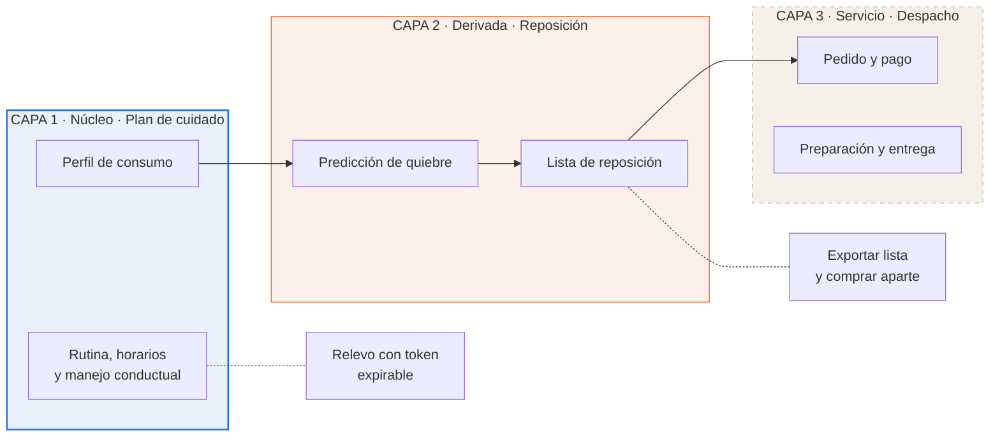

**La capa 1 es el producto.** El plan de cuidado convierte el conocimiento del cuidador en algo transferible, que es lo que permite el relevo. Sin ella, MATU es un despacho más.

**La capa 2 es el diferenciador computable.** Del perfil de consumo declarado en la capa 1 se deriva cuándo se acaba cada insumo. Ese cálculo es lo que MATU tiene y un delivery genérico no puede tener, porque requiere conocer a la persona cuidada.

**La capa 3 es un servicio, no la razón de existir.** Con convenio, MATU despacha. Sin convenio, la familia exporta la lista y compra donde quiera. El sistema sigue entregando su valor central.

**Consecuencia arquitectónica principal:** las dependencias apuntan hacia abajo y nunca hacia arriba. `care_plan` no sabe que existe `fulfillment`. Eso es lo que permite construir y demostrar el producto sin haber cerrado un solo convenio.

---

## 5. Vista de contexto (C4 nivel 1)

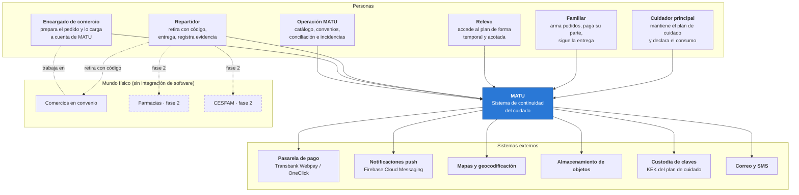

**El cuidador principal es ahora el usuario central**, no el familiar que paga. Es quien alimenta la capa 1, de la cual depende todo lo demás. Ese cambio respecto de la versión anterior tiene consecuencias de diseño en toda la aplicación.

**MATU no se integra por software con el punto de venta de ningún comercio.** La integración es humana: el comercio recibe el pedido en una pantalla, lo prepara, lo carga a cuenta y lo entrega contra un código. Intentar integración con el punto de venta de un supermercado en un capstone es una vía muerta.

**La persona cuidada no es usuaria del sistema.** Es sujeto de los datos y destinataria de la entrega, pero no tiene cuenta. Esa distinción tiene consecuencias legales tratadas en la sección 11.

**MATU es soporte logístico y de continuidad del cuidado, no un prestador de salud.** Esa frase delimita el alcance del sistema y explica por qué el modelo de datos no contiene diagnósticos.

---

## 6. Vista de contenedores y módulos

### 6.1 Contenedores (C4 nivel 2)

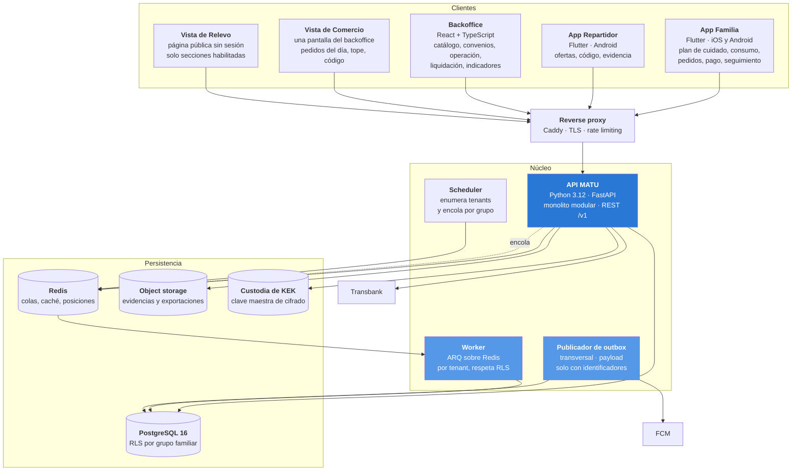

### 6.2 Responsabilidad de cada contenedor

| Contenedor | Responsabilidad | Lo que explícitamente no hace |
|---|---|---|
| **App Familia** | Plan de cuidado, perfil de consumo, catálogo, pedido, reparto del gasto, seguimiento | No calcula totales finales. No decide sustituciones |
| **App Repartidor** | Ofertas, aceptación, código de retiro, evidencia, entrega | No compra. No paga. **No accede al plan de cuidado bajo ninguna circunstancia** |
| **Backoffice** | Catálogo, convenios, monitoreo, incidencias, conciliación, liquidación, indicadores | No accede al plan de cuidado. No es canal de soporte al cliente final |
| **Vista de Comercio** | Pedidos del día, resolución de faltantes, monto real, validación de código | No ve la dirección de entrega ni datos de la persona cuidada más allá del nombre de pila |
| **Vista de Relevo** | Lectura de las secciones habilitadas del plan de cuidado | No permite edición. No expone otras secciones. No crea sesión persistente |
| **API MATU** | Toda la lógica de negocio y toda la autorización | No ejecuta trabajo largo. Nada sobre 2 segundos vive aquí |
| **Worker** | Trabajo por tenant: ocurrencias, predicción de quiebre, asignación en cascada | No expone endpoints. No es alcanzable desde internet. **No evade RLS** |
| **Publicador de outbox** | Publicación de eventos de dominio hacia notificaciones | **Transversal a tenants, y por eso su payload contiene solo identificadores, nunca datos** |
| **PostgreSQL** | Fuente única de verdad transaccional | No almacena archivos binarios |
| **Redis** | Colas, caché de catálogo, posición reciente del repartidor | No es fuente de verdad de nada. Se puede vaciar sin pérdida |
| **Object storage** | Evidencias, exportaciones del plan de cuidado y de la lista de reposición | Nunca sirve archivos públicos. Solo URLs firmadas de vida corta |
| **Custodia de KEK** | Guarda la clave maestra que cifra las claves de datos | No guarda datos. Ver ADR-016 |

### 6.3 Módulos del backend (C4 nivel 3)

```
app/
├── core/                 configuración, seguridad, dependencias, errores
├── shared/               eventos de dominio, outbox, auditoría, tipos comunes
├── modules/
│   ├── iam/              usuarios, autenticación, roles, dispositivos
│   ├── care_circle/      grupo familiar, membresías, personas cuidadas, direcciones
│   ├── care_plan/        plan de cuidado, secciones, accesos de relevo   ← CAPA 1
│   ├── consumption/      perfil de consumo, predicción de quiebre, lista ← CAPA 2
│   ├── catalog/          productos, comercios, convenios, ofertas
│   ├── replenishment/    planes de reposición, ocurrencias, calendario
│   ├── ordering/         carrito, pedido, líneas, reglas de sustitución
│   ├── payments/         cargos, participaciones, recaudación, pasarela  ← CAPA 3
│   ├── fulfillment/      preparación, oferta en cascada, código, evidencia
│   ├── settlement/       consumo por comercio, conciliación, liquidación
│   ├── rx/               recetas, farmacia, CESFAM                        [FASE 2]
│   ├── notifications/    plantillas, push, correo, SMS
│   └── backoffice/       operación, vista de comercio, indicadores
└── main.py
```

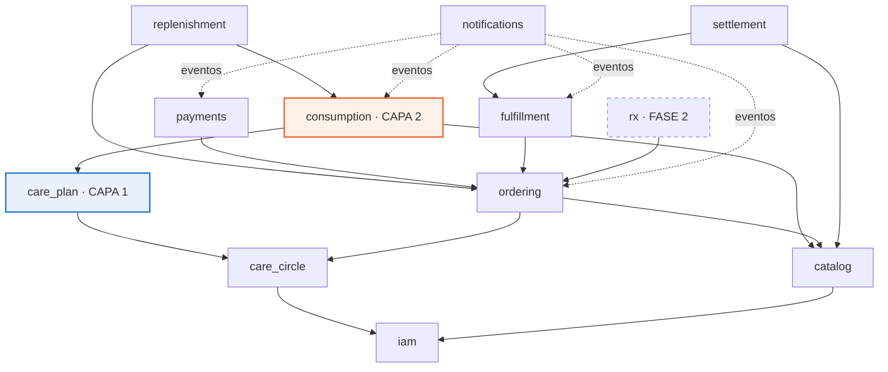

### 6.4 Regla de dependencias

Cuatro reglas, que verificará una prueba automática recorriendo el árbol de importaciones. No dependen de disciplina.

1. **Las flechas no se invierten.** `catalog` no importa `ordering`. Si necesita reaccionar a algo, escucha un evento.
2. **`care_plan` es hoja hacia arriba.** Ningún módulo de la capa 2 o 3 lo importa, salvo `consumption`, y solo para leer el perfil de consumo a través de una interfaz explícita que no expone las secciones clínicas.
3. **`fulfillment`, `settlement` y `payments` no son importados por `care_plan` ni por `consumption`.** Es lo que hace desacoplable el despacho: se puede eliminar la capa 3 completa y el sistema arranca.
4. **`notifications` no se llama directamente.** Solo consume eventos, para que ningún flujo de negocio falle porque una notificación falló.

La prueba vivirá en `tests/test_arquitectura.py`. La regla 3 se verifica además con una prueba de arranque que desactiva los routers de la capa 3 y comprueba que la aplicación levanta y que los flujos de las capas 1 y 2 siguen respondiendo.

---

## 7. Modelo de datos

### 7.1 Diagrama entidad-relación

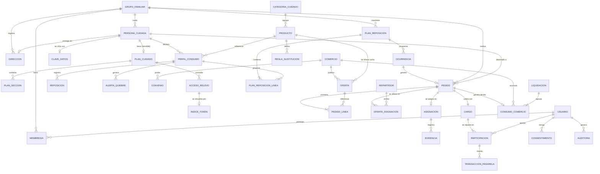

### 7.2 Capa 1 · Plan de cuidado

| Entidad | Campos relevantes | Notas de diseño |
|---|---|---|
| `plan_cuidado` | id, grupo_id, persona_cuidada_id, completitud_pct, actualizado_por, actualizado_en | `completitud_pct` alimenta la interfaz que invita a completar de a poco. Ver ADR-018 |
| `plan_seccion` | id, plan_id, tipo, **contenido_cifrado**, **nonce**, **tag_auth**, **version**, actualizado_por, actualizado_en | Cifrado por sección, no por documento, para compartir una parte sin descifrar el resto. **`nonce` de 96 bits aleatorio por cada escritura, nunca un contador**: repetir un nonce en AES-GCM permite recuperar la clave de autenticación y forjar texto cifrado. `version` implementa bloqueo optimista (RF-04) |
| `acceso_relevo` | id, plan_id, otorgado_a_nombre, otorgado_a_telefono, secciones_permitidas, token_hash, **pin_hash**, expira_en, revocado_en, motivo, usos | El relevo no crea cuenta. **Token de uso múltiple hasta vencer**, no de un solo uso: el relevo consulta el plan durante todo su turno. `pin_hash` es el segundo factor de cuatro dígitos enviado al teléfono ya registrado, porque un enlace por WhatsApp es una credencial al portador sobre datos de salud |
| `clave_datos` | id, persona_cuidada_id, dek_cifrada_con_kek, kek_version, creada_en, rotada_en | Sobre-cifrado. Una clave de datos por persona cuidada, cifrada con la clave maestra. Ver ADR-016 |

**Tipos de sección:** `rutina`, `horarios`, `manejo_situaciones`, `preferencias`, `actividades`, `red_apoyo`, `alimentacion`, `movilidad`.

### 7.3 Capa 2 · Perfil de consumo

| Entidad | Campos relevantes | Notas de diseño |
|---|---|---|
| `perfil_consumo` | id, grupo_id, persona_cuidada_id, producto_id, **tasa_uso_diaria**, **stock_unidades**, **stock_medido_en**, **fecha_quiebre_estimada**, dias_aviso, activo | El corazón de la capa 2. **Todo en unidades base**, nunca en envases: la conversión vive en la presentación. **El ancla del cálculo es `stock_medido_en`, no la última reposición**, porque el cuidador declara stock en cualquier momento sin haber comprado nada, y anclar en la reposición produce fechas de quiebre en el pasado |
| `reposicion` | id, perfil_id, **cantidad_unidades**, origen (`pedido_matu`, `declarada`), **pedido_ref**, ocurrida_en | Registrar una compra hecha fuera de MATU es obligatorio (RF-13): sin eso el cálculo se desalinea y las alertas pierden credibilidad. **`pedido_ref` es una referencia opaca sin clave foránea**, para que la capa 2 no dependa de la 3 |
| `alerta_quiebre` | id, perfil_id, fecha_prevista, estado (`pendiente`, `notificada`, `resuelta`, `descartada`), notificada_en | Se materializa igual que la ocurrencia del plan de reposición, y por la misma razón: hace idempotente el aviso |

**El cálculo, completo:**

```
dias_de_cobertura = piso(stock_unidades / tasa_uso_diaria)
fecha_quiebre     = stock_medido_en + dias_de_cobertura
alerta_si         = (fecha_quiebre - hoy) <= dias_aviso
```

Tres detalles que parecen menores y no lo son. **El piso es deliberado**: es preferible avisar un día antes que un día tarde. **El ancla es `stock_medido_en`**, no la reposición. Y **`unidades_a_envases` redondea hacia arriba**, porque nadie compra un tercio de paquete de pañales.

Vive en `app/modules/consumption/domain/quiebre.py` y su criterio de aceptación son ocho pruebas de dominio, incluida una de regresión sobre el ancla. Entregable del sprint 5, junto con el resto de la capa 2.

Es aritmética de tercero básico, y esa es exactamente la gracia. **El valor no está en el algoritmo, está en tener el dato.** Ningún despacho genérico sabe que la persona usa cuatro pañales al día, porque nunca se lo preguntó a nadie.

`dias_aviso` tiene un valor por defecto de 7 y es configurable por producto, porque no es lo mismo quedarse sin pañales que sin crema de manos.

### 7.4 Capa 3 · Catálogo, pedido, cumplimiento y pagos

| Entidad | Campos relevantes | Notas de diseño |
|---|---|---|
| `producto` | id, categoria_id, nombre, marca, presentacion, unidad, **unidades_por_envase**, requiere_receta, activo | `unidades_por_envase` es lo que conecta el catálogo con el perfil de consumo: 30 pañales por paquete permite traducir tasa de uso a paquetes |
| `oferta` | producto_id, comercio_id, precio_referencia, disponibilidad, actualizado_en | El precio es referencial, no vinculante. Ver ADR-011 |
| `convenio` | comercio_id, vigencia_desde, vigencia_hasta, **comision_pct**, **tarifa_despacho**, prepara_pedidos, cuenta_corriente, estado | `comision_pct` y `tarifa_despacho` son la regla de cálculo de la liquidación, que en el diseño anterior faltaba |
| `pedido` | id, grupo_id, persona_cuidada_id, comercio_id, direccion_id, estado, modo_cumplimiento, origen (`manual`, `reposicion`, `alerta_quiebre`), ventana_entrega, total_estimado, total_autorizado, total_real, codigo_retiro_hash, creado_por | `origen` incorpora `alerta_quiebre`, que es el camino nuevo de la capa 2 |
| `pedido_linea` | id, pedido_id, oferta_id, cantidad, precio_snapshot, precio_real, estado_linea, sustituto_de_linea_id | La sustitución es una línea nueva que apunta a la original, no una edición |
| `oferta_asignacion` | id, pedido_id, repartidor_id, ofrecido_en, expira_en, resultado, orden_cascada | Registrar cada oferta emitida es lo que permite explicar por qué un pedido tardó |
| `cargo` | id, pedido_id, monto_objetivo, monto_autorizado, monto_capturado, estado, recaudacion_expira_en, respaldo_usuario_id | |
| `participacion` | id, cargo_id, usuario_id, monto_comprometido, monto_autorizado, **monto_capturado**, porcentaje, estado, es_respaldo | `monto_capturado` por participación es lo que hace posible el prorrateo de la sección 8.3 |
| `transaccion_pasarela` | id, participacion_id, proveedor, buy_order, token, tipo (`autorizacion`, `ampliacion`, `captura`, `reversa`), monto, estado, payload_respuesta, idempotency_key | Nunca se borra ni se actualiza destructivamente. Es el registro contable |
| `consumo_comercio` | id, comercio_id, pedido_id, monto_autorizado, monto_boleta, folio_boleta, evidencia_id, estado, desviacion_pct | Contrapartida de `cargo`: lo que MATU debe al comercio |
| `liquidacion` | id, comercio_id, periodo_desde, periodo_hasta, monto_bruto, **monto_comision**, monto_neto, estado, factura_ref, pagada_en | `monto_comision = Σ(consumo.monto_boleta × convenio.comision_pct)` |

### 7.5 Transversales

| Entidad | Campos relevantes | Notas |
|---|---|---|
| `consentimiento` | id, grupo_id, usuario_id, persona_cuidada_id, **calidad_otorgante** (`titular`, `representante_legal`, `cuidador_de_hecho`), finalidad, version_politica, evidencia, otorgado_en, revocado_en | Requisito directo de la Ley 21.719. **`calidad_otorgante` es la pieza que el diseño anterior no tenía**: el titular de los datos es muchas veces una persona sin capacidad para consentir, y quien opera la aplicación puede no ser su representante legal. Ver la sección 11.5 |
| `auditoria` | id, grupo_id, actor_tipo, **actor_ref**, accion, entidad, entidad_id, **motivo**, ip, ocurrido_en | Append-only, con una prueba comprometida que lo verifique. **`actor_ref` es polimórfico** porque el relevo no es usuario y es justamente el actor más sensible del sistema. **`motivo`** existía como exigencia en la sección 2.2 y faltaba en el modelo |
| `evento_outbox` | id, grupo_id, tipo, **payload solo con identificadores**, agregado_id, disponible_en, intentos, publicado_en, fallido_en | Tabla de **infraestructura sin RLS**, acotada por permiso de rol. Contrato completo en 8.6 |
| `idempotencia` | clave, **grupo_id**, endpoint, respuesta, creada_en | Soporta el header `Idempotency-Key`, que en el diseño anterior se exigía sin tener dónde guardarse. **Lleva `grupo_id` y RLS como cualquier tabla de negocio**: guarda cuerpos de respuesta de pedidos y pagos, de modo que sin tenant sería una excepción no declarada al modelo de aislamiento (sección 12.8) |
| `evento_consumido` | evento_id, consumidor, consumido_en | Clave primaria compuesta. Es lo que hace idempotente al consumidor |

### 7.6 Nueve decisiones de modelado que conviene defender

**a) El dinero es entero, no decimal.** El peso chileno no tiene subunidad en uso. Todo monto es `BIGINT` en pesos. Usar coma flotante para dinero es un error clásico, y `NUMERIC(12,2)` aquí solo invita a redondeos que no existen en el dominio.

**b) La sustitución es una línea nueva, no una edición.** Se crea una línea con `sustituto_de_linea_id` apuntando a la original, y la original pasa a `sustituida`. La familia ve exactamente qué pidió y qué llegó. Editar la línea original destruiría la evidencia que la familia necesita revisar.

**c) El precio se congela al confirmar y se reconcilia al preparar.** `precio_snapshot` guarda el referencial mostrado, `precio_real` lo efectivamente cobrado. La diferencia es visible y auditable, y es la base de confianza de un servicio de compra por encargo.

**d) La ocurrencia y la alerta se materializan antes de dispararse.** El scheduler no pregunta "qué toca hoy", crea filas con anticipación. Adelantar es cambiar una fecha, saltar es cambiar un estado, y una corrida doble del job no genera dos pedidos ni dos avisos. El mismo patrón para los planes de reposición y para las alertas de quiebre.

**e) La fecha de quiebre es un campo materializado, no una consulta.** Se recalcula cuando cambia el perfil o cuando se registra una reposición, y una vez al día por seguridad. Consultarla en línea obligaría a calcular sobre toda la base para responder "qué se está por acabar", que es la consulta más frecuente de la aplicación.

**f) Hay dos flujos de dinero y dos tablas distintas.** `cargo` y `participacion` describen lo que MATU cobra a la familia. `consumo_comercio` y `liquidacion` describen lo que MATU debe al comercio. Son montos parecidos en momentos distintos: se cobra el día de la entrega y se paga a fin de período. Unificarlos parece simple y hace imposible responder cuánto debemos y a quién.

**g) El código de retiro se guarda con hash, no en claro.** Es la credencial que autoriza a llevarse mercadería cargada a la cuenta de MATU. Se trata como contraseña de un solo uso, no como número de pedido.

**h) El nonce se guarda, no se deriva.** `plan_seccion` lleva `nonce` y `tag_auth` como columnas. Es la diferencia entre un cifrado que funciona y uno que parece funcionar: sin nonce almacenado no se puede descifrar, y reutilizarlo entre escrituras rompe AES-GCM por completo.

**i) El plan de cuidado se cifra por sección y con clave por persona.** Cifrar por sección permite compartir rutina y manejo conductual con un relevo sin exponer red de apoyo ni preferencias. Una clave de datos por persona cuidada permite revocar el acceso a una persona sin rotar todo el sistema.

### 7.7 Aislamiento multi-tenant sobre tres ejes

Esta sección se reescribió por completo tras la primera ronda de revisión. La versión anterior describía un solo eje de acceso, el de la familia, y con eso **no se podía atender a tres de los ocho roles del sistema**: un comercio ve pedidos de decenas de grupos distintos, un repartidor también, y la operación necesita intervenir de forma transversal. Afirmar que el aislamiento no tenía agujeros era falso.

#### Los tres hechos que gobiernan el modelo

**1. El rol de la aplicación no es propietario de las tablas, y se aplica `FORCE`.**

En PostgreSQL, **el propietario de una tabla ignora sus propias políticas RLS** salvo que se declare `FORCE ROW LEVEL SECURITY`. Si Alembic corre las migraciones con el mismo usuario que la API, que es lo natural en un equipo de dos personas, el aislamiento queda desactivado en silencio. Es literalmente el escenario "RLS finge proteger".

```sql
-- migraciones: matu_owner. Ejecución: matu_app, que NO es propietario.
ALTER TABLE pedido ENABLE ROW LEVEL SECURITY;
ALTER TABLE pedido FORCE  ROW LEVEL SECURITY;
```

**2. Hay tres ejes de acceso, y PostgreSQL los combina con OR.**

Las políticas permisivas se acumulan. Eso permite que el mismo `pedido` sea visible para su familia **y** para el comercio que lo prepara, y para nadie más.

```sql
CREATE POLICY pedido_familia   ON pedido FOR ALL
  USING (grupo_id    = current_setting('app.grupo_id',    true)::uuid);
CREATE POLICY pedido_comercio  ON pedido FOR ALL
  USING (comercio_id = current_setting('app.comercio_id', true)::uuid);
CREATE POLICY pedido_operacion ON pedido FOR ALL
  USING (current_setting('app.rol', true) = 'operacion');
```

**Y el eje de operación no está en todas partes.** `plan_cuidado` y `perfil_consumo` quedan deliberadamente **fuera** de él, porque la sección 11.2 declara que operación nunca los alcanza. Esa exclusión es lo que hace verdadera la garantía, y una prueba de la suite de la sección 12.5 deberá sostenerla.

**3. Las tablas hijas no llevan `grupo_id`: heredan del padre.**

```sql
CREATE POLICY plan_seccion_hereda ON plan_seccion FOR ALL
  USING (EXISTS (SELECT 1 FROM plan_cuidado p WHERE p.id = plan_seccion.plan_id));
```

Duplicar `grupo_id` en cada hija invita a que se desincronice. La regla correcta es: **toda raíz de agregado lleva `grupo_id`, las hijas heredan con `EXISTS`.**

#### Contexto de sesión

| Variable | Cuándo se fija |
|---|---|
| `app.usuario_id` | **Siempre y primero.** La política de `membresia` depende de él |
| `app.grupo_id` | Cuando el actor es una familia |
| `app.comercio_id` | Cuando el actor es un comercio en convenio |
| `app.rol` | `operacion` habilita el eje transversal, auditado |

```python
@asynccontextmanager
async def sesion_tenant(maker, *, usuario_id=None, grupo_id=None,
                        comercio_id=None, rol=None, verificar_membresia=True):
    async with maker() as sesion:
        async with sesion.begin():
            # el orden importa: primero identidad, después tenant
            await _fijar(sesion, "app.usuario_id",  usuario_id)
            await _fijar(sesion, "app.grupo_id",    grupo_id)
            await _fijar(sesion, "app.comercio_id", comercio_id)
            await _fijar(sesion, "app.rol",         rol)
            if verificar_membresia and usuario_id and grupo_id and rol != "operacion":
                ...  # la consulta de membresía corre DENTRO del contexto
            yield sesion
```

El `true` de `set_config(clave, valor, true)` hace el ajuste **local a la transacción**, de modo que el pool de conexiones no arrastre el contexto de una petición a la siguiente. Ese detalle es la diferencia entre que RLS proteja y que RLS finja proteger.

**Y el orden importa.** La verificación de membresía consulta una tabla con RLS, cuya política es por `app.usuario_id`. Fijar el contexto **después** de verificar habría devuelto cero filas y toda petición autenticada habría fallado.

#### Los trabajos asíncronos

Un worker no tiene petición HTTP, así que no hay dependencia que fije el contexto. La solución, detallada en el ADR-013:

1. El scheduler enumera los grupos activos y **encola un job por grupo**, no un job global.
2. Cada job abre su transacción y fija `app.grupo_id` con el mismo helper que usa la API.
3. **El worker corre con el mismo rol que la API.** No existe un rol de aplicación que evada RLS.

#### Las dos excepciones, reconocidas y acotadas

Decir "sin excepciones" era inexacto. Hay dos, y ambas se resuelven **por permiso**, no relajando RLS.

**a) El publicador de outbox.** Es transversal por definición. `evento_outbox` se declara **tabla de infraestructura sin RLS**, justificado porque su payload contiene solo identificadores y nunca contenido. El publicador corre con un rol propio, `matu_publisher`, con permiso **únicamente** sobre esa tabla:

```sql
REVOKE ALL ON ALL TABLES IN SCHEMA public FROM matu_publisher;
GRANT SELECT, UPDATE ON evento_outbox   TO matu_publisher;
GRANT SELECT, INSERT ON evento_consumido TO matu_publisher;
```

**b) Los endpoints públicos.** La vista de relevo y el retorno de pasarela deben resolver un token **antes** de saber a qué grupo pertenece. Con RLS activo y sin `app.grupo_id`, esa búsqueda devolvería cero filas. Se resuelve con `indice_token`, una tabla sin RLS y sin dato sensible que solo traduce `token_hash → grupo_id`. Desde ahí se fija el contexto y todo lo demás ocurre dentro del aislamiento normal.

#### Qué hay que demostrar, y no solo afirmar

Este modelo no se da por bueno porque esté escrito. `tests/test_aislamiento.py` es entregable comprometido del sprint 1 y debe correr contra PostgreSQL real, no contra un doble. Las cuatro afirmaciones que más importan:

| Prueba | Qué debe demostrar |
|---|---|
| sin contexto, cero filas | Una consulta sin `app.grupo_id` no devuelve todo, devuelve nada |
| worker sin contexto, cero filas | El hueco que tenía el diseño anterior quedó cerrado |
| operación no alcanza el plan | La celda "operación · plan de cuidado · nunca" de la sección 11.2 es cierta |
| `FORCE` activo tabla por tabla | El escenario "RLS finge proteger" no puede ocurrir |

La revisión de este modelo descrita en la sección 12.8 encontró **cinco defectos que la lectura del diseño no dejaba ver**. Tres afectan directamente a esta sección: el rol de operación alcanzaba el plan de cuidado por herencia de política, `clave_datos` heredaba de `persona_cuidada` y quedaba a su alcance, y `usuario` y `grupo_familiar` habían quedado sin política alguna. Los tres están corregidos en el modelo que esta sección describe; los otros dos, en la sección 12.8.

---

## 8. Máquinas de estado y flujos

### 8.1 Ciclo de vida del pedido

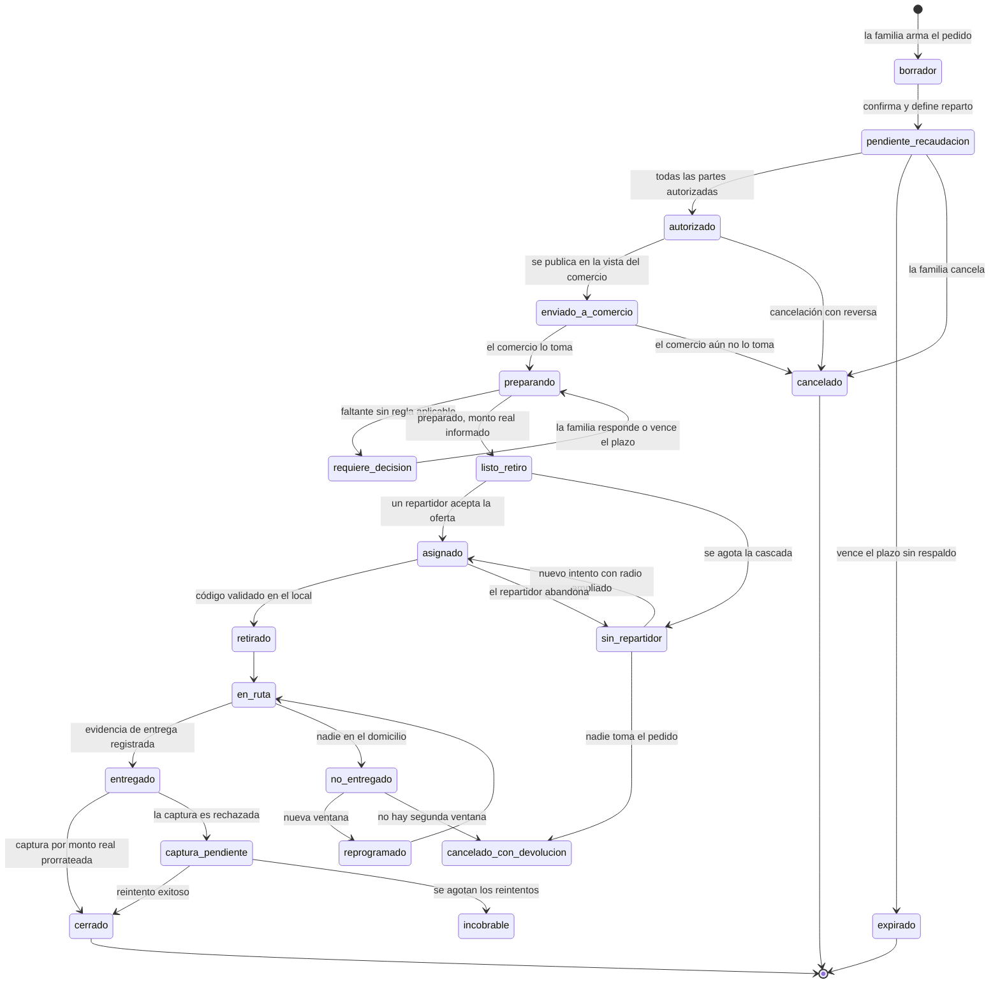

**El pedido se prepara antes de asignar repartidor**, no después. En modo `preparado` no tiene sentido tener a alguien esperando en el local. El comercio confirma `listo_retiro` con el monto real y recién ahí sale la oferta. Eso baja el tiempo del repartidor por pedido de unos 40 minutos a menos de 10, que es lo que hace competitiva la tarifa frente a Uber o Rappi.

**Efecto colateral valioso:** `requiere_decision` dejó de ser un cuello de botella. Ya no ocurre con alguien parado frente a una góndola sino con el comercio preparando, y hay minutos u horas para que la familia responda.

**Cuatro estados nuevos respecto del diseño anterior**, todos por casos que la auditoría detectó y que la versión anterior dejaba colgados:

| Estado | Por qué existe |
|---|---|
| `sin_repartidor` | Si la cascada se agota, el pedido quedaba en `listo_retiro` con mercadería ya preparada, deuda con el comercio ya creada y una autorización que caduca. Ahora tiene salida |
| `captura_pendiente` | Entre autorizar y capturar pasan horas. La tarjeta puede bloquearse **con la mercadería ya entregada**. La máquina anterior garantizaba formalmente algo que el mundo real no garantiza |
| `incobrable` | Salida de `captura_pendiente` cuando se agotan los reintentos. Es una pérdida reconocida, no un pedido eterno |
| `cancelado_con_devolucion` | Cierra los dos casos donde la mercadería ya salió del local y no llegó a destino |

Y se agregó `enviado_a_comercio → cancelado`, que el caso 12 del plan de pruebas exigía y el diagrama no permitía.

Una prueba parametrizada recorre las **400 combinaciones** de estados y verifica que toda transición no declarada lanza. Dos pruebas adicionales comprueban que ningún estado no terminal queda sin salida y que todos son alcanzables desde `borrador`.

### 8.2 Autorización y captura

Una transacción con tarjeta tiene dos momentos que normalmente ocurren juntos y que aquí se separan a propósito.

**Autorizar** es preguntar al banco si la tarjeta tiene el monto y, si la respuesta es sí, **reservarlo**. El dinero no se mueve. **Capturar** es indicar cuánto de lo reservado se cobra. El resto se libera solo.

| Momento | Qué ocurre | Ejemplo |
|---|---|---|
| La familia confirma el pedido | Se **autoriza** el estimado más 15% de holgura | $69.000 retenidos |
| El comercio prepara e informa | Se registra el monto real | $51.340 |
| Se registra la entrega | Se **captura** el monto real | $51.340 cobrados |
| Automático | Se libera la diferencia | $17.660 liberados |

Sin separar los dos momentos hay que elegir entre cobrar el estimado y reembolsar en cada pedido, o salir a comprar sin certeza de fondos. Y, crucialmente, **la separación es lo que hace viable el pago dividido**: revertir una autorización no capturada es liberar cupo de forma inmediata, no gestionar un reembolso.

**Obligación de interfaz.** Al cliente se le retiene más de lo que paga durante algunas horas. Si la aplicación no lo explica, genera reclamos. Ver la sección 10.4.

### 8.3 Recaudación multi-pagador y prorrateo de la captura

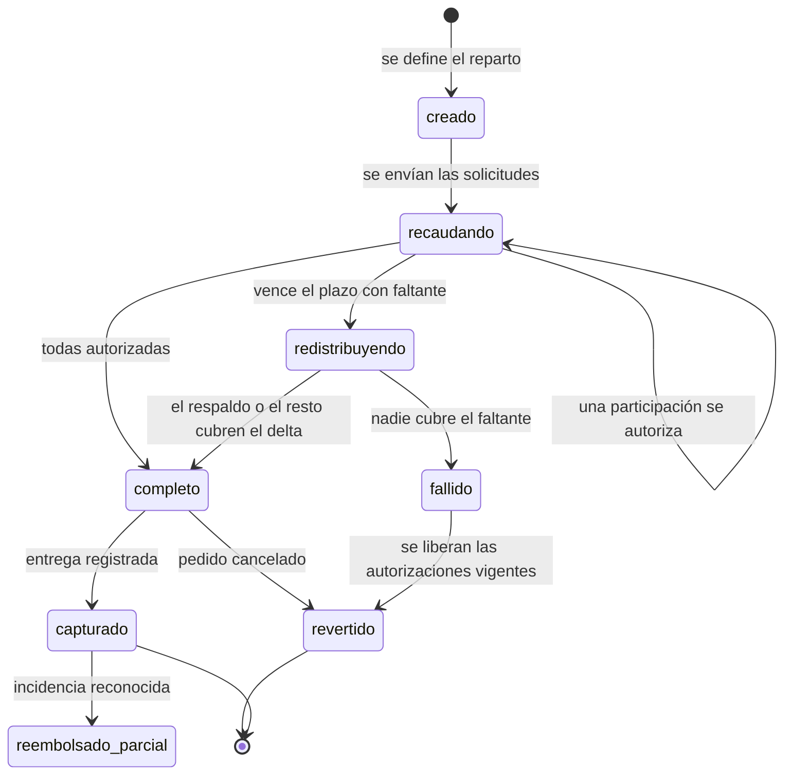

**Las tres reglas del reparto**

**a) Plazo de recaudación explícito.** El cargo nace con vencimiento, por defecto 2 horas. Mientras corre, el pedido no se envía al comercio. Al vencer, el sistema actúa, no espera.

**b) La redistribución es una autorización nueva, no una modificación.** Una autorización aprobada **no se puede aumentar**. Si tres familiares reparten y el tercero no paga, se emite una transacción de tipo `ampliacion` sobre los otros dos y al entregar se capturan todas. Por eso `participacion` tiene varias `transaccion_pasarela`.

**c) Respaldo designado.** Quien crea el pedido designa a alguien, normalmente él mismo, que autoriza por adelantado cubrir el faltante. Con OneClick ocurre sin fricción. Es lo que evita que un pedido de pañales se congele porque un familiar se durmió.

**Pagar sin dividir es el mismo flujo con una participación de 100%.** No es un caso especial ni un código aparte.

#### Regla de prorrateo de la captura

Esta era la objeción O-2 de la auditoría y aquí queda cerrada. **La captura se reparte proporcionalmente al monto autorizado de cada participación, con método del mayor resto para que la suma sea exacta al peso.**

```python
def prorratear(total_a_capturar: int, participaciones) -> dict[str, int]:
    base = sum(p.monto_autorizado for p in participaciones)
    cuota, resto = {}, {}
    for p in participaciones:
        q, r = divmod(total_a_capturar * p.monto_autorizado, base)   # entero puro
        cuota[p.id], resto[p.id] = q, r
    faltan = total_a_capturar - sum(cuota.values())
    # mayor resto primero; el respaldo desempata; el id desempata al final
    orden = sorted(participaciones, key=lambda p: (-resto[p.id], not p.es_respaldo, p.id))
    for p in orden[:faltan]:
        cuota[p.id] += 1
    return cuota
```

**Corrección aplicada: aritmética entera de punta a punta.** La versión anterior usaba `total * monto / base`, que en Python devuelve coma flotante, y un valor exacto como 17.114,0 puede materializarse como 17.113,999999999996 y truncarse a 17.113, desplazando un peso y el orden del desempate. Con `divmod` sobre enteros eso no puede ocurrir. Es exactamente el error que la decisión 7.6(a) prohíbe, cometido en la propia regla que reparte el dinero.

**Ejemplo trabajado.** Tres familiares reparten en partes iguales un estimado de $60.000. Se autoriza $69.000, es decir $23.000 cada uno. El comercio informa un monto real de $51.340.

| Participación | Autorizado | Exacto | Truncado | Ajuste | **Capturado** |
|---|---|---|---|---|---|
| A (respaldo) | $23.000 | 17.113,33 | $17.113 | +1 | **$17.114** |
| B | $23.000 | 17.113,33 | $17.113 | — | **$17.113** |
| C | $23.000 | 17.113,33 | $17.113 | — | **$17.113** |
| | | | $51.339 | +1 | **$51.340** |

**El peso sobrante va a la mayor parte fraccionaria, y el respaldo desempata.** En el ejemplo de arriba los tres restos son iguales, así que gana el respaldo. Con un reparto desigual, que es el caso normal, gana quien tenga el mayor resto. El diseño anterior afirmaba que el respaldo siempre lo absorbía, y eso era falso salvo en el ejemplo elegido.

La regla se verifica con **una prueba de propiedad sobre 300 casos generados**: para cualquier total y cualquier reparto, la suma de lo capturado es exactamente el total y ninguna participación captura más de lo autorizado. Vivirá en `tests/unit/test_prorrateo.py`.

**Dentro de una participación** con varias transacciones (la original más una `ampliacion`), la captura se aplica en orden cronológico hasta agotar el monto, y la última se captura por el resto.

### 8.4 Flujo de pago con retorno de pasarela

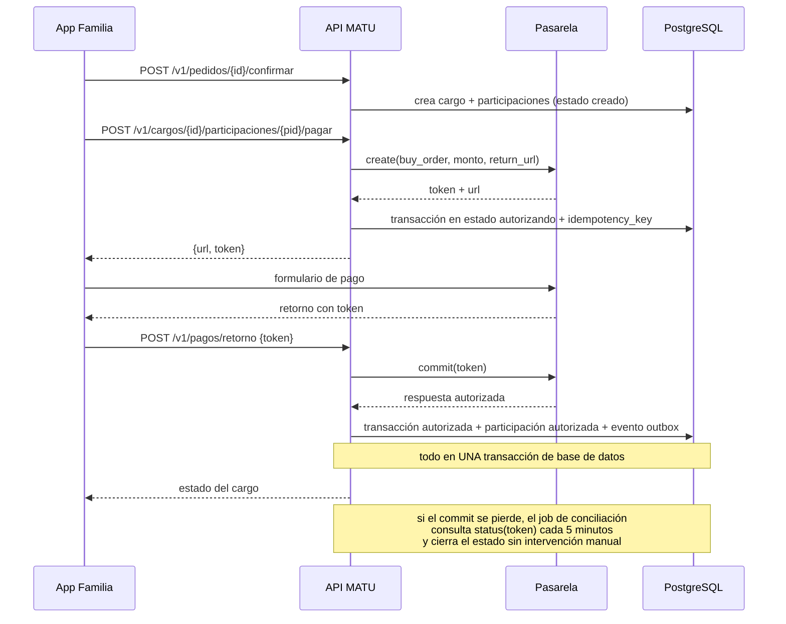

Con reparto entre varios familiares, esta secuencia ocurre **en paralelo una vez por participación**, y el cargo pasa a `completo` cuando la última cierra.

**Tres defensas contra el punto más frágil del sistema**, que es el usuario que paga y cierra el navegador antes de volver:

1. `commit` es idempotente por token. Un segundo llamado no cobra dos veces.
2. Un job de conciliación consulta el estado de toda transacción en `autorizando` con más de 10 minutos.
3. El resultado se escribe en **una sola transacción** junto con el cambio de estado y el evento del outbox.

### 8.5 Predicción de quiebre y lista de reposición

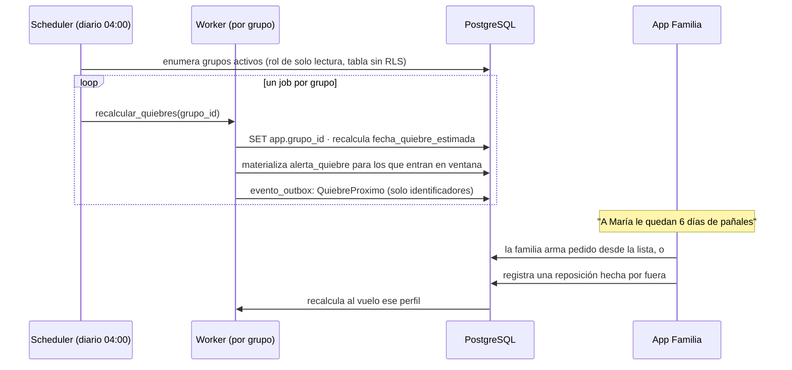

**El aviso es el momento de mayor valor del producto** y es también el que decide la retención. Una aplicación que hay que recordar abrir se desinstala. Una que avisa antes de que se acabe algo que no puede acabarse, no.

Por eso el aviso se materializa como fila antes de enviarse, igual que la ocurrencia del plan de reposición: para que una corrida doble del job no genere dos notificaciones, y para que "descartar" y "resolver" sean transiciones auditables y no un borrado.

### 8.6 Contrato del outbox

Esta era la objeción O-3 y aquí queda especificada.

| Aspecto | Definición |
|---|---|
| **Escritura** | El evento se inserta en `evento_outbox` **dentro de la misma transacción** que cambia el estado. Nunca fuera |
| **Payload** | Solo identificadores y tipo. **Nunca contenido de negocio ni datos personales**, porque el publicador es transversal a tenants |
| **Toma** | `SELECT ... FOR UPDATE SKIP LOCKED LIMIT 100 ORDER BY id`, para que varios publicadores no se pisen |
| **Orden** | **No se garantiza orden.** `SKIP LOCKED` con varios publicadores, y el backoff por `disponible_en`, rompen el FIFO por construcción. Afirmarlo y no cumplirlo es peor que no ofrecerlo: el consumidor debe tolerar reordenamiento, que es coherente con la entrega al menos una vez |
| **Entrega** | **Al menos una vez.** El consumidor está obligado a ser idempotente |
| **Idempotencia** | Tabla `evento_consumido(evento_id, consumidor)` con clave primaria compuesta. Si la inserción falla por duplicado, el evento se descarta sin efecto |
| **Reintentos** | Backoff exponencial: 1 s, 5 s, 30 s, 2 min, 10 min, 30 min, 1 h, 2 h. `disponible_en` controla cuándo vuelve a estar elegible |
| **Tope** | 8 intentos. Al superarlo pasa a `fallido`, se alerta a operación y **no se reintenta solo** |
| **Observabilidad** | Indicador de eventos con `intentos = 0` pendientes hace más de 5 minutos. Condicionar por `intentos` evita que el indicador se dispare con eventos legítimamente en backoff, cuya escalera llega a 2 horas |

Sin este contrato, un outbox con consumidor no idempotente reintroduce exactamente el problema que vino a resolver, con el agravante de que el equipo cree que está resuelto.

### 8.7 Asignación en cascada

Los repartidores de Santiago operan varias aplicaciones a la vez. La oferta no se adjudica, **se ofrece**.

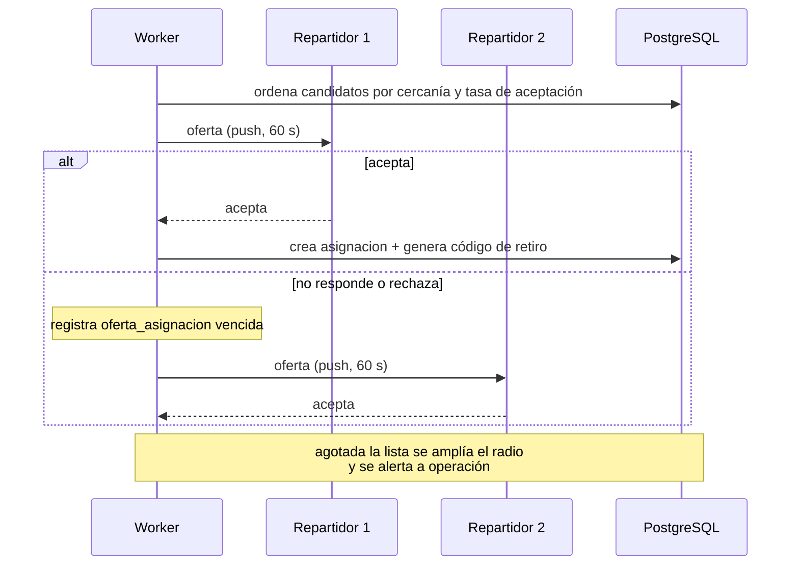

**Ventaja competitiva que sale del diseño.** Los planes de reposición y las alertas de quiebre generan demanda predecible: hoy se sabe qué pedidos habrá el jueves. Eso permite ofrecer bloques horarios agendados, que para un repartidor multi-plataforma vale porque le da piso de ingreso sin cazar pedidos. Es una carta de retención más barata que la exclusividad.

### 8.8 Preparación, retiro y liquidación

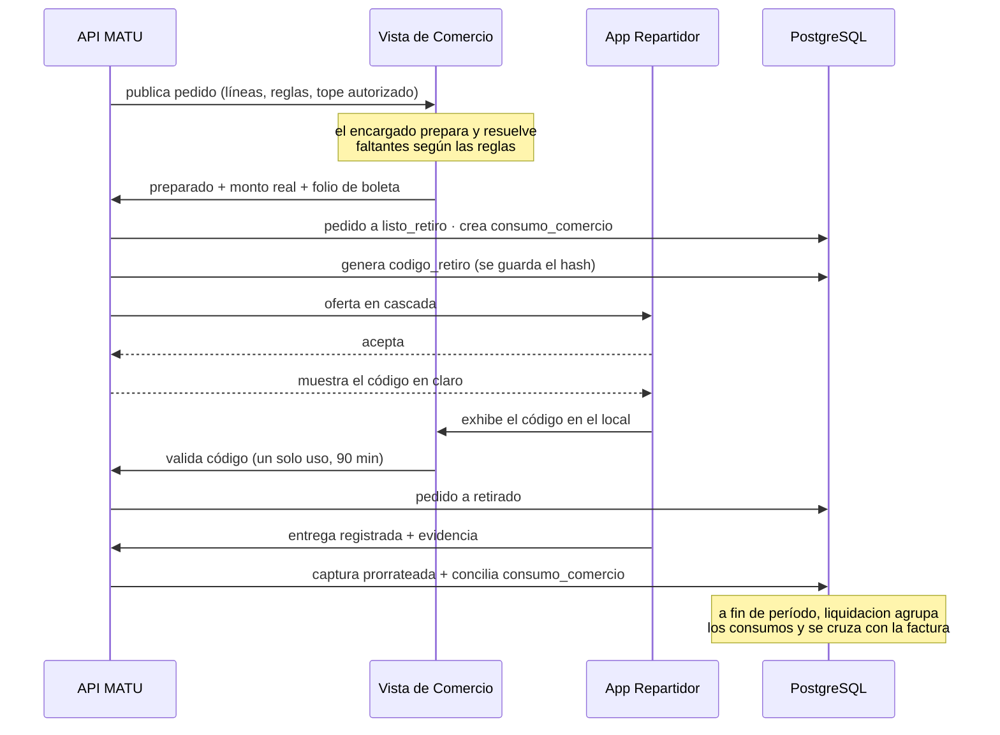

**El calce de caja va a favor de MATU:** se cobra a la familia el día de la entrega y se paga al comercio a fin de período. Es un argumento de viabilidad que conviene mencionar en la defensa, porque muestra que el modelo de negocio y la arquitectura se sostienen mutuamente.

### 8.9 Generación de pedidos recurrentes

El scheduler materializa ocurrencias con 14 días de anticipación, con restricción única sobre `(plan_reposicion_id, fecha_programada)`. Generar el pedido es una transición de estado sobre esa fila, no una creación.

La ventana de 24 horas entre generación y cobro obliga a que el pedido de reposición nazca en `borrador` y no en `pendiente_recaudacion`. Es lo que evita el peor escenario de la reposición programada, que es cobrar pañales que la familia ya compró.

**Decisión de esta versión:** las líneas del plan de reposición **se proponen desde el perfil de consumo** en vez de escribirse a mano. La familia confirma o ajusta. Es la conexión entre la capa 2 y la capa 3, y es lo que hace que el plan de reposición deje de ser una lista estática que envejece.

---

## 9. Contratos de API

### 9.1 Convenciones transversales

| Aspecto | Definición |
|---|---|
| Base | `/v1` |
| Autenticación | `Authorization: Bearer <access_token>` JWT de 15 minutos, refresh rotativo de 30 días por dispositivo con detección de reutilización |
| Contexto de tenant | Header `X-Grupo-Id`. La API verifica membresía en cada petición y nunca confía en el header |
| Errores | RFC 7807 `application/problem+json` con `type`, `title`, `status`, `detail`, `errores[]` |
| Idempotencia | Header `Idempotency-Key` obligatorio en POST de pedidos, pagos y evidencias |
| Concurrencia | `If-Match` con `ETag` en PUT de secciones del plan de cuidado. Respuesta 412 con el contenido actual si cambió |
| Sondeo | `If-None-Match` en el endpoint de posición. Respuesta 304 cuando no hay cambio |
| Paginación | Cursor, no offset |
| Fechas | ISO 8601 con zona. El servidor opera en UTC, la aplicación muestra en America/Santiago |
| Versionado | La v1 no rompe contratos. Un cambio incompatible crea `/api/v2` |

### 9.2 Capa 1 · Plan de cuidado

```
POST   /v1/grupos/{id}/personas-cuidadas
GET    /v1/personas-cuidadas/{id}/plan              → secciones, completitud, ETags
PUT    /v1/personas-cuidadas/{id}/plan/secciones/{tipo}
       headers: If-Match: "<version>"               → 412 si otro miembro editó
GET    /v1/personas-cuidadas/{id}/plan/exportar     → documento imprimible
POST   /v1/personas-cuidadas/{id}/plan/accesos-relevo
       body: {secciones:[...], expira_en, motivo, nombre, telefono}
DELETE /v1/accesos-relevo/{id}                      → revocación inmediata
GET    /v1/relevo/{token}                           → vista pública restringida, sin sesión
```

### 9.3 Capa 2 · Perfil de consumo y reposición

```
GET    /v1/personas-cuidadas/{id}/consumo           → perfiles con fecha de quiebre
POST   /v1/personas-cuidadas/{id}/consumo
       body: {producto_id, tasa_uso, unidad_tasa, stock_estimado, dias_aviso}
PATCH  /v1/consumo/{id}
POST   /v1/consumo/{id}/reposiciones                → registrar compra hecha por fuera
GET    /v1/personas-cuidadas/{id}/lista-reposicion  → productos próximos a quiebre
POST   /v1/personas-cuidadas/{id}/lista-reposicion/exportar
                                                     → PDF o enlace compartible
GET    /v1/alertas?estado=pendiente
POST   /v1/alertas/{id}/descartar
POST   /v1/pedidos/desde-alertas                    → recibe una lista de alertas y genera
                                                      un borrador por comercio (ADR-024)
```

### 9.4 Capa 3 · Catálogo, pedidos y pagos

```
GET    /v1/catalogo/categorias
GET    /v1/catalogo/productos?categoria=&q=&cursor=
GET    /v1/catalogo/productos/{id}/ofertas?comuna=

POST   /v1/pedidos                                  → crea borrador
PUT    /v1/pedidos/{id}/lineas
POST   /v1/pedidos/{id}/reglas-sustitucion
POST   /v1/pedidos/{id}/reparto                     → participaciones y respaldo
POST   /v1/pedidos/{id}/confirmar                   → crea cargo, abre recaudación
GET    /v1/pedidos/{id}
POST   /v1/pedidos/{id}/cancelar
POST   /v1/pedidos/{id}/decisiones/{lid}

GET    /v1/cargos/{id}                              → estado de recaudación, quién falta
POST   /v1/cargos/{id}/participaciones/{pid}/pagar  → autoriza mi parte
POST   /v1/cargos/{id}/redistribuir                 → emite ampliaciones
POST   /v1/pagos/retorno                            → commit, público con validación de token
GET    /v1/grupos/{id}/aportes?periodo=

POST   /v1/planes-reposicion                        → líneas propuestas desde el consumo
PATCH  /v1/planes-reposicion/{id}
GET    /v1/planes-reposicion/{id}/ocurrencias
POST   /v1/planes-reposicion/{id}/ocurrencias/{oid}/adelantar
POST   /v1/planes-reposicion/{id}/ocurrencias/{oid}/saltar
```

### 9.5 Repartidor, comercio y operación

```
GET    /v1/repartidor/ofertas
POST   /v1/repartidor/ofertas/{id}/aceptar          → crea asignación, devuelve código
POST   /v1/repartidor/ofertas/{id}/rechazar
GET    /v1/repartidor/asignaciones/{id}             → local, código, destino, ventana
POST   /v1/repartidor/asignaciones/{id}/posicion    → cada 20 s en ruta
POST   /v1/repartidor/asignaciones/{id}/evidencias  → URL firmada de subida
POST   /v1/repartidor/asignaciones/{id}/entregar    → dispara la captura prorrateada

GET    /v1/comercio/pedidos?fecha=
GET    /v1/comercio/pedidos/{id}                    → líneas, reglas, tope autorizado
POST   /v1/comercio/pedidos/{id}/lineas/{lid}/resolver
POST   /v1/comercio/pedidos/{id}/preparado          → monto real y folio de boleta
POST   /v1/comercio/pedidos/{id}/validar-codigo

GET    /v1/backoffice/comercios/{id}/consumos?estado=&periodo=
POST   /v1/backoffice/consumos/{id}/conciliar
POST   /v1/backoffice/comercios/{id}/liquidaciones  → cierra período
GET    /v1/backoffice/indicadores
```

### 9.6 Ejemplo de respuesta con la capa 2 en acción

```json
{
  "persona_cuidada": {"id": "3a...", "nombre": "María"},
  "generada_en": "2026-09-14T09:00:00-03:00",
  "items": [
    {
      "producto": "Pañal adulto talla M x30",
      "tasa_uso": "4 por día",
      "stock_estimado": 24,
      "dias_restantes": 6,
      "fecha_quiebre_estimada": "2026-09-20",
      "sugerido": {"cantidad": 2, "razon": "cubre 15 días"},
      "estado_alerta": "notificada"
    },
    {
      "producto": "Suplemento nutricional 400 g",
      "tasa_uso": "1 cada 5 días",
      "stock_estimado": 3,
      "dias_restantes": 15,
      "fecha_quiebre_estimada": "2026-09-29",
      "sugerido": null,
      "estado_alerta": "pendiente"
    }
  ],
  "acciones": ["armar_pedido", "exportar_lista", "compartir_enlace"]
}
```

La clave está en `acciones`. **`exportar_lista` y `compartir_enlace` funcionan sin ningún comercio en convenio.** Es la decisión 2 de cabecera hecha contrato de API.

---

## 10. Diseño de interacción y accesibilidad

Esta sección no existía en las versiones anteriores y su ausencia era el hueco más grave del anteproyecto. **Aquí la accesibilidad es un requisito funcional, no un acabado.**

### 10.1 Perfiles de usuario

| Perfil | Edad típica | Contexto de uso | Implicancia de diseño |
|---|---|---|---|
| **Cuidador principal** | 45 a 70 | En casa, con interrupciones constantes, muchas veces cansado o de noche | Todo tiene que poder pausarse y retomarse. Nada de formularios largos sin guardado |
| **Familiar que aporta** | 30 a 60 | Desde el trabajo, en dos minutos, para pagar su parte | El pago tiene que resolverse en menos de tres toques desde la notificación |
| **Relevo** | 20 a 70 | Primera vez, con urgencia, en casa ajena, muchas veces sin instalar nada | Vista web, sin cuenta, legible en un teléfono prestado |
| **Repartidor** | 20 a 50 | En la calle, con una mano, con sol en la pantalla | Contraste alto, áreas grandes, mínima lectura |
| **Encargado de comercio** | 20 a 60 | En el local, con computador compartido, apurado | Una pantalla, sin navegación, sin aprendizaje previo |

### 10.2 Cinco principios de diseño

1. **Nada obligatorio de una sola vez.** El plan de cuidado se completa de a poco. La primera versión útil se llena en cinco minutos y muestra su progreso.
2. **El sistema recuerda, la persona no.** El producto avisa antes del quiebre. El usuario nunca tiene que acordarse de nada.
3. **Un asunto por pantalla.** Sin pestañas, sin acordeones anidados, sin menús de tres niveles.
4. **El dinero se explica siempre.** Cada monto que aparece dice de dónde sale y en qué se puede convertir.
5. **La urgencia manda.** El caso "necesito relevo ahora" tiene que resolverse en dos toques, incluso a costa de configurabilidad.

### 10.3 Criterios de accesibilidad, medibles

| Criterio | Valor obligatorio | Cómo se verifica |
|---|---|---|
| Área táctil mínima | 48 × 48 dp, con 8 dp de separación | Inspección en el prototipo y prueba manual |
| Tamaño de texto base | 17 sp, escalable hasta **200%** sin pérdida de contenido ni de función | Prueba manual con el ajuste del sistema al máximo |
| Contraste de texto | 4,5:1 mínimo. 3:1 para texto grande y elementos gráficos | Verificación automática en el pipeline sobre los tokens de color |
| Identidad por color | **Nunca solo color.** Todo estado lleva ícono o etiqueta | Revisión de checklist por pantalla |
| Lenguaje | Sin jerga técnica ni clínica. "Se acaban en 6 días", no "stock proyectado" | Revisión por el equipo, con criterio explícito |
| Etiquetado para lector de pantalla | Todo control con etiqueta semántica, incluidos íconos | Prueba con TalkBack en el flujo principal |
| Objetivo de tiempo | Primer pedido completo en menos de 6 minutos por una persona de 65+ sin ayuda | Prueba con 3 usuarios reales antes del sprint 10 |

### 10.4 Los tres momentos difíciles

Tres puntos donde la arquitectura genera un problema de interfaz que hay que resolver a propósito.

**a) Explicar la retención mayor al cobro.** El sistema autoriza $69.000 y captura $51.340. Si no se explica, genera reclamos.

> **Solución:** al confirmar, un bloque fijo dice *"Reservamos $69.000 por si algún precio cambió. Se te cobrará solo lo que realmente cueste, y el resto se libera automáticamente."* Y al cerrar el pedido, una notificación dice *"Se cobraron $51.340. Los $17.660 restantes ya se liberaron."* La segunda frase es la que construye confianza.

**b) Repartir el gasto entre tres personas.** Es el flujo más difícil de la aplicación y el más valioso.

> **Solución:** partir siempre de una propuesta razonable en partes iguales, no de una pantalla en blanco. Un control de porcentaje por persona con el total siempre visible. El respaldo se marca con una casilla que dice *"Si alguien no paga a tiempo, lo cubro yo"* y viene marcada por defecto en quien crea el pedido.

**c) Llenar el plan de cuidado sin abandonar.** Es el riesgo de producto más grande: pedirle a alguien agotado que escriba.

> **Solución:** ocho preguntas concretas y cortas para la versión mínima, no un formulario abierto. Preguntas del tipo *"¿A qué hora se levanta habitualmente?"* y no *"Describa la rutina"*. Dictado por voz disponible en todos los campos de texto. Barra de completitud que celebra el avance en vez de castigar lo que falta. Y el acceso de relevo se puede generar con el plan incompleto, porque un plan al 40% ya sirve más que ninguno.

### 10.5 Prototipo y validación

El prototipo navegable de los flujos críticos es entregable del **sprint 0**, no del sprint 12. Cubre:

0. Alta de persona cuidada y consentimiento
1. Plan de cuidado, acceso de relevo, vista del relevo, auditoría de accesos, revocación y versión imprimible
2. Declaración de consumo, alerta de quiebre y lista de reposición
3. Reparto del gasto y pago
4. Vista de comercio
5. Repartidor
6. Errores y casos borde

En total **32 pantallas en siete recorridos**.

**Validación:** tres usuarios reales, de tres perfiles distintos, antes del sprint 10. No es investigación de mercado, es prueba de usabilidad, y con tres personas se detecta la mayoría de los problemas graves.

---

## 11. Seguridad, privacidad y cumplimiento

### 11.1 Marco legal aplicable

La **Ley 21.719** de protección de datos personales, publicada en diciembre de 2024, entra plenamente en vigencia el **1 de diciembre de 2026**, dentro del horizonte de vida del proyecto. Crea una Agencia con potestad sancionatoria, exige consentimiento verificable y documentado, medidas de seguridad proporcionales al riesgo y notificación de brechas sin dilación indebida.

MATU trata datos que la ley clasifica como sensibles: estado de salud y condición de dependencia. **Con la reestructuración en tres capas, el plan de cuidado pasa a ser el núcleo del producto, y por lo tanto el cumplimiento pasa de importante a estructural.**

| Exigencia legal | Traducción técnica |
|---|---|
| Consentimiento explícito, verificable y versionado | Tabla `consentimiento` con finalidad, versión de política y evidencia. Sin consentimiento vigente, `care_plan` devuelve 403 |
| Finalidad limitada y minimización | Proyecciones por rol. El repartidor recibe un DTO distinto, no el objeto completo con campos ocultos en la interfaz |
| Medidas proporcionales al riesgo | Sobre-cifrado por sección, MFA para operación, URLs firmadas de vida corta, cifrado de volumen |
| Notificación de brecha **sin dilación indebida** | La ley chilena exige notificar sin dilación indebida a la Agencia y a los titulares. **El plazo de 72 horas proviene del artículo 33 del RGPD europeo**, y se adopta como objetivo interno, no como cifra legal chilena. Requiere **detectar**: registro de acceso a datos sensibles con alerta ante patrones anómalos |
| Derechos de acceso, rectificación y supresión | Endpoints de exportación y borrado por titular, con borrado lógico que respeta obligaciones contables sobre pagos |
| Encargados de tratamiento | Repartidor, comercio y proveedores de infraestructura son encargados. Requieren cláusula contractual y registro |

### 11.2 Modelo de autorización

Tres dimensiones, evaluadas siempre en este orden: **quién es** (JWT válido y no revocado), **si pertenece al tenant** (consulta a `membresia` más contexto RLS) y **si su rol permite la acción sobre ese recurso**.

| Rol | Plan de cuidado | Perfil de consumo | Catálogo | Pedidos | Pago | Datos de la persona cuidada |
|---|---|---|---|---|---|---|
| `admin` del grupo | ver, editar, compartir | ver, editar | ver | crear, cancelar | pagar, repartir | completo |
| `cuidador` | ver, editar, compartir | ver, editar | ver | crear | no | completo |
| `pagador` | según permiso explícito | ver | ver | ver | pagar | nombre, dirección |
| `observador` | no | ver | ver | ver | no | nombre |
| `relevo` (token) | **solo secciones habilitadas, solo lectura** | no | no | no | no | nombre de pila |
| `repartidor` | **nunca** | **nunca** | solo su asignación | solo su asignación, sin precios unitarios | no | nombre de pila, dirección, teléfono enmascarado |
| `comercio` | **nunca** | **nunca** | solo su propia oferta | solo sus pedidos del día | no | nombre de pila, **sin dirección de entrega** |
| `operación` | **nunca** | **nunca** | administrar | ver todos, intervenir | ver, reembolsar, liquidar | nombre, dirección |

**Las celdas "nunca" no se garantizan por permiso, se garantizan por arquitectura.** `fulfillment`, `settlement` y `backoffice` no importan `care_plan` ni `consumption`, y la regla se verifica con la prueba de dependencias de la sección 6.4. Un permiso se puede configurar mal. Una importación que no existe, no.

### 11.3 Minimización de datos de salud

**`persona_cuidada` no tiene campo de diagnóstico.** Tiene `nivel_apoyo`, un enumerado operacional (`autovalente_con_supervision`, `apoyo_parcial`, `apoyo_total`), que es lo que el servicio realmente necesita.

Guardar "demencia tipo Alzheimer, etapa moderada" no cambiaría ni un pañal del catálogo, pero convertiría la base de datos en un repositorio clínico con las obligaciones correspondientes. **El diagnóstico es del sistema de salud, no de una plataforma de continuidad del cuidado.**

Lo mismo aplica al plan de cuidado: sus secciones describen **conducta y manejo**, no patología. "Se altera cuando hay ruido fuerte, ayuda bajar las persianas" es información de cuidado. "Demencia frontotemporal con desinhibición" es información clínica y no entra al sistema.

### 11.4 Sobre-cifrado del plan de cuidado

Esquema de dos niveles:

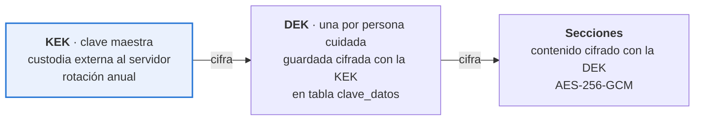

**Por qué dos niveles.** Rotar la clave maestra no obliga a redescifrar y recifrar todo el contenido, solo las claves de datos, que son pocas y pequeñas. Y borrar los datos de una persona cuidada se reduce a destruir su clave de datos, lo cual es borrado criptográfico inmediato y verificable, que es la forma limpia de responder a un derecho de supresión.

**Dónde vive la clave maestra.** El ADR-016 lo cierra: en el servicio de custodia de secretos del proveedor de nube, no en el servidor de aplicación. Si el despliegue del piloto termina siendo un VPS único sin ese servicio disponible, **la limitación se declara explícitamente** en el informe: la clave estaría en variable de entorno en el mismo servidor, quien accede al servidor accede a todo, y el piloto no debe operar con datos reales de terceros hasta migrar. Declarar la limitación es preferible a fingir que no existe.

### 11.5 Quién consiente por una persona con demencia

Esta es la pregunta jurídica central del proyecto y la versión anterior no la tocaba.

**El problema.** La Ley 21.719 exige el consentimiento del titular o de su representante legal para tratar datos sensibles. En MATU el titular es, con frecuencia, una persona con demencia moderada o avanzada, es decir sin capacidad para consentir. Y quien opera la aplicación suele ser un hijo o hija que **no tiene interdicción declarada ni curatela**: es un cuidador de hecho. Esa es la situación mayoritaria en Chile, no la excepción.

**Lo que hace el diseño.**

| Calidad del otorgante | Qué habilita | Qué exige |
|---|---|---|
| `titular` | Todo, incluido el plan de cuidado completo | Declaración del propio titular, registrada con fecha y versión de política |
| `representante_legal` | Todo | Declaración más referencia al documento que acredita la representación. **No se almacena el documento**, solo su referencia |
| `cuidador_de_hecho` | Todo, con **alcance declarado y revisión periódica** | Declaración responsable de la relación de cuidado, aviso explícito de la limitación y recordatorio anual |

**Lo que el diseño reconoce que no resuelve.** El caso `cuidador_de_hecho` es una zona gris. MATU no puede verificar la representación y no pretende hacerlo. Lo que sí hace es **registrar la calidad declarada**, mostrarla en la interfaz, y no tratarla como equivalente a un consentimiento del titular. Para el piloto se acota así, y la definición definitiva es una de las consultas legales que el proyecto declara pendientes.

**Por qué esto importa para la arquitectura y no solo para el informe.** Sin consentimiento vigente, el módulo `care_plan` devuelve 403. Es la única puerta de entrada al dato sensible, y esa puerta depende de una tabla que ahora sí distingue quién otorgó y con qué calidad.

### 11.6 Controles técnicos

| Capa | Control |
|---|---|
| Transporte | TLS 1.3 y HSTS. **Sin certificate pinning en el piloto**: con renovación automática de certificados, fijar el certificado hoja inhabilita todas las instalaciones publicadas cada 60 días, y un equipo de dos personas no puede sostener ese ciclo. Se evalúa pinning de SPKI con clave de larga duración y pin de respaldo cuando exista operación estable |
| Autenticación | Argon2id, access token de 15 min, refresh rotativo con detección de reutilización, MFA obligatorio para operación. **La revocación de un access token es efectiva en 15 minutos por caducidad**, no de forma inmediata: un JWT autocontenido no se revoca. Se acepta y se declara, en vez de prometer una revocación que el diseño no entrega |
| API | Rate limiting por IP y por usuario, validación estricta con Pydantic, CORS restringido, proyecciones por rol |
| Base de datos | RLS forzado en toda tabla de negocio, con las dos excepciones de la sección 7.7 acotadas por permiso, usuario de aplicación sin `SUPERUSER`, `auditoria` sin UPDATE ni DELETE, cifrado de volumen |
| Datos sensibles | Sobre-cifrado por sección, borrado criptográfico, sin plan de cuidado en ningún registro de log |
| Archivos | Bucket privado, URL firmada de 5 minutos para lectura y 15 para subida, sin CDN público, hash SHA-256 de cada evidencia |
| Acceso de relevo | Token de **uso múltiple hasta vencer** más **PIN de cuatro dígitos** enviado al teléfono registrado, alcance por sección, revocación inmediata, cada apertura auditada. El enlace se canjea por una cookie de sesión efímera en un paso, para que el token no quede en el historial de un teléfono prestado ni en los registros del proxy |
| Secretos | Variables inyectadas, nunca en el repositorio, escaneo de secretos en el pipeline |
| Aplicación móvil | Sin datos sensibles en el dispositivo, tokens en el keystore del sistema, bloqueo de captura de pantalla en la vista del plan de cuidado |
| Registro | Logs estructurados en JSON, sin datos personales en el mensaje, correlación por `request_id` |

### 11.7 Control de fraude sobre la cuenta del comercio

| Control | Implementación |
|---|---|
| Código de retiro de un solo uso | Generado al aceptar, guardado con hash, vence en 90 minutos, se invalida al primer uso |
| Tope autorizado por pedido, como control **detectivo** | Viaja al comercio con el pedido. **No es un control técnico**: sin integración con el punto de venta, el tope es un número en una pantalla que el encargado puede ignorar. Si `monto_boleta` lo excede, la conciliación marca la desviación, MATU captura hasta el tope y la diferencia se disputa con el comercio según el convenio. Presentarlo como barrera dura era falso |
| Conciliación boleta contra pedido | `consumo_comercio.desviacion_pct`. Sobre umbral abre incidencia sin bloquear la entrega |
| Evidencia geolocalizada | Foto de boleta con coordenadas y hash que impide alteración posterior |
| Bloqueo automático **del comercio** | Dos desviaciones de monto en 30 días abren revisión del convenio. **En modo `preparado` el repartidor no elige productos, no pasa por caja y no informa montos**: la desviación es imputable al comercio, no a él. El diseño anterior sancionaba al actor equivocado |
| Bloqueo automático **del repartidor** | Dos entregas sin evidencia o con geolocalización inconsistente en 30 días lo suspenden hasta revisión. Ese sí es su ámbito |

Que la incidencia **no bloquee la entrega** es deliberado: la familia está esperando insumos que no admiten quiebre. El control se aplica sobre el repartidor después, no sobre el pedido en curso.

### 11.8 Retención

| Dato | Retención | Fundamento |
|---|---|---|
| Registro de pagos y boletas | 6 años | Obligación tributaria |
| Pedidos y evidencias de entrega | 2 años | Resolución de disputas |
| Posición del repartidor | 30 días | Solo sirve para soporte de la entrega |
| **Plan de cuidado** | Mientras exista consentimiento vigente, más 90 días | Dato sensible. Se minimiza |
| Perfil de consumo | Igual que el plan de cuidado | Deriva de él |
| Auditoría de acceso | 3 años | Capacidad de acreditar cumplimiento |

---

## 12. Estrategia de calidad y pruebas

Esta sección tampoco existía y su ausencia era la segunda debilidad del anteproyecto. **Un sistema cuyo atributo de calidad número uno es la integridad del pago no puede tener como plan de pruebas una meta de cobertura.**

### 12.1 Principio: la testabilidad es una decisión de arquitectura

Toda dependencia externa entra por un **puerto** definido en `application/ports.py` de su módulo, con al menos dos implementaciones: la real en `infrastructure/` y un doble determinista en `tests/dobles/`.

| Puerto | Real | Doble |
|---|---|---|
| `PasarelaPago` | `TransbankAdapter` | `PasarelaFalsa` con respuestas programables, incluidas las de falla |
| `AlmacenObjetos` | `S3Adapter` | `AlmacenEnMemoria` |
| `Notificador` | `FcmAdapter` | `NotificadorRegistrador` que solo acumula |
| `Reloj` | `RelojSistema` | `RelojFijo`, indispensable para probar vencimientos y predicciones |
| `CustodiaClaves` | `KmsAdapter` | `CustodiaEnMemoria` |

**El `Reloj` como puerto no es purismo.** Sin él no se puede probar el vencimiento de la recaudación, la expiración del token de relevo ni la predicción de quiebre, que son tres de las piezas más importantes del sistema.

### 12.2 Niveles de prueba

| Nivel | Qué cubre | Herramienta | Dónde corre | Objetivo |
|---|---|---|---|---|
| **Unitarias de dominio** | Reglas puras: prorrateo, cálculo de quiebre, transiciones de estado | pytest, sin base de datos | Cada push, < 10 s | **85% en `app/modules/*/domain` y `app/shared`** |
| **Integración** | Repositorios, RLS, migraciones, transacciones | pytest + PostgreSQL en contenedor | Cada push, < 3 min | 70% en `application/` |
| **Contrato de API** | Que el esquema generado por el código **no rompa** el contrato acordado y versionado en `docs/api/openapi.json` | comparación del generado contra el versionado, más schemathesis | Cada push | 100% de endpoints |
| **Extremo a extremo** | Los seis recorridos críticos | pytest + cliente HTTP + dobles | Cada push | Los 6, siempre verdes |
| **Interfaz** | Widgets críticos y accesibilidad básica | flutter test | Cada push de móvil | Los flujos del prototipo |
| **Manual con pasarela real** | Autorizar, capturar por menos, revertir | Guion escrito, ambiente de integración | Un sprint por medio | 3 casos |
| **Usabilidad** | 3 usuarios reales, de tres perfiles distintos | Guion de tareas | Antes del sprint 10 | 3 sesiones |

**Sobre la cobertura.** La meta es 85% en `domain/` y 70% en `application/`, y **ninguna meta en `infrastructure/`**. Una meta global de 70% se cumple probando adaptadores triviales y dejando sin probar la regla de prorrateo. La meta por capa apunta donde está el riesgo.

### 12.3 Cómo se prueban las máquinas de estado

Las transiciones válidas se declaran una vez, como dato, y la prueba las recorre todas:

```python
TRANSICIONES_VALIDAS = {
    ("borrador", "pendiente_recaudacion"),
    ("pendiente_recaudacion", "autorizado"),
    ("pendiente_recaudacion", "expirado"),
    ("pendiente_recaudacion", "cancelado"),
    ("autorizado", "enviado_a_comercio"),
    # ... el conjunto completo
}

@pytest.mark.parametrize("desde", ESTADOS)
@pytest.mark.parametrize("hacia", ESTADOS)
def test_transiciones(desde, hacia):
    pedido = pedido_en(desde)
    if (desde, hacia) in TRANSICIONES_VALIDAS:
        pedido.transicionar_a(hacia)
        assert pedido.estado == hacia
    else:
        with pytest.raises(TransicionInvalida):
            pedido.transicionar_a(hacia)
```

Con 20 estados son **400 combinaciones** verificadas por una prueba de doce líneas, más otras 64 para la máquina del cargo, que tiene ocho estados. **Es la mejor relación entre esfuerzo y confianza de todo el plan**, y cubre el error más frecuente en sistemas de estados, que es la transición que nadie previó.

### 12.4 Pruebas obligatorias del flujo de pago

Doce casos que tienen que estar verdes antes de considerar terminado el módulo de pagos.

| # | Caso | Resultado esperado |
|---|---|---|
| 1 | Autorizar y capturar por el mismo monto | Cargo capturado, pedido cerrado |
| 2 | Autorizar y capturar por menos | Se captura el real, se libera la diferencia |
| 3 | Autorizar y revertir | Autorización liberada, nada cobrado |
| 4 | Retorno de pasarela recibido dos veces | Un solo cobro. Idempotencia por token |
| 5 | Retorno nunca recibido | El job de conciliación cierra el estado en menos de 15 min |
| 6 | Pasarela no responde durante 20 minutos | Reintentos con backoff, sin doble cobro, alerta a operación |
| 7 | Reparto en tres, todos pagan | Cargo completo, captura prorrateada exacta al peso |
| 8 | Reparto en tres, uno no paga, hay respaldo | Ampliación al respaldo, cargo completo |
| 9 | Reparto en tres, uno no paga, sin respaldo | Redistribución propuesta, y si nadie cubre, reversa de las tres |
| 10 | Monto real mayor al autorizado | Se captura el autorizado. **La diferencia es pérdida de MATU o se disputa con el comercio, no es un saldo del cliente**: no existe entidad de deuda del cliente ni forma de cobrarla, y fingir que sí sería un agujero de caja disfrazado de funcionalidad |
| 11 | Prorrateo con resto no divisible | La suma es exacta y **los pesos sobrantes van a los mayores restos**; el respaldo solo desempata (sección 8.3). Una prueba debe fallar si se invierte el criterio |
| 12 | Cancelación después de autorizar y antes de preparar | Reversa completa, ninguna captura |

Los casos 1 a 3 se ejecutan además **manualmente contra el ambiente de integración de Transbank en el sprint 0**, porque si alguno falla caen juntos el ADR-006 y el ADR-007 y hay que saberlo en el sprint 0, no en el sprint 8.

**Y hay un cuarto caso que el diseño anterior no contemplaba: el medio de pago.** La captura diferida de Transbank opera sobre transacciones de **crédito**. Las de débito y prepago se cursan en el acto y no admiten retención con captura posterior, y el débito es medio de pago mayoritario en el segmento objetivo. La prueba de concepto del sprint 0 debe verificarlo. Si se confirma, la aplicación **rechaza débito en el flujo con reparto y lo dice en la interfaz**, o cobra el estimado y emite nota de crédito. Ver el riesgo correspondiente en la sección 17.

**Reparto de los doce casos entre sprints:** los casos 1 a 6 y el 12 en el sprint 8, los casos 7 a 11 en el sprint 9, que es donde se construye la recaudación multi-pagador.

### 12.5 Pruebas obligatorias de aislamiento y privacidad

| # | Caso | Resultado esperado |
|---|---|---|
| 1 | Usuario del grupo A consulta un pedido del grupo B por identificador | 404, nunca 403, para no confirmar existencia |
| 2 | Consulta SQL directa sin fijar `app.grupo_id` | Cero filas |
| 3 | Job de worker sin fijar el contexto | Cero filas, y la prueba falla si el job asumió lo contrario |
| 4 | Repartidor consulta el endpoint del plan de cuidado | 404. El router ni siquiera está montado para su rol |
| 5 | Respuesta de asignación al repartidor | El esquema no contiene ningún campo del plan de cuidado ni del perfil de consumo |
| 6 | Token de relevo vencido | 410, y la apertura queda auditada como intento. **Criterio de códigos:** 404 cuando el solicitante no tiene relación alguna con el recurso, para no confirmar existencia. 403 o 410 cuando la relación ya está acreditada, porque ahí no hay nada que revelar |
| 7 | Token de relevo con alcance de dos secciones | La respuesta contiene exactamente esas dos |
| 8 | Acceso al plan sin consentimiento vigente | 403 con motivo explícito |
| 9 | Lectura de `idempotencia` desde otro grupo | Cero filas. Regresión del defecto 4 de la sección 12.8 |
| 10 | Escritura sobre el plan después del borrado criptográfico | Error de dominio explícito, **nunca una clave nueva en silencio**. Regresión del defecto 5 de la sección 12.8 |

### 12.6 Criterio de terminado

Una historia está terminada cuando, y solo cuando:

1. Tiene pruebas de dominio de sus reglas nuevas.
2. Tiene al menos una prueba de integración del camino feliz y una del principal camino de error.
3. El pipeline pasa completo, incluidas las pruebas de arquitectura y de aislamiento.
4. Si toca una pantalla, cumple los criterios de accesibilidad de la sección 10.3.
5. Si toca dinero o datos sensibles, la revisa la otra persona del equipo. **Sin excepción.**

### 12.7 Integración continua

```yaml
# .github/workflows/ci.yml (esquema)
on: [push, pull_request]
jobs:
  calidad:
    - ruff check + ruff format --check
    - mypy app/
    - pytest tests/unit --cov=app/modules --cov=app/shared --cov-fail-under=85
    - pytest tests/integration --cov=app/modules --cov-fail-under=70
    - openapi-diff docs/api/openapi.json <(python -m app.exportar_openapi)  # contrato acordado
    - pytest tests/test_arquitectura.py      # regla de dependencias
    - pytest tests/test_aislamiento.py       # RLS entre grupos y en workers
    - pytest tests/test_capa3_desacoplable.py # arranca sin la capa 3
    - schemathesis run openapi.json
    - detect-secrets scan
  migraciones:
    - alembic upgrade head sobre base efímera
    - alembic downgrade -1 y upgrade de vuelta   # reversibilidad
  build:
    - docker build api, worker
  deploy:
    - solo en main, tras aprobación
    - migración antes del cambio de imagen
    - healthcheck posterior, rollback automático si falla
```

La prueba `test_capa3_desacoplable.py` merece mención aparte: debe **arrancar la aplicación con los routers de la capa 3 desactivados y verificar que los flujos de las capas 1 y 2 responden.** Es la garantía ejecutable de la decisión 2 de cabecera, y sin ella esa decisión queda en una intención. Es entregable del sprint 3.

---

### 12.8 Cinco defectos que el modelo de aislamiento tenía y no se veían

El modelo de la sección 7.7 no se dio por bueno al escribirlo. Se revisó escribiendo las políticas una por una y siguiendo, para cada rol, qué filas alcanzaría realmente en PostgreSQL. Ese ejercicio encontró **cinco defectos que la lectura del diseño no dejaba ver**:

1. El rol de operación alcanzaba el plan de cuidado por herencia de política.
2. `clave_datos` heredaba de `persona_cuidada` y quedaba al alcance de ese mismo rol.
3. `usuario` y `grupo_familiar` habían quedado sin política alguna.
4. **`idempotencia` guardaba cuerpos de respuesta de pedidos y pagos sin columna de tenant y sin RLS.** Era una tercera excepción no declarada al modelo de aislamiento, y estaba en la lista blanca de la propia prueba etiquetada como infraestructura.
5. **Tras el borrado criptográfico el servicio generaba una clave nueva en silencio**, dejando filas cifradas huérfanas y una falsa sensación de que el dato seguía ahí. Ahora falla con un error de dominio explícito.

Los cinco están corregidos en el modelo que este documento describe, y cada uno queda comprometido como prueba de regresión en la sección 12.5, que incorpora un caso por defecto. **Es el argumento más fuerte que este documento puede ofrecer sobre su propio modelo de aislamiento: no se afirma correcto, se afirma revisado hasta encontrarle cinco errores, y corregido en los cinco.**

Ninguno de estos defectos era una equivocación de escritura. Los cinco eran consecuencias de segundo orden —herencia de políticas, tablas que nadie había clasificado, un servicio que se recuperaba de un borrado en silencio— y ese es exactamente el tipo de error que un modelo de aislamiento produce y que una lectura lineal no atrapa.


---

## 13. Despliegue e infraestructura

### 13.1 Topología

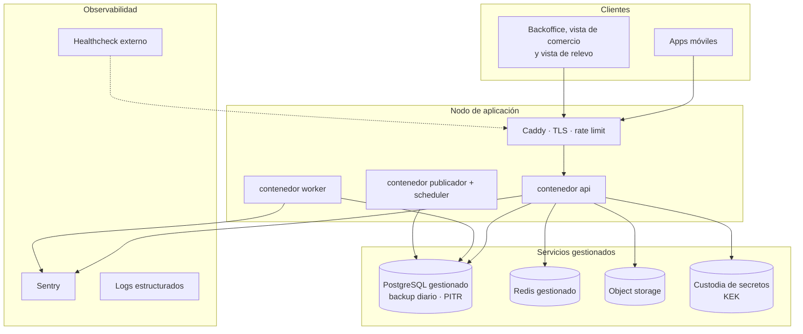

**Recomendación para el capstone (ADR-019): una instancia de cómputo persistente en un proveedor con base de datos gestionada y servicio de secretos.** No una plataforma de escalado a cero.

**Corrección respecto del diseño anterior**, que recomendaba "Cloud Run o equivalente" y a la vez dibujaba tres contenedores de larga vida. Son incompatibles: una plataforma de ámbito de petición que escala a cero **no sostiene** un worker ARQ en escucha permanente, ni un bucle de publicador de outbox, ni un scheduler. Elegir una cosa y dibujar la otra es el tipo de inconsistencia que una comisión detecta de inmediato.

Las razones de la decisión son **acumuladas**, no una sola: respaldos gestionados con recuperación a un punto en el tiempo, restauración probada, y custodia de secretos separada del cómputo. Sobre esta última conviene ser preciso, porque una redacción anterior del ADR-019 la sobrevendía: **un servicio de custodia impide extraer la clave maestra, no impide usarla.** Una API comprometida puede invocar el descifrado tantas veces como quiera. El beneficio real es contra robo de respaldos y de disco, y el control complementario es el registro de uso de la clave con alerta por volumen anómalo.

Kubernetes queda descartado: consume sprints y no agrega puntos en la defensa.

### 13.2 Entornos

| Entorno | Propósito | Datos |
|---|---|---|
| Local | `docker compose up` levanta todo | Semillas sintéticas, jamás datos reales |
| Staging | Integración, demostración al profesor guía, pasarela en modo integración | Sintéticos |
| **Demostración** | **Entorno dedicado con catálogo semilla, comercio simulado y guion de recorrido** | Sintéticos verosímiles |
| Producción | Piloto real | Reales, backup diario y restauración probada |

**El entorno de demostración es entregable del sprint 6, no del 12.** Era la objeción O-5 de la auditoría. En un proyecto cuyo mayor riesgo externo es no conseguir convenio, el entorno de demostración es también el plan de contingencia de la defensa.

### 13.3 Observabilidad mínima viable

- Logs estructurados en JSON con `request_id`, `usuario_id`, `grupo_id`, nunca datos personales en el mensaje.
- Sentry para excepciones no controladas, con `release` atado al SHA del despliegue.
- `/health` que verifica base de datos, Redis, almacenamiento y custodia de claves, consultado por un monitor externo que alerta al equipo.
- **Seis indicadores de negocio** en el backoffice, que son los que se muestran en la defensa: pedidos por estado, **alertas de quiebre generadas y convertidas en pedido**, tasa de sustitución por producto, tiempo medio de entrega, desviación entre estimado y real, y **completitud media del plan de cuidado**.

Los dos indicadores en negrita son nuevos respecto del diseño anterior y son los que miden si el producto funciona como producto y no solo como software.

---

## 14. Decisiones de arquitectura (ADR)

### ADR-001 · MATU es un sistema de continuidad del cuidado en tres capas

**Contexto.** Los dos diseños anteriores a esta línea base concibieron MATU como plataforma de despacho con una bitácora de cuidados anexa en fase 2. Dos evaluaciones independientes, una de negocio y una académica, llegaron al mismo hallazgo: el activo diferenciador estaba relegado y el componente replicable estaba al centro. Además, la bitácora y el catálogo no se comunicaban, con lo cual el producto se leía como dos cosas pegadas.

**Decisión.** Reestructurar en tres capas con dependencia estrictamente descendente. Capa 1, el plan de cuidado, es el núcleo. Capa 2, el perfil de consumo y la predicción de quiebre, deriva de la capa 1. Capa 3, el despacho, deriva de la capa 2 y es desacoplable.

**Consecuencias.**
- El diferenciador se construye desde el sprint 2 y queda demostrable de punta a punta en el sprint 3, no en fase 2.
- La pregunta "¿esto no lo hace Cornershop?" tiene respuesta estructural: un despacho genérico no sabe cuánto consume la persona cuidada.
- El cumplimiento de la Ley 21.719 pasa de importante a estructural, porque el núcleo del producto es dato sensible.
- El cuidador principal reemplaza al familiar pagador como usuario central, con efectos en toda la interfaz.

**Alternativas descartadas.** Mantener el despacho al centro: deja el proyecto expuesto a la dependencia del convenio y a una economía de márgenes finos. Pivotar a venta institucional: correcto como destino, inviable como punto de partida en doce sprints.

---

### ADR-002 · El despacho es desacoplable

**Contexto.** El MVP del diseño anterior no se podía construir sin al menos un comercio dispuesto a convenio con cuenta corriente y preparación de pedidos. Era el único punto de falla externo del proyecto y no estaba bajo control del equipo.

**Decisión.** Las capas 1 y 2 no dependen de la capa 3. Si no hay convenio, la familia **exporta su lista de reposición** como documento o enlace compartible y compra donde quiera. El sistema entrega su valor central igual.

**Consecuencias.** La exportación de lista es un requisito de primer orden (RF-15), no un extra. La regla de dependencias lo protege y una prueba automática lo verifica arrancando la aplicación sin la capa 3. El riesgo del convenio baja de crítico a medio.

**Costo.** Se pierde parte del atractivo inmediato de "delivery para el cuidado". Se gana un producto que existe sin permiso de terceros.

---

### ADR-003 · El perfil de consumo lo declara el cuidador

**Contexto.** El sistema necesita saber a qué ritmo se consume cada insumo. Hay dos caminos: inferirlo del historial de pedidos o preguntárselo a quien cuida.

**Decisión.** Lo declara el cuidador. Tasa de uso, unidad y stock estimado, en un formulario de tres campos por producto.

**Por qué.** Al inicio no existe historial del cual inferir, y el problema del arranque en frío haría inútil la funcionalidad justo cuando más importa, que es el primer mes. Además, quien cuida **sabe** cuántos pañales al día se usan, con una precisión que ningún modelo alcanzaría. Y una tercera razón que pesa: declarar el consumo obliga a un momento de reflexión sobre el cuidado que tiene valor por sí mismo.

**Consecuencias.** Hay que diseñar bien ese formulario, porque es fricción temprana. Se compensa con valores sugeridos por categoría y con la posibilidad de declarar solo dos o tres productos al principio.

**Evolución.** La inferencia desde el historial queda como RF-35 de fase 2, para **corregir** la declaración, nunca para reemplazarla.

---

### ADR-004 · Monolito modular en lugar de microservicios

**Contexto.** El documento conceptual sugiere componentes separables, y la tentación de dividirlos en servicios es fuerte porque suena mejor en una presentación.

**Decisión.** Un solo despliegue de FastAPI con módulos de límite explícito, comunicación por interfaces de aplicación y eventos de dominio vía outbox.

**Consecuencias.** Una transacción de base de datos cubre operaciones que en microservicios exigirían saga distribuida. Un pipeline, un despliegue, depuración local trivial. A cambio, todo escala junto, lo cual es irrelevante con decenas de pedidos diarios.

**Salida futura.** Los límites de módulo y el outbox son exactamente lo que permitiría extraer un servicio si hiciera falta. Se paga el diseño ahora y se difiere el costo operacional.

---

### ADR-005 · Flutter con un repositorio y dos aplicaciones

**Contexto.** Se necesitan dos aplicaciones móviles con audiencias y ciclos distintos. El equipo son dos personas.

**Decisión.** Flutter, monorepo con un paquete `core` compartido y dos targets, `app_familia` y `app_repartidor`.

**Por qué Flutter y no React Native. Una sola razón, y es honesta.**

La aplicación de repartidor necesita **ubicación en segundo plano y cámara con buen rendimiento**, y el soporte para ese par está más consolidado en un solo paquete. Sumado a que las dos aplicaciones comparten un núcleo, eso sostiene la decisión.

**Se elimina la segunda razón que el diseño anterior alegaba**, porque se invierte con su propia premisa: el argumento decía que React Native traería el ecosistema de npm como costo adicional, pero el equipo **ya** construye un backoffice en React con TypeScript, luego ya carga npm y su mantenimiento. React Native no agregaría ningún lenguaje ni cadena de herramientas nueva, mientras Dart sí agrega un tercer lenguaje, un segundo gestor de paquetes y un segundo pipeline. Y la sección 17 lista "el equipo no domina Dart" como riesgo de probabilidad alta, que es precisamente el costo que el argumento decía estar evitando.

**Un ADR con una razón sólida es más defendible que uno con una sólida y una falsa.**

**Sobre accesibilidad, con corrección respecto del diseño anterior.** La versión anterior argumentaba que el canvas propio de Flutter da mejor accesibilidad. **Eso es incorrecto y se corrige aquí.** Renderizar canvas propio significa que la aplicación **no hereda** el árbol de accesibilidad nativo y debe reconstruirlo mediante una capa de semántica. Flutter lo resuelve bien, pero es trabajo explícito, no una ventaja gratuita. Lo que el canvas propio sí entrega es **control uniforme del diseño visual** entre plataformas, que es una ventaja distinta y menor.

**Consecuencia práctica:** los criterios de accesibilidad de la sección 10.3 hay que implementarlos y probarlos a mano, con TalkBack, y están en el criterio de terminado.

**Si el equipo ya domina React Native**, esta decisión se invierte sin daño arquitectónico. La API no cambia.

---

### ADR-006 · Autorización con margen y captura por monto real

**Contexto.** El precio no se conoce hasta que el comercio prepara. Cobrar el estimado obliga a reembolsar en casi todos los pedidos, y reembolsar es lento, caro y genera desconfianza.

**Decisión.** Webpay Plus en modalidad diferida. Al confirmar se autoriza `total_estimado × 1,15`. Al registrar la entrega se captura el `total_real`. La diferencia se libera automáticamente.

**Consecuencias.** El cliente ve una retención mayor durante algunas horas, lo que exige la comunicación de la sección 10.4. Se elimina el reembolso como operación rutinaria. Si el monto real excede lo autorizado, **se captura solo hasta el tope autorizado**. La diferencia no se convierte en deuda del cliente: es pérdida de MATU o se disputa con el comercio, según el caso 10 de la sección 12.4.

**Alternativas descartadas.** Cobro exacto con reembolso posterior: insostenible operacionalmente. Cobro contra entrega: obliga a manejo de efectivo por el repartidor.

**Riesgo declarado.** Depende de que la captura parcial y la reversa se comporten como documenta el proveedor. Se verifica en el **sprint 0** con los tres casos de la sección 12.4, contra el ambiente de integración.

---

### ADR-007 · Pago dividido con recaudación, redistribución y respaldo

**Contexto.** El documento conceptual pide dividir el gasto entre familiares. **Ninguna pasarela chilena divide un cobro entre pagadores distintos.** Las variantes Mall de Transbank reparten entre comercios receptores, no entre compradores.

**Por qué se puede hacer igual.** Con autorización diferida nadie ha pagado todavía mientras el reparto está en curso, solo hay cupo reservado. Deshacer es liberar cupo de forma inmediata, no gestionar un reembolso. **La combinación del ADR-006 con este es lo que vuelve viable el pago dividido, y por separado ninguno lo lograría.**

**Decisión.** Cada participante autoriza su parte de forma independiente. Plazo de recaudación de 2 horas. Al vencer con faltante se emiten transacciones de tipo `ampliacion` sobre quienes ya autorizaron, empezando por el respaldo. Si nadie cubre, se revierte todo sin que nadie pierda dinero.

**El detalle que hay que tener claro.** Una autorización aprobada no se puede aumentar. Redistribuir es emitir una transacción nueva, no editar la anterior.

**La captura se prorratea por resto mayor**, con aritmética entera. Regla completa en la sección 8.3.

**Dependencia dura que el diseño anterior no reconocía: OneClick entra al MVP.** Con Webpay Plus por redirección no se puede emitir una autorización nueva sobre la tarjeta de un tercero sin que ese tercero vuelva al formulario de pago. Es decir, **la "ampliación automática al vencer el plazo" y el "respaldo que autoriza por adelantado" solo funcionan con tarjeta inscrita**. El diseño anterior declaraba RF-24 como *Debe* y a la vez ponía OneClick en fase 2, lo cual era una contradicción no resuelta.

La decisión: **OneClick entra al MVP como dependencia del RF-24**, con su costo en el sprint 9. Si la prueba de concepto del sprint 0 muestra que la inscripción es más cara de lo estimado, el plan B es degradar el respaldo a "el sistema notifica al respaldo y le pide autorizar, con plazo adicional de 30 minutos", que es peor producto pero no bloquea el semestre.

**Alternativas descartadas.** Pagador ancla con deuda intrafamiliar: da visibilidad pero no resuelve que nadie quiere adelantar $60.000 todos los meses. Billetera interna con saldo: convierte a MATU en emisor de dinero electrónico, con las obligaciones regulatorias correspondientes.

---

### ADR-008 · El repartidor no maneja dinero

**Contexto.** Hay tres modelos en la industria de compra por encargo. **Instacart** entrega al shopper una tarjeta prepagada que la empresa carga por pedido. **Cornershop** opera de forma equivalente, cobrando el 85% al inicio y la diferencia al salir de la tienda. **Rappi**, en pedidos donde el repartidor compra, hace que adelante dinero propio, lo que genera un flujo constante y documentado de reclamos por reembolsos.

**La restricción específica de MATU.** Los repartidores de Santiago operan varias aplicaciones simultáneamente y no tendrán exclusividad. Una tarjeta prepago exige entregarla, controlarla y recuperarla cuando alguien deja de trabajar con la plataforma.

**Decisión.** Cuenta corriente de MATU en el comercio en convenio. El comercio carga el pedido a esa cuenta y MATU liquida por período. El repartidor no toca dinero, ni propio ni de la plataforma.

**Consecuencias.** Aparece el módulo `settlement`, que reemplaza al módulo de rendición que el modelo Rappi habría exigido. El calce de caja queda a favor. El fraude se mueve del anticipo a la cuenta y se controla con la sección 11.7.

**Camino de evolución.** La tarjeta prepago vuelve a ser correcta cuando exista un programa de repartidores con beneficios por exclusividad.

---

### ADR-009 · Solo el modo de cumplimiento `preparado` en el MVP

**Contexto.** El documento conceptual describe un repartidor que compra en góndola, que es el modelo `picking`. Cargar a cuenta del comercio habilita otro: que el comercio prepare y el repartidor retire con un código, que es `preparado`.

**Decisión.** El MVP implementa solo `preparado`. `picking` queda en el enumerado `modo_cumplimiento` y sin implementar.

**Consecuencias.** La aplicación de repartidor se reduce a ofertas, código, evidencia y entrega. El estado `requiere_decision` deja de ser cuello de botella. El monto real se conoce antes de asignar repartidor. El tiempo del repartidor por pedido baja de unos 40 minutos a menos de 10.

**A cambio, el comercio tiene que aceptar preparar pedidos.** Con el ADR-002, ese riesgo dejó de ser existencial.

---

### ADR-010 · Asignación en cascada con plazo de aceptación

**Contexto.** El repartidor puede estar entregando un pedido de otra aplicación cuando llega la oferta. Adjudicarle un pedido lo deja detenido sin que nadie se entere.

**Decisión.** El pedido se ofrece, no se adjudica. Candidatos ordenados por cercanía y tasa histórica de aceptación, 60 segundos por oferta, cascada al siguiente. Agotada la lista se amplía el radio y se alerta a operación. Cada oferta emitida se registra, aceptada o no.

**Consecuencias.** Un pedido puede tardar en encontrar repartidor y el sistema puede explicar exactamente por qué. Se paga una tabla más y un job más.

---

### ADR-011 · El precio de catálogo es referencial

**Contexto.** MATU no mantiene inventario ni controla precios. Publicar un precio como vinculante es una promesa que no se puede cumplir.

**Decisión.** El catálogo muestra `precio_referencia` con fecha de actualización visible. El pedido congela `precio_snapshot`. El comercio informa `precio_real`. La aplicación muestra las tres cifras cuando difieren.

**Consecuencias.** Transparencia total, que es la base de confianza de un servicio de compra por encargo, y una obligación de interfaz tratada en la sección 10.4.

---

### ADR-012 · Ocurrencias y alertas materializadas

**Contexto.** Los envíos periódicos deben poder adelantarse, saltarse y reintentarse. Los avisos de quiebre no pueden duplicarse. Y ningún job puede generar efectos dobles si corre dos veces.

**Decisión.** El scheduler materializa filas de `ocurrencia` con 14 días de anticipación y filas de `alerta_quiebre` al entrar en la ventana de aviso, ambas con restricción única. Disparar es una transición de estado sobre una fila existente.

**Consecuencias.** Adelantar es cambiar una fecha. Saltar y descartar son cambios de estado auditables. Reintentar es idempotente por construcción. Y la familia puede ver su calendario futuro, que es buena funcionalidad de producto que sale gratis del diseño.

---

### ADR-013 · Aislamiento con Row Level Security, incluidos los trabajos asíncronos

**Contexto.** Multi-tenancy por grupo familiar sobre datos que incluyen categoría sensible. El diseño anterior resolvía el caso de la API y **dejaba sin resolver el de los workers**, que corren fuera del ciclo de petición.

**Decisión.** RLS de PostgreSQL sobre **tres ejes** de acceso (familia, comercio, operación) implementados como políticas permisivas separadas que PostgreSQL combina con OR, con `FORCE ROW LEVEL SECURITY` en toda tabla de negocio y **rol de aplicación distinto del rol propietario**. El worker usa el mismo rol que la API y no existe un rol de aplicación que evada RLS. El scheduler encola un job por grupo.

**Dos excepciones reconocidas y acotadas por permiso**, no relajando RLS: el publicador de outbox, con rol propio limitado a esa tabla, y los endpoints públicos, que resuelven su tenant por `indice_token`. Detalle completo en la sección 7.7.

**Tres correcciones respecto del diseño anterior**, todas señaladas en las rondas de revisión:

1. **Faltaba `FORCE`.** En PostgreSQL el propietario de una tabla ignora sus políticas. Con Alembic corriendo como el mismo usuario que la API, el aislamiento habría quedado desactivado en silencio.
2. **Faltaban los ejes de comercio y operación.** Un comercio atiende pedidos de decenas de grupos. Con un solo eje, tres de los ocho roles del sistema no podían operar. Afirmar que el aislamiento no tenía agujeros era falso.
3. **El orden de la verificación de membresía estaba invertido.** Consultar `membresia` antes de fijar `app.usuario_id` devuelve cero filas y hace fallar toda petición autenticada.

**Consecuencias.** Más políticas y más jobs, cada uno pequeño e idempotente. Costo de rendimiento despreciable a esta escala. Y una suite de pruebas contra PostgreSQL real que deberá verificarlo, entre ellas una que recorra tabla por tabla comprobando `FORCE` (sección 7.7).

**Alternativas descartadas.** Esquema por tenant: inmanejable con cientos de grupos y migraciones. Solo filtro de ORM: un olvido equivale a una filtración de datos de salud, que bajo la Ley 21.719 es una brecha notificable en 72 horas.

---

### ADR-014 · Sobre-cifrado del plan de cuidado con clave por persona

**Contexto.** El plan de cuidado es el núcleo del producto y el dato más sensible del sistema. Se comparte de forma parcial con relevos que no son usuarios. Y el titular tiene derecho a supresión.

**Decisión.** Cifrado en dos niveles. Una clave de datos por persona cuidada, guardada cifrada con una clave maestra en custodia externa. El contenido de cada sección se cifra con la clave de datos, con AES-256-GCM.

**Consecuencias.**
- Rotar la clave maestra no obliga a recifrar contenido, solo claves de datos.
- El derecho de supresión se cumple con **borrado criptográfico**: destruir la clave de datos, que es inmediato y verificable.
- Compartir con un relevo descifra solo las secciones habilitadas.
- El cifrado por sección hace imposible buscar dentro del plan, lo cual es aceptable: nadie busca texto dentro del plan de cuidado de su madre.

---

### ADR-015 · Concurrencia del plan de cuidado por bloqueo optimista

**Contexto.** Varios miembros del grupo pueden editar el plan. Perder la edición de un cuidador por sobreescritura silenciosa sería un fallo caro en el activo diferenciador del producto.

**Decisión.** Bloqueo optimista por sección. `plan_seccion.version` viaja como `ETag`, el PUT exige `If-Match`, y una versión desactualizada devuelve **412 con el contenido actual** para que la aplicación muestre el conflicto.

**No hay fusión automática.** Fusionar texto libre de forma automática produce resultados peores que mostrar ambas versiones y dejar decidir a la persona.

---

### ADR-016 · La clave maestra vive fuera del servidor de aplicación

**Contexto.** El ADR-014 no sirve de nada si la clave maestra está en una variable de entorno junto a la base de datos: quien accede al servidor accede a todo.

**Decisión.** La clave maestra se guarda en el servicio de custodia de secretos del proveedor, con acceso por identidad de servicio y registro de uso.

**Con una limitación que conviene declarar y que el diseño anterior omitía:** un servicio de custodia **impide extraer** la clave, no impide **usarla**. Una API comprometida puede invocar el descifrado tantas veces como quiera y obtener todas las claves de datos. El beneficio real es contra robo de respaldos y de disco. El control complementario es el **registro de uso de la clave maestra con alerta por volumen anómalo**, que sí detecta el escenario de aplicación comprometida.

**Si el piloto termina en un servidor único sin ese servicio**, la limitación se declara explícitamente en el informe de título: la clave estaría en el mismo servidor, el cifrado protege contra robo de respaldo pero no contra acceso al servidor, y el piloto no debe operar con datos reales de terceros hasta migrar. **Declarar la limitación es preferible a fingir que no existe**, y una comisión valora más lo primero.

---

### ADR-017 · Seguimiento en tiempo real por sondeo con cadencias alineadas

**Contexto.** La aplicación muestra la posición del repartidor en ruta. WebSocket es la respuesta reflexiva.

**Decisión.** Los cambios de estado viajan por notificación push, canal que ya existe. La posición se publica **cada 20 segundos** y se consulta **cada 20 segundos**, solo mientras el pedido está `en_ruta` y la pantalla está en primer plano, usando `If-None-Match` para que la respuesta sin cambios sea 304.

**Corrección respecto del diseño anterior**, que publicaba cada 30 segundos y consultaba cada 15, con lo cual la mitad de las consultas devolvía dato repetido. Las cadencias ahora coinciden y el condicional evita transferencia inútil.

**Consecuencias.** Sin conexiones persistentes, sin sesiones pegajosas, sin manejo de reconexión en el cliente. Un pedido en ruta de 30 minutos genera 90 peticiones baratas servidas desde Redis.

**Alternativas descartadas.** WebSocket: complejidad que no se paga a esta escala. SSE: mejor que WebSocket para este caso y queda como evolución natural.

---

### ADR-018 · Completitud progresiva del plan de cuidado

**Contexto.** El mayor riesgo de producto del diseño anterior no es técnico: es que un cuidador agotado no se siente a llenar información. Si el plan de cuidado exige una hora, no se llena nunca y toda la arquitectura queda sin sustrato.

**Decisión.** El plan se completa de forma incremental y **nunca se exige completo**. La versión mínima son ocho preguntas cortas y concretas que se responden en menos de cinco minutos. Dictado por voz en todos los campos de texto. Un indicador de completitud que celebra el avance. **El acceso de relevo se puede generar con el plan incompleto.**

**Consecuencias.** El modelo lleva `completitud_pct`, la interfaz lleva un orden de prioridad de secciones, y el diseño de las ocho preguntas iniciales es una decisión de producto de primer orden, no de redacción.

**Cómo se valida.** Es la hipótesis número uno de la investigación con cuidadores. Si las entrevistas muestran que ni siquiera cinco minutos son aceptables, el ADR-001 completo vuelve a revisión.

---

### ADR-019 · Despliegue gestionado en lugar de servidor único

**Contexto.** El diseño anterior recomendaba un VPS único con Docker Compose por costo. El ADR-016 cambió la ecuación.

**Decisión.** Despliegue en plataforma gestionada con base de datos gestionada y servicio de custodia de secretos, dentro de niveles gratuitos o de bajo costo.

**Por qué, concretamente.** No es por moda ni por currículum: es porque la custodia de la clave maestra de cifrado no se puede resolver bien en un servidor único, y sin esa custodia el ADR-014 pierde la mitad de su valor.

**Consecuencias.** Un poco más de configuración inicial y de acoplamiento al proveedor. A cambio, backups gestionados, restauración probada y custodia de claves separada del cómputo. Kubernetes sigue descartado por costo de operación.

---

### ADR-020 (retirado)

Existía en el diseño anterior sobre la publicación exclusiva en Android. Se reemplazó por el **ADR-025**, que expone el mismo contenido con el contexto de por qué era una decisión implícita. **La numeración no se reutiliza**, para que las referencias antiguas no apunten a otra cosa.

---

### ADR-021 · La testabilidad entra por puertos, no por disciplina

**Contexto.** El atributo de calidad número uno del sistema es la integridad transaccional del pago. Si el módulo de pagos llama directamente a Transbank, no se puede probar sin llamar a Transbank, y entonces no se prueba.

**Decisión.** Toda dependencia externa entra por un **puerto** declarado en `application/ports.py` de su módulo, con dos implementaciones: la real en `infrastructure/` y un doble determinista en `tests/dobles/`. Los cinco puertos están en la sección 12.1.

**El caso que lo justifica solo.** `Reloj` como puerto no es purismo: sin él no se puede probar el vencimiento de la recaudación, la expiración del token de relevo ni la predicción de quiebre, que son tres de las piezas más importantes del sistema. Un `RelojFijo` convierte "esperar dos horas" en una línea de prueba.

**Consecuencias.** Una indirección más por dependencia externa. A cambio, la suite de dominio corre sin tocar un solo servicio de terceros, que es lo que permite cumplir el objetivo de la sección 12.2: pruebas unitarias bajo 10 segundos.

---

### ADR-022 · Medicamentos y CESFAM quedan fuera por riesgo regulatorio, no por alcance

**Contexto.** El retiro de medicamentos en CESFAM es el diferenciador más vistoso del documento conceptual original. El diseño anterior lo dejaba fuera del MVP pero sin ADR, siendo que es exactamente el tipo de decisión que una comisión pregunta.

**Decisión.** `rx` se diseña en el modelo de datos y **no se implementa**. Ni la compra de medicamentos en farmacia ni el retiro autorizado en CESFAM entran al MVP.

**Por qué, en orden de peso.** Primero, **responsabilidad**: un error en la entrega de un medicamento tiene consecuencias que un error con pañales no tiene, y el proyecto no tiene definido quién responde. Segundo, **el retiro por un tercero exige autorización del titular** y el procedimiento varía por establecimiento, sin API pública. El Sistema Nacional de Receta Electrónica del MINSAL, lanzado en diciembre de 2025, va en la dirección correcta pero está orientado a farmacias, no a terceros retiradores. Tercero, **depende de una negociación institucional** que el equipo no controla.

**Lo que sí conviene hacer en el semestre:** documentar el procedimiento real de un CESFAM concreto y modelar el flujo con evidencia. Es investigación de campo válida y vale más que el código.

**Consecuencias.** El MVP entrega valor sin depender de una negociación institucional. Para la defensa, **es más sólido presentar un diseño consciente del riesgo regulatorio que una funcionalidad implementada que no puede operar legalmente.**

---

### ADR-023 · Un plan B preparado para el riesgo número uno

**Contexto.** El riesgo de mayor criticidad del proyecto es que un cuidador agotado no complete el plan de cuidado. El riesgo de pagos, de igual criticidad, tiene plan B explícito. El número uno no tenía ninguno: "vuelve a revisión en el sprint 2" significa reescribir la arquitectura de cinco sprints sin alternativa preparada.

**Decisión.** Si la investigación con cuidadores refuta la hipótesis, se activa el **modo ficha de relevo**: la capa 1 se reduce a **tres campos** (rutina en una línea, qué hacer si se altera, a quién llamar), y el peso del producto se traslada a la capa 2, que no depende de texto largo porque el perfil de consumo son dos números por producto.

**Por qué funciona como plan B.** Mantiene el ADR-002 intacto, conserva el diferenciador computable, no toca el modelo de datos, y cuesta menos de un sprint. **Salva el semestre en vez de rehacerlo.**

**Cuándo se decide.** Antes del sprint 2, con los criterios de falsación del protocolo de validación, fijados por escrito antes de entrevistar.

---

### ADR-024 · Un pedido por comercio, y las alertas se consolidan

**Contexto.** Con un costo de última milla de $3.500 por entrega, un pedido por producto destruye la unidad económica. Y `pedido` tiene un solo `comercio_id`, mientras la lista de reposición puede abarcar productos de dos comercios distintos.

**Decisión.** El endpoint es `POST /v1/pedidos/desde-alertas` con una lista de alertas, no uno por alerta. Si las alertas cruzan comercios, **se generan tantos borradores como comercios**, y la interfaz lo explica antes de confirmar.

**Consecuencias.** La familia ve con claridad que está armando dos pedidos y por qué. Es preferible a esconderlo y sorprenderla con dos cobros.

---

### ADR-025 · La aplicación de repartidor se publica solo en Android

**Contexto.** El diseño anterior mostraba la app de repartidor como Android sin decisión que lo respaldara. Una decisión implícita es el peor tipo de decisión.

**Decisión.** Publicar solo en Android durante el piloto. El parque de dispositivos de repartidores en Chile es mayoritariamente Android, y publicar en la tienda de Apple exige cuenta de pago anual y un ciclo de revisión que no aporta al piloto. La aplicación de familia sí sale en ambas, porque ahí el perfil de usuario es distinto.

**Consecuencias.** Reversible sin costo arquitectónico: el código Flutter es el mismo. Se revisa si un repartidor del piloto usa iPhone, que es perfectamente posible.

---

## 15. Alcance por fases y plan de doce sprints

### 15.1 Alcance

| Componente | MVP (12 sprints) | Fase 2 |
|---|---|---|
| **Plan de cuidado** | **Completo**: secciones, cifrado, concurrencia, acceso de relevo, exportación | Plantillas por tipo de dependencia, adjuntos, historial de cambios |
| **Perfil de consumo y predicción** | **Completo**: declaración, cálculo, alertas, lista, exportación | Corrección por historial real, sugerencia de cantidad óptima |
| Registro, grupo familiar, persona cuidada | Completo | Invitaciones por enlace profundo |
| Catálogo y convenios | Completo, administrado desde backoffice | Precios sincronizados, disponibilidad en vivo |
| Reposición programada | Completa, alimentada desde el perfil de consumo | Bloques horarios agendados para repartidores |
| Pedido y pago | Completo: reparto, recaudación, respaldo, captura prorrateada | OneClick para la reposición programada |
| Vista de comercio | Completo | Integración con punto de venta |
| Despacho y liquidación | Completo si hay convenio, **demostrable simulado si no lo hay** | Optimización de ruta |
| Medicamentos y CESFAM | **Fuera**, diseñados en el modelo | Piloto con convenio explícito |

### 15.2 Capacidad declarada

El diseño anterior presentaba doce sprints sin decir cuánto duraba un sprint ni cuántas horas semanales tenía el equipo. Sin eso, un plan no se puede contrastar.

| Parámetro | Valor |
|---|---|
| Duración del sprint | **1 semana** |
| Sprints | **0 más doce**, es decir 13 semanas de desarrollo dentro del semestre |
| Personas | 2 |
| Horas semanales por persona | **15**, compatibles con trabajo y otros ramos |
| **Capacidad total** | **30 horas por sprint, 390 horas en el semestre** |

**No se aplica factor de foco.** Las tallas están estimadas en horas reales, no ideales, e incluyen el costo de aprender Flutter dentro de los requisitos móviles. Declarar además un factor de foco sería descontar dos veces lo mismo.

**Estimación por talla, contrastada contra esa capacidad.**

| Talla | Horas | Requisitos | Total |
|---|---|---|---|
| S | 4 | RF-01, 03, 07, **09**, 13, 15, 18, 28, **30**, 37, 38 | 44 h |
| M | 10 | RF-02, 04, 05, 06, 08, 10, 11, 12, 14, 20, 21, 27, 29, 31, 39, 40 | 160 h |
| L | 20 | RF-16, 17, 19, 22, 23, 26, 32 | 140 h |
| XL | 35 | RF-24, 25 (recaudación con ampliaciones y captura prorrateada) | 70 h |
| | | **Subtotal** | **414 h** |
| | | Capacidad disponible | **390 h** |

**414 contra 390 no cierra**, y menos con cero holgura para integración, corrección y demostración. **El recorte es obligatorio, no opcional.**

### 15.3 El recorte que sí es un recorte

El diseño anterior decía que el recorte "ya estaba aplicado". No lo estaba: había sacado medicamentos y CESFAM, que ya estaban fuera del núcleo. Este sí saca cosas que estaban dentro.

| Qué se saca | Requisitos | Horas según la tabla de tallas | Cómo se demuestra igual |
|---|---|---|---|
| **Aplicación de repartidor** | RF-27 (M, 10 h) + RF-28 (S, 4 h) + RF-29 (M, 10 h) | **24 h** | El pedido se marca retirado y entregado desde la vista de comercio. El flujo completo se ve, sin app dedicada |
| **Seguimiento de posición** | RF-30 (S, 4 h, *Debería* desde el inicio) | **4 h** | Los cambios de estado por push cubren la necesidad real |
| **Liquidación automática** | mitad de RF-31 (M, 10 h) | **5 h** | Se registra el consumo por pedido y el cierre se hace en planilla |
| **Indicadores avanzados** | parte de RF-32 (L, 20 h) | **8 h** | Quedan cuatro de los seis indicadores: se sacan la tasa de sustitución por producto y la desviación entre estimado y real |
| | | **41 h liberadas** | |

**Esta tabla se corrigió dos veces, y conviene contarlo.** El primer recorte contaba RF-30 dos veces y declaraba 86 horas. El segundo corrigió el doble conteo a 74 horas, pero **seguía sin reconciliar con la tabla de tallas de la sección 15.2**: sumaba 32 h por tres requisitos que allí valen 24, y 20 h por medio requisito que allí vale 10 completo. **La versión actual suma exactamente lo que dice la tabla de tallas: 41 horas.** El error estaba, dos veces seguidas, en la sección titulada "el recorte que sí es un recorte".

**Alcance resultante: 373 horas contra 390 de capacidad**, con **17 horas de holgura, un 4,4%**. Eso es poco, y decirlo importa: significa que **el recorte actual no es suficiente** y que el equipo debe estar preparado para sacar también la vista de comercio automatizada o el backoffice de operación si el sprint 8 termina atrasado. Ese segundo recorte declaraba 15% de holgura y era optimismo aritmético. **Y la tabla de tallas tampoco estimaba RF-09 ni RF-30**, dos requisitos comprometidos como *Debería*: incorporarlos subió el subtotal de 406 a 414 horas y bajó la holgura de 6% a 4,4%.

**Y el recorte se propaga.** RF-27, RF-28 y RF-29 bajan de *Debe* a *Debería* en la sección 3.3 —RF-30 ya lo era—, y el sprint 10 deja de entregar la aplicación de repartidor. Un recorte que no se propaga al catálogo de requisitos ni al plan de sprints no es un recorte, es una intención.

**Lo que no se saca bajo ninguna circunstancia:** el plan de cuidado, la predicción de quiebre, la exportación de lista y el flujo de pago con reparto. Son el producto.

### 15.4 Plan de sprints

| Sprint | Objetivo | Entregable verificable |
|---|---|---|
| 0 | Preparación | Repositorios, pipeline, esquema base, ADR aprobados, **prototipo navegable**, **estrategia de pruebas**, **prueba de concepto de Transbank** |
| 1 | Identidad y grupo | Registro, login, grupo familiar, persona cuidada, RLS con prueba de aislamiento en API y en worker |
| 2 | **Plan de cuidado, parte 1** | Secciones, cifrado con sobre-cifrado, concurrencia optimista, auditoría de acceso |
| 3 | **Plan de cuidado, parte 2** | Acceso de relevo con token, vista de relevo, exportación. **Primer producto demostrable de punta a punta** |
| 4 | App familia, núcleo | Navegación, autenticación, plan de cuidado en móvil, criterios de accesibilidad aplicados |
| 5 | **Perfil de consumo y predicción** | Declaración, cálculo de quiebre, alertas materializadas, notificaciones |
| 6 | Catálogo y lista de reposición | Catálogo curado, lista generada, exportación y enlace compartible. **Entorno de demostración operativo** |
| 7 | Pedido y reposición programada | Carrito, reglas de sustitución, plan de reposición propuesto desde el consumo, ventana de 24 h |
| 8 | Pagos, parte 1 | Transbank, autorización diferida, retorno, conciliación, los casos 1 a 6 y el 12 de la sección 12.4 |
| 9 | Pagos, parte 2 | Recaudación multi-pagador, ampliaciones, respaldo, captura prorrateada |
| 10 | Cumplimiento | Vista de comercio, código de retiro, marcado de retiro y entrega desde esa vista. **La app de repartidor queda fuera del alcance comprometido** (sección 15.3) y solo se construye si el sprint 9 cierra con holgura |
| 11 | Operación | Backoffice, liquidación, conciliación, **cuatro indicadores** (sección 15.3), notificaciones |
| 12 | Cierre | Endurecimiento, retención, pruebas de carga, despliegue, guion de demostración, informe |

**El cambio decisivo está en el sprint 3.** Con el plan anterior había algo que mostrar recién en el sprint 8, cuando el pago funcionaba. Ahora hay **producto demostrable a un cuarto del semestre**, lo que permite validar temprano con cuidadores reales, mostrar avance continuo al profesor guía, y llegar a la defensa con algo íntegro aunque el semestre se complique.

**Qué se sacrifica ante atraso, en este orden:** primero los indicadores avanzados del backoffice, después la liquidación automática, que se hace en planilla durante el piloto, después el seguimiento de posición en tiempo real, y después la app de repartidor, que se puede demostrar con la vista de comercio y un pedido marcado a mano. **Nunca el plan de cuidado, la predicción de quiebre ni el flujo de pago.**

### 15.5 Reparto del trabajo entre dos personas

Con dos desarrolladores el mayor riesgo de calendario no es la dificultad técnica sino el bloqueo mutuo. **El reparto es por eje vertical, no por capa**: el error clásico es que uno haga "todo el backend" y el otro "todo el frontend", con lo cual el segundo siempre espera un endpoint.

| Eje | Módulos | Sprints |
|---|---|---|
| **A · Cuidado y consumo** | `care_plan`, `consumption`, `catalog`, `replenishment` | 1 a 7, y app de familia en 10 a 12 |
| **B · Identidad, dinero y operación** | `iam`, `care_circle`, `ordering`, `payments`, `settlement`, `backoffice` | **1 a 6** con identidad, grupo, catálogo administrativo y backoffice temprano, y 7 a 12 con pedido y pagos |

**Corrección respecto del diseño anterior**, que dejaba al eje B sin módulos asignados en los sprints 1 a 6 y al eje A sin nada en 8 a 12. Sobre trece sprints, eso significaba una persona ociosa la mitad del semestre. Peor: el eje A entregaba `replenishment` en el sprint 7, que depende de `ordering`, construido por el eje B **en ese mismo sprint**. Era exactamente el bloqueo mutuo que la sección declaraba evitar, agravado por la regla de que nadie edita módulos del otro eje.

**`ordering` se adelanta al sprint 6** para que `replenishment` no espere, y el eje B toma `iam`, `care_circle` y el esqueleto del backoffice desde el sprint 1.

Ambos ejes tocan la app de familia, así que el paquete `core` de Flutter se construye **en conjunto** en el sprint 4.

**Tres reglas de coordinación:**

1. **El contrato de API se acuerda y se mergea antes que la implementación.** A partir de ahí quien consume trabaja contra un doble sin esperar.
2. **Nadie edita módulos del otro eje.** Si el eje A necesita algo del B, lo pide como cambio. La prueba de dependencias impide los atajos peores.
3. **Las migraciones de Alembic se revisan de a dos, siempre.** Es el único punto del repositorio donde dos ramas paralelas producen un conflicto que no se resuelve solo.

**Trabajo conjunto obligatorio:** sprint 0 completo, modelo de datos, `core` de Flutter, prueba de concepto de Transbank, y toda revisión que toque dinero o datos sensibles.

**Riesgo de capacidad.** Con dos personas, la ausencia de una es el 50% de la capacidad. La mitigación es que cada eje tenga documentado su estado en el propio repositorio y que las revisiones cruzadas mantengan a ambos al tanto del otro eje. No elimina el riesgo, lo hace sobrevivible.

---

## 16. Unidad económica y viabilidad

Esta sección no existía y su ausencia era la tercera debilidad del anteproyecto. **No pretende ser un plan de negocio.** Es la aritmética mínima que un proyecto de ingeniería debe poder defender sobre su propia operación.

### 16.1 Supuestos declarados

| Supuesto | Valor | Origen |
|---|---|---|
| Canasta mensual de cuidado por persona | $50.000 a $70.000 | Estimación a partir de consumo típico de incontinencia e higiene |
| Consumo de pañales en dependencia moderada | 3 a 5 unidades diarias | Rango de referencia, a confirmar en la investigación con cuidadores |
| Costo de última milla por entrega en Santiago | $3.500 | Carga voluminosa, requiere vehículo. Punto medio del rango $3.000 a $4.500 |
| **Entregas por familia y mes** | **1,5** | Supuesto explícito que el cálculo anterior omitía y sin el cual la tabla siguiente no se puede derivar |
| Costo de pasarela | ~3% del monto | Transbank |
| Precio de suscripción del plan de cuidado | $5.990 mensuales | Contrastado con el referente de mercado de 16.3 |

**Todos estos números son estimaciones y están declarados como tales.** El propósito de la sección es mostrar el orden de magnitud y el punto de equilibrio, no simular precisión que no existe.

### 16.2 Comparación de modelos, sobre 200 familias activas

Con 200 familias, 1,5 entregas mensuales cada una son **300 entregas al mes**.

| | **Solo despacho** | **Suscripción + despacho** |
|---|---|---|
| Pedidos mensuales | 300 | 300 |
| Ingreso por comisión (10% de canasta de $60.000) | $1.800.000 | $1.800.000 |
| Ingreso por suscripción ($5.990 × 200) | — | $1.198.000 |
| Costo de última milla (300 × $3.500) | −$1.050.000 | −$1.050.000 |
| Costo de pasarela (3% del **volumen transado**, no del ingreso) | −$540.000 | −$576.000 |
| **Margen de contribución** | **$210.000** | **$1.372.000** |
| Operación necesaria | Repartidores, convenios, liquidación, soporte de entrega | La misma, más soporte de producto |

**Corrección respecto del diseño anterior, y es importante.** La versión anterior calculaba el costo de pasarela sobre el **ingreso de MATU** ($1.800.000) y no sobre el **volumen transado**. Pero MATU cobra la canasta completa a la familia: 300 pedidos por $60.000 son **$18.000.000** que pasan por la pasarela. El 3% son $540.000, no $54.000. **Un error de un orden de magnitud en la línea que decide si el modelo funciona.**

**Dos lecturas de la tabla corregida, y la primera no favorece al proyecto.**

**El despacho por sí solo casi no deja margen:** $210.000 mensuales sobre 200 familias, es decir **$1.050 por familia al mes**. Basta que el costo de última milla suba de $3.500 a $4.500 para que el margen sea **negativo**. Con dos entregas mensuales en vez de 1,5, también. El modelo de solo despacho **no se sostiene**, y ese es el hallazgo más importante de esta sección.

**La suscripción cambia el orden de magnitud:** $1.372.000 contra $210.000, más de seis veces, sin agregar costo variable relevante. Ese es el argumento del ADR-001, y con los números corregidos es más fuerte, no más débil.

**El cálculo anterior presentaba una tabla con un error de cálculo de un factor diez.** Esta está derivada y verificada. Que la conclusión cualitativa sobreviva a la corrección es tranquilizador, pero no excusa el error.

### 16.3 Referencia de mercado

Mis Tatas, la empresa chilena más cercana en el espacio, cobra entre $10.000 y $39.000 mensuales por hogar por teleasistencia, opera desde 2019 y supera los 2.500 usuarios.

**Ese dato no valida el precio de MATU.** La teleasistencia incluye dispositivo, botón de emergencia y central de respuesta humana 24/7. MATU entrega un plan de cuidado cifrado y una alerta calculada. Que $5.990 sea menor no lo hace conservador: podría ser caro para lo que entrega. Lo que el referente sí indica, y es lo valioso, es el **techo de disposición a pagar del sector** y, sobre todo, que ese operador vende a **municipios, instituciones y aseguradoras** además de a familias. Ahí está el presupuesto.

La validación del precio queda remitida a la investigación con cuidadores (sección 18), no a esta comparación.

### 16.4 Punto de equilibrio del piloto

Con costos fijos austeros de aproximadamente $600.000 mensuales (infraestructura, herramientas y soporte mínimo, **sin** la pasarela, que es costo variable y está en la tabla anterior):

| Modelo | Margen por familia al mes | **Punto de equilibrio** |
|---|---|---|
| Suscripción + despacho | $6.860 | **88 familias** |
| Solo despacho | $1.050 | **571 familias** |

**La diferencia entre 88 y 571 familias en una comuna es la diferencia entre un piloto alcanzable y uno que no lo es.** Con los números equivocados del cálculo anterior esa diferencia parecía ser entre 65 y 175, es decir, mucho menos dramática. La corrección refuerza el ADR-002. En una comuna de 100.000 habitantes hay del orden de 7.000 personas mayores de 60 años y varios cientos con algún grado de dependencia, de modo que **88 familias** es una fracción alcanzable del universo local, aunque **exige una tasa de conversión que la investigación con cuidadores debe validar**. Las **571** del modelo de solo despacho, en cambio, no lo son.

### 16.5 Los tres sustitutos, reconocidos

| Sustituto | Por qué no anula a MATU |
|---|---|
| **Cornershop, Rappi y despacho de supermercados** | Despachan lo que se les pide. No saben qué necesita la persona cuidada ni cuándo. La capa 2 es precisamente esa diferencia |
| **Entrega pública de pañales** a personas con dependencia severa, vía CESFAM y municipios | Cubre el insumo, no la continuidad del cuidado. Esas familias siguen necesitando el plan de cuidado, y el canal municipal pasa de competencia a oportunidad |
| **Comercio electrónico especializado en incontinencia** | Vende producto, no gestión. No tiene relación con el cuidado ni con el grupo familiar |

### 16.6 Lo que esta sección no resuelve, dicho sin adornos

Cuatro cosas, y todas pesan:

1. **No hay costo de adquisición ni tasa de abandono.** Con 88 familias como piso, el costo de conseguir cada una es la variable que decide si el negocio existe, y no está estimada. Un costo de adquisición de $30.000 por familia significa que la primera se paga sola recién al cuarto mes.
2. **No hay figura legal.** Operar Webpay en producción, cobrar a familias reales y abrir una cuenta corriente en un comercio exigen una persona jurídica con RUT. MATU no la tiene, y constituirla tiene plazo y costo que el proyecto no ha estimado.
3. **El cobro de la suscripción está fuera del MVP** (RF-41 es *Podría*). El punto de equilibrio de arriba es un **ejercicio de viabilidad, no un compromiso de alcance del semestre.**
4. **La disposición a pagar no tiene evidencia.** Cero entrevistas realizadas a la fecha.

**Esta sección establece que el proyecto conoce su propia aritmética y sus propios huecos. No que el negocio esté validado.**

---

## 17. Riesgos

| Riesgo | Prob. | Impacto | Mitigación |
|---|---|---|---|
| **El cuidador no completa el plan de cuidado** | Media | **Crítico** | Riesgo número uno del proyecto. Mitigación de producto: 8 preguntas en 5 minutos, dictado por voz, relevo generable con plan incompleto (ADR-018). **Se valida con entrevistas antes del sprint 2** y, si se refuta, **hay plan B preparado**: modo ficha de relevo de tres campos (ADR-023) |
| La captura diferida no se comporta como documenta el proveedor | Media | **Crítico** | Prueba de concepto en sprint 0 sobre autorizar, capturar por menos y revertir. Si falla caen juntos ADR-006 y ADR-007, y el plan B es cobro exacto con reembolso y pagador ancla |
| El alcance no cabe en 12 sprints | Alta | Alto | Recorte ya aplicado. Orden de sacrificio declarado en 15.4. El plan de cuidado y el pago no se sacrifican |
| Ningún comercio acepta convenio | Media | **Medio**, ya no crítico | El ADR-002 lo degradó. Se demuestra con comercio simulado y la exportación de lista cubre a la familia |
| Curar el catálogo toma más de lo previsto | Alta | Medio | Empezar con 40 a 60 productos de un comercio. Es trabajo humano, no de código, y tiene sprint asignado (6) |
| Pérdida de capacidad de una persona | Media | Alto | 50% de la capacidad. Revisiones cruzadas y estado documentado en el repositorio mantienen ambos ejes conocidos por los dos |
| Filtración entre grupos familiares | Baja | **Crítico** | RLS forzado incluidos los workers (sección 7.7), más pruebas de aislamiento en el pipeline (12.5) |
| Un repartidor abusa de la cuenta del comercio | Media | Medio | Los seis controles de la sección 11.7 |
| Rendimiento en dispositivos de gama baja | Media | Medio | Probar en un dispositivo real de gama baja desde el sprint 4, no al final |
| Cambio regulatorio con la vigencia de la Ley 21.719 | Media | Medio | El diseño ya cumple lo exigible. Revisar guías de la Agencia cuando se publiquen |
| El equipo no domina Dart | Alta | Medio | El costo de aprendizaje ya está dentro de las tallas de los requisitos móviles (sección 15.2), Flutter entra recién en el sprint 4 y el `core` compartido se construye entre los dos |
| **La captura diferida no aplica a débito ni prepago** | **Alta** | **Alto** | En Chile la retención con captura posterior opera sobre crédito. El débito es medio de pago mayoritario en el segmento. Se verifica en el sprint 0. Si se confirma, la aplicación rechaza débito en el flujo con reparto y lo dice en la interfaz |
| **No existe persona jurídica** | **Alta** | **Alto** | Operar Webpay en producción y abrir cuenta corriente en un comercio exigen RUT. Definir la figura y sus plazos antes del sprint 3, o el piloto opera en ambiente de integración y se declara como tal |
| **Pérdida o rotación fallida de la clave maestra** | Baja | **Crítico** | Deja ilegible todo el plan de cuidado de forma irreversible. Mitigación: `kek_version` registrada por clave de datos, retención de la versión anterior durante una rotación, y procedimiento de custodia documentado. **Y el borrado criptográfico se completa cuando expira el último respaldo que contiene la clave, no en el instante del borrado** |
| El reclutamiento de diez cuidadores para las entrevistas no se logra | Media | Alto | Contactar tres canales en paralelo. Con seis entrevistas se puede decidir, con menos no |
| El alta comercial de Transbank demora más de lo previsto | Media | Medio | El ambiente de integración no requiere alta. Iniciar el trámite en el sprint 1 aunque no se use hasta el final |

---

## 18. Definiciones pendientes

| Pregunta | Qué decisión desbloquea | Plazo |
|---|---|---|
| **¿Un cuidador agotado completa ocho preguntas?** | Valida o invalida el ADR-001 completo | **Antes del sprint 2** |
| ¿Cuál es la comuna de partida? | Zonificación, catálogo inicial, volumen esperado | Sprint 3 |
| ¿El ingreso es suscripción, comisión o mixto? | Modelo de `cargo`, cálculo de comisión, reportería | Sprint 4 |
| ¿Cuánto está dispuesta a pagar una familia por el plan de cuidado? | El precio de la sección 16 y con él todo el punto de equilibrio | Sprint 4 |
| ¿Hay un comercio dispuesto a convenio con preparación? | Si sí, la capa 3 se demuestra real. Si no, simulada | Sprint 7 |
| ¿Cada cuánto se liquida al comercio y contra qué documento? | Período de liquidación y flujo de conciliación | Sprint 10 |
| ¿Existe un CESFAM dispuesto a un convenio piloto? | Revisaría el alcance de fase 2 | Sin plazo |

**La primera es ahora la más urgente del proyecto**, y reemplaza al convenio comercial en ese lugar. Toda la arquitectura descansa en que exista un plan de cuidado que alguien efectivamente llene.

### 18.1 Lo que este documento no puede resolver por sí solo

Conviene decirlo con todas sus letras, porque un documento que se presenta como completo cuando no lo está pierde credibilidad en la primera repregunta.

| Hueco | Por qué no se cierra escribiendo | Quién lo cierra y cómo |
|---|---|---|
| **Evidencia primaria del problema** | Las cifras de prevalencia están citadas, pero no hay una sola entrevista con un cuidador real | El equipo, con el protocolo de validación ya escrito. Diez entrevistas, diez días |
| **Comportamiento real de Transbank** | La captura parcial, la reversa y el soporte de débito son afirmaciones del proveedor, no observaciones | El equipo, con la prueba de concepto del sprint 0 contra el ambiente de integración |
| **Convenio comercial** | Ningún comercio ha comprometido nada | El equipo, con una carta de intención antes del sprint 7 |
| **Disposición a pagar** | El precio de la sección 16 es una hipótesis contrastada contra un referente no homologable | El equipo, en la misma ronda de entrevistas |
| **Consulta legal sobre representación** | La sección 11.5 acota la zona gris pero no la resuelve | Asesoría jurídica o el profesor guía, antes de operar con datos reales |

**Estos cinco huecos no se cierran con más documento.** Es la limitación honesta de esta versión, y declararla vale más que disimularla.

---

## 19. Anexos

### 19.1 Estructura prevista del repositorio

Esta es la estructura que el repositorio tendrá al término del desarrollo. Hoy solo existen `docs/` y las carpetas de evidencias del curso.

```
MATU/
├── backend/
│   ├── app/
│   │   ├── core/            configuración, seguridad, dependencias, errores
│   │   ├── shared/          eventos, outbox, auditoría, tipos comunes
│   │   ├── modules/         iam, care_circle, care_plan, consumption,
│   │   │                    catalog, replenishment, ordering, payments,
│   │   │                    fulfillment, settlement, rx, notifications,
│   │   │                    backoffice
│   │   └── main.py
│   ├── alembic/
│   ├── tests/
│   │   ├── unit/                        reglas de dominio
│   │   ├── integration/                 repositorios, RLS, migraciones
│   │   ├── e2e/                         los 6 recorridos críticos
│   │   ├── dobles/                      implementaciones falsas de los puertos
│   │   ├── test_arquitectura.py         regla de dependencias entre módulos
│   │   ├── test_aislamiento.py          RLS en API y en workers
│   │   └── test_capa3_desacoplable.py   arranca sin la capa de despacho
│   ├── pyproject.toml
│   └── Dockerfile
├── mobile/
│   ├── packages/core/       modelos, cliente API, auth, diseño accesible
│   ├── apps/familia/
│   └── apps/repartidor/
├── web/                     backoffice, vista de comercio y vista de relevo
├── infra/
├── docs/
│   ├── arquitectura.md      este documento
│   ├── adr/                 un archivo por decisión
│   ├── prototipo/           wireframes navegables
│   ├── requisitos.md        catálogo RF trazado a módulos
│   └── api/                 OpenAPI generado
└── .github/workflows/
```

Cada módulo interno sigue la misma estructura, de modo que agregar uno nuevo sea mecánico:

```
modules/consumption/
├── domain/          entidades, objetos de valor, reglas puras
├── application/     casos de uso, puertos
├── infrastructure/  repositorios SQLAlchemy, adaptadores
├── api/             router, esquemas Pydantic
└── events.py        eventos de dominio que publica
```

### 19.2 Glosario

| Término | Significado en MATU |
|---|---|
| **Plan de cuidado** | Conjunto cifrado de secciones que describen cómo se cuida a una persona. Núcleo del producto. Antes llamado bitácora |
| **Perfil de consumo** | Declaración de a qué ritmo se consume un insumo, base de la predicción de quiebre |
| **Quiebre** | Momento en que se agota un insumo que no admite agotarse |
| **Relevo** | Persona que reemplaza temporalmente al cuidador principal. Accede al plan sin crear cuenta |
| **Grupo familiar** | Unidad de aislamiento de datos. Es el tenant del sistema |
| **Recaudación** | Proceso por el cual varios familiares autorizan su parte de un mismo cargo |
| **Respaldo** | Familiar que autoriza por adelantado cubrir el faltante de la recaudación |
| **Modo preparado** | Cumplimiento donde el comercio arma el pedido y el repartidor solo retira |
| **Código de retiro** | Credencial de un solo uso que autoriza a llevarse un pedido cargado a cuenta de MATU |
| **Consumo de comercio** | Deuda que MATU contrae con un comercio por un pedido cargado a su cuenta |

---

### 19.3 Bibliografía y fuentes

**Fuentes oficiales**

1. Ministerio de Desarrollo Social y Familia. *Estudio Nacional de la Discapacidad y Dependencia (ENDIDE) 2022 · Resultados: personas dependientes y necesidades de cuidado*. Observatorio Social, 2023. Prevalencia de dependencia, perfil del cuidador y déficit de cuidado.
2. Ministerio de Salud. *Plan Nacional de Demencia 2025-2035*. DIPRECE, marzo de 2026. Prevalencia de demencia y carga epidemiológica.
3. Biblioteca del Congreso Nacional. *Ley 21.719 sobre protección de datos personales*. Publicada el 13 de diciembre de 2024, plena vigencia el 1 de diciembre de 2026.
4. Ministerio de Salud. *Sistema Nacional de Receta Electrónica*. Lanzamiento, diciembre de 2025.
5. Transbank Developers. *Documentación de Webpay Plus y OneClick*. Modalidad diferida, captura y reversa.

**Fuentes de industria**

6. Instacart. *Shopper payment card*. Modelo de tarjeta prepagada por pedido para compra por encargo.
7. Municipalidad de Providencia. *Ayuda social en pañales para adultos*. Ejemplo de entrega municipal a personas con dependencia.
8. Reclamos.cl. Registro público de reclamos por reembolsos en plataformas de compra por encargo en Chile.

**Por qué la sección 16 casi no aparece en esta lista.** Sus valores no salen de fuentes externas salvo dos: el costo de pasarela, que publica Transbank, y el precio de suscripción, contrastado con el referente de mercado de la sección 16.3. Los demás son estimaciones del equipo, declaradas una por una con su origen en la tabla de la sección 16.1. La investigación con cuidadores es lo que puede reemplazarlas por evidencia, y por eso la sección 18.1 la nombra como el primero de los cinco huecos que este documento no cierra solo.

---

*Documento de arquitectura MATU · versión 1.0 · agosto 2026 · Jorge Espinoza y Martín Henríquez*
*Anteproyecto: línea base de diseño. El desarrollo comienza en el sprint 1.*


